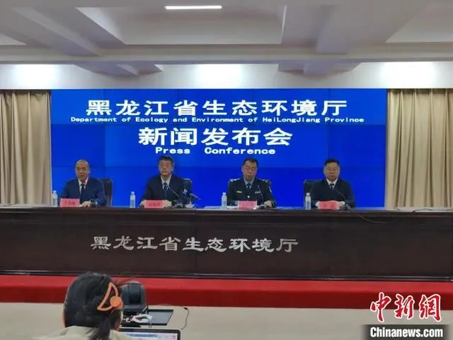

# 评论丨185人烧秸秆被罚1.78亿？误读与真实的治理困境

对于相关误读，当地官方在及时澄清的同时，更要看到背后的治理困境和社会期待

这两天，一则“一个半月黑龙江省焚烧秸秆罚款1.78亿”的话题引发了很多关注和讨论。在一些解读中，它被理解为“罚款式创收”。尤其是，将“拘留了185人，罚款1.78亿”打包解读，得出人均罚96.3万的结论，非常吸引眼球。但综合各方面的信息来看，事情的真相显然并不是一些人所理解的那样。

这个话题的源头，来自于今年3月黑龙江省生态环境厅召开的一场新闻发布会。该发布会披露了当地禁烧秸秆的治理进展：2022年11月1日至12月15日，黑龙江省共发现秸秆及根茬、残余物露天焚烧火点共计594处。因秸秆禁烧管控不力，当地414名党政干部被问责，并行政拘留露天焚烧秸秆及根茬残余物人员185人。同时，黑龙江省联席会议办公室依据相关规定，对594处秸秆及根茬残余物露天焚烧火点拟移交黑龙江省财政厅扣拨资金(罚款)1.782亿元。

_↑3月3日，黑龙江省生态环境厅召开新闻发布会，介绍2022年至2023年禁烧期黑龙江省有关工作情况。_

结合上述官方信息不难看出，1.782亿罚款并不是针对露天焚烧秸秆及根茬残余物的农民，而是594处秸秆及根茬残余物露天焚烧火点，它的处罚对象应该是相关火点所在的地方政府。这里要普及的一个背景信息是，2018年，黑龙江省出台的《禁止秸秆露天焚烧工作奖惩暂行规定》明确，每年的9月15日~12月10日或翌年3月10日~5月15日期间内，出现第一个（秸秆焚烧）火点的，省财政将直接扣拨相关县（市、区）50万元，再出现火点，按每个火点30万元扣拨资金。而这些扣拨资金（罚款）将通过奖励和专项补偿的方式，划拨给禁止秸秆露天焚烧和综合利用工作先进县（市、区），用于下一年度秸秆综合利用项目和禁止秸秆露天焚烧等相关工作。

也就是说，对禁烧秸秆工作做得不好的地方的罚款，是用于奖励和补贴做得好的地方。这一做法，实际是一种激励机制，与地方政府的财政压力并没有什么直接关系。黑龙江省生态环境保护综合行政执法局局长王凤华日前在接受红星新闻采访时也作了澄清：“1.782亿是直接扣拨地方财政资金，跟焚烧秸秆的农民本人无关，此次对农民并无实际处罚。”

但这个本来很“正常”的新闻却引发如此大的关注，并带来一系列的误读，背后也的确有一些问题值得讨论。

要知道，当地禁止焚烧秸秆的治理行动，在过去就曾引发过争议。类似的问责、处罚乃至行政拘留的组合拳“严治”，其实已持续了数年。时至今日依然“问责多，罚款多”，虽然体现了治理力度的延续，但似乎也更说明，违规焚烧秸秆的现象在当地依然“高发”。
**这是不是意味着这套治理方案，并没有带来预期的治理效果？这一疑问与对禁烧秸秆本身的质疑相互强化，自然就增加了外界对于“巨额罚款”的消极观感，乃至催生“以罚代治”“罚款式创收”等习惯性想象。**

要指出的是，作为农业大省，黑龙江受秸秆焚烧问题的困扰，诸如环保问题、火灾隐患等，确实比其他地方都相对更严重，这也是当地治理动作更为强力的一个现实原因。但正如现状所示，这般持续数年的严治严管之下，为何到今天依然出现大量违规“点火”现象，乃至于罚款额度达到了让外界震惊的程度？

**这背后或涉及一个非常现实的问题，那就是禁止焚烧后，大量的秸秆到底该如何妥善处理？**
要知道，焚烧秸秆作为一个沿袭很长时间的做法，要彻底禁绝，不仅涉及农民行为习惯的改变，更关键的问题是处理的成本。对农民来说，就地焚烧是成本最低的处理方式，并且还可以增强土壤的肥力。而配合环保治理禁烧后，这些秸秆如果不能有一个合理的“出路”，其实就大大增加了农民的处理成本。如果在没有足够配套支持和服务的情况下，将增加的成本完全推给农民来消化，治理效果就自然容易打折扣，也难以获得社会对于禁烧的足够认同。

其实，公开报道显示，对于秸秆的回收再利用，很多地方都在探索，包括黑龙江不少地方也有相关成功案例的介绍。但总体来说，可能还是未跟上禁烧后大量秸秆的合理处理需求。事实上，去年黑龙江省有效解决农作物秸秆露天焚烧工作联席会议办公室下发的通报中也明确要求，要加大秸秆综合利用，提升秸秆压块站、固化站等项目达产率、解决好秸秆综合利用不畅等问题。据此来说，当地对秸秆的综合利用水平，显然还有极大的提升空间。这或许也是“年年治，年年罚”，但焚烧秸秆行为依然未能根治的重要原因之一。

因此，对于相关误读，当地官方在及时澄清的同时，更要看到背后的治理困境和社会期待。毕竟，问责、罚款只是手段。
**如果既定的治理手段未能实现预期的治理效果，那就有必要及时思考，治理方案是否该进一步优化。**

红星新闻特约评论员 朱昌俊

编辑 汪垠涛

红星评论投稿邮箱：hxpl2020@qq.com

