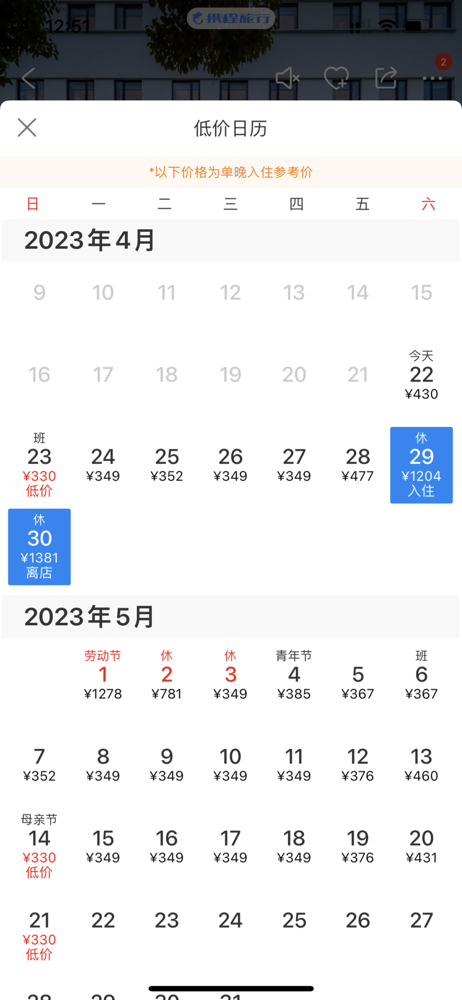
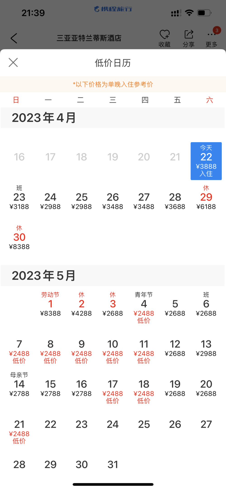
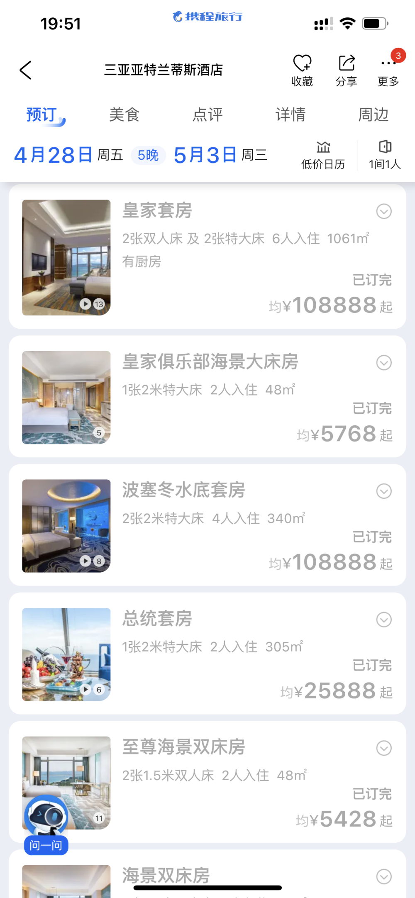
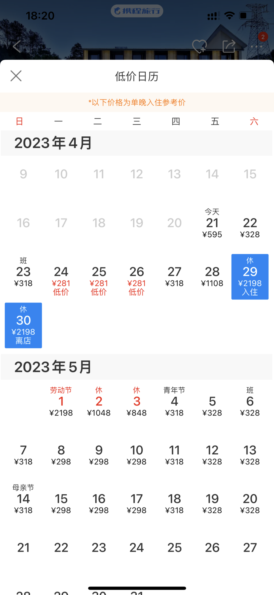

# 五一热门旅游城市酒店涨价10倍，是“酒店刺客”还是“价格回归”？

距离“五一”假期还有一周，随着各地旅游产品进入“冲刺”阶段，多地酒店房价也随之“水涨船高”。

澎湃新闻（www.thepaper.cn）搜索发现，全国各地旅游城市热门景点附近的酒店在“五一”假期前3天的价格均较平日高出2-3倍，甚至还有酒店价格上涨5倍，令人直呼“酒店刺客”。

以苏州观前街附近的酒店为例，平日最低房价约350元/晚的某连锁酒店4月29日最低入住价格为1204元/晚，是平日价格的3.44倍；4月30日的入住价格为1381元/晚，是平日价格的约3.9倍。

三亚亚特兰蒂斯酒店4月、5月平日最低房价为2488元/晚，目前4月29日能够入住的最低房价为6188元/晚，4月30日和5月1日的最低入住价格达8388元/晚。

不过，澎湃新闻发现，截至目前，三亚亚特兰蒂斯平日最便宜的海景双床房和海景大床房在4月28日至5月3日均已订完，4月29日最低房价6188元/晚的皇家俱乐部海景大/双床房平日最低价格为3288元/晚起。

值得一提的是，澎湃新闻搜索发现，截至目前，三亚亚特兰蒂斯4月28日至5月3日入住的房型中，有10种房型已订满，其中包括108888元/晚的皇家套房和波塞冬水底套房，不过该两个户型的平日价格也为108888元/晚。

某位于景德镇的四钻酒店看起来“五一”假期和平日的价差更大。澎湃新闻搜索发现，该酒店4月、5月平日最低能订到300元/晚左右的房间，甚至“五一”前一周有房型的最低价300元不到，仅281元/晚，而4月29日至5月1日最低仅能订到2198元的房间。

澎湃新闻发现，该酒店平日为281元价格的房型在4月28日入住的价格为1108元/晚，是平日价格的3.9倍；在4月29日入住的价格为2198元/晚，是平日价格的7.8倍；在4月30日入住的话，房间已经售罄，价格显示为3140元/晚，是平日价格的11倍。此外，该酒店在4月30日晚入住的房型中已有8个房型订完。

根据澎湃新闻从某在线旅游平台获得的数据，以今年4月29日至5月3日计算，热门旅游城市中，绝大多数城市的酒店平均支付价格超2019年同期。其中北京、天津、杭州、武汉、上海、济南等地酒店平均支付价格超2019年“五一”假期的25%。

有不愿具名的业内分析人士向澎湃新闻表示，
今年五一假期全国酒店价格普遍上涨，可以从供求两方面来解释：首先，在供给端，经历了三年疫情，国内酒店供给大幅减少。按中国饭店协会的统计，截至2022年年初，国内酒店数量较疫情前减少了约8.6万家，降幅约25%，客房总数较疫情前减少了约47万间，降幅约24.7%。

其次，今年年初以来国内商务旅行及旅游度假需求出现了超预期的复苏（3月份铁路日均客流量已经反超2019年同期），多个旅游城市一季度的游客接待量超过了2019年同期。与需求端的快速反弹相比，供给端的修复则需要相对较长的周期，而“五一”假期出游需求集中释放更加剧了当前供给不足的问题，尤其是热门旅游目的地住宿设施供给严重不足，价格上涨是必然的。

不过，该人士表示，也不必过于担忧酒店价格问题。“在需求快速恢复的刺激下，酒店供给也在快速恢复中，国内中高端酒店一季度的开业量出现了翻倍增长，各大酒管集团也在开足马力抢占优质物业，开店数量每月都在增长。”该业内分析人士预计，下半年国内住宿业将基本恢复到供求平衡的状态，届时酒店房价也有望结束剧烈波动状态，基本回归正常水平。

另一方面，若以“五一”价格较平日价格的涨幅（下称“价格系数”）来看，今年大部分热门目的地的价格系数并未高于2019年“五一”。

澎湃新闻从某在线旅游平台的数据显示，今年“五一”的热门目的地中，包括无锡、常州、广州、苏州、绍兴、西安、北京等在内的12个城市价格系数均低于2019年“五一”，也就是说，这些城市今年“五一”价格较平日价格的涨幅低于2019年“五一”。此外，上海、大理、深圳、成都、珠海、杭州等地的价格系数与2019年“五一”基本持平。

从今年以来酒店的整体价格情况来看，上述分析人士指出，尽管年初以来国内各星级酒店平均房价同比涨幅较高，但主要是受2022年同期低基数效应影响，对比疫情前的2019年同期，酒店的平均房价基本可以被认为是回归正常价格水平。

“以五星级酒店为例，2022年国内五星级酒店的平均房价仅为509.33元，同比下降8%，较2019年同期下降15%以上。疫情期间，一些热门旅游目的地的五星级酒店的预售价一度出现了‘白菜价’，平均每晚售价甚至不及疫情前的三星级、四星级酒店的房价。”该人士表示。

