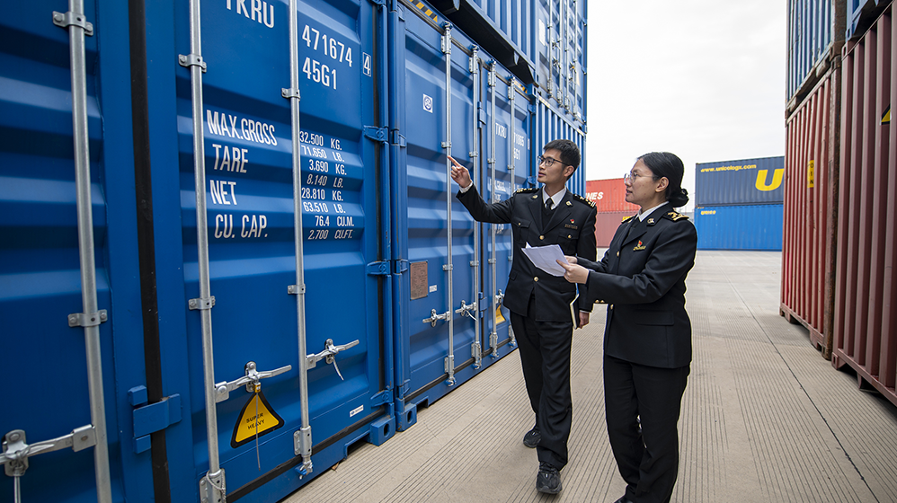

# 商务部：中国进口平均关税水平约7％，低于许多发展中国家

4月23日，在国务院新闻办举行的推动外贸稳规模优结构有关情况国务院政策例行吹风会上，有媒体提问：扩大进口为经济增长作出了重要贡献。请问，下一步商务部将采取哪些措施，更好发挥进口对外贸稳规模优结构的积极作用？

对此，商务部国际贸易谈判代表兼副部长王受文表示，扩大进口不仅仅对中国的经济作了贡献，也为世界经济、出口国经济的发展有非常重要的贡献。现在，中国已经是140多个国家和地区的主要贸易伙伴。根据WTO不完全统计，中国已经是50多个国家和地区的最主要出口市场。中国消费市场容量大、层次多、后劲足，有巨大潜力。去年，我国进口总额达到了2.7万亿美元，世界名列第二，占世界进口的近11%。世界上整个的进口有近11%是中国进口的，为世界经济作出了贡献，为很多贸易伙伴的经济发展作出了贡献。中国已经连续14年是世界第二大进口市场。大家知道，我们举办了进博会，以进口为主，我们在广交会上有进口展，刚刚还举办了消博会，也主要是以进口为主。这些重要展会的举办，表明了中国扩大对外开放的坚定决心，也表明了中国愿意与世界上其他经济体共享发展的真诚愿望。

王受文表示，下一步，会继续采取一系列措施扩大进口，具体有以下几个方面：

第一，要扩大进口市场。今年，我们对1020项商品实行了进口暂定税率，所谓的进口暂定税率就是比我们向WTO承诺的税率要低，
**现在中国进口平均关税水平在7%左右，** 世贸组织统计的发展中国家进口平均关税水平在10%左右，所以我国的进口关税 **低于许多发展中国家**
，这表明我们 **愿意扩大我国进口市场的准入**
。我们已经与26个国家和地区签署了19个自由贸易协定。签订自由贸易协定意味着我们大部分进口产品的关税要降为零，这也有利于扩大进口。我们还发挥跨境电商零售进口积极作用，保障大宗产品进口稳定，增加我们国内所需要的能源资源产品、农产品、消费品等的进口。比如说，最近我们和厄瓜多尔签署了一个火龙果市场准入议定书，厄瓜多尔火龙果就可以卖到中国来了。我们前不久也恢复了巴西部分牛肉对中国的出口。更重要的是，我们支持先进技术重要装备和关键零部件的进口，来促进国内产业结构的调整和优化。

第二，发挥进口展会平台作用。进博会、消博会、广交会进口展等，这些都为外国产品提供者提供了一个和中国消费者用户直接见面的机会，帮助他们向中国推销他们的产品和服务。值得一提的是，4月15日，财政部、海关总署、税务总局出台了一个政策，对今年中国进出口商品交易会展期内销售的进口展品，就是他们要带他们的展品来参加展会，这个展品如果在参展期间就卖到了中国，在额度内免进口关税、进口环节增值税和消费税，这就有助于他们把展品带到中国来展览、销售。现在我们国家已经有13个展会享受这项政策，利于扩大进口。

第三，培育进口贸易促进创新示范区。国家已经设立了43个进口示范区，去年就设了29个。对于这些进口示范区，各地都开展了一些政策创新，比如说扩大消费品进口，打造大宗商品交易中心，促进了进口产品和国内消费与国内下游企业的相互融合。所以，这些进口促进创新示范区的建设有助于我们分享经验，便利其他地方扩大进口。

第四，全面提升进口便利化水平。我们和海关一起，推动拓展“单一窗口”服务功能，推进贸易便利化走深走实，推动各进口口岸互学互鉴，进一步提高进口货物流转效率，减轻企业负担，使我国产业链供应链能够更加可靠、更加高效。

