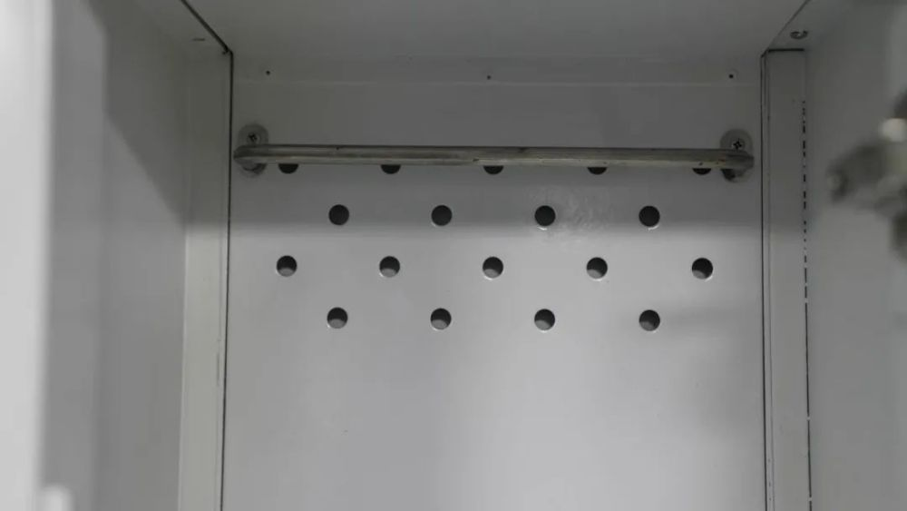

# 山东舰内部画面，大开眼界！

在山东舰上工作生活是什么体验？山东舰内部有哪些独特设计？一起探访山东舰。

山东舰副舰长做向导，硬核科普来啦！总台记者跟随山东舰副舰长徐英探访山东舰。

**山东舰有多大？**

甲板总面积15000平方米，相当于两个足球场大小。舰上3600多个房间，如果每天住一间，要用10年才能住一遍。

山东舰与辽宁舰最明显的不同是， **山东舰舰岛有双层指挥室。**

大家关注的舰载机在着舰时， **阻拦索最佳挂索原来在第二第三根。**

驾驶航母的舵轮 **竟然比汽车方向盘还小。**

小神器大社区，探访航母舰员的生活日常。

山东舰创新增加了很多生活便利设施，社区化生活模式极大便利了舰员的工作生活。

山东舰之大，一眼望不到头。可要是在航母上迷路了咋办？

这是山东舰的内部通讯工具，战士们称它为 **“小手机”，** 不仅可以让舰上所有人保持沟通畅通，一旦迷路了，它还可以进行精准定位。

在舰上为了保证用电安全，手机在充电时旁边必须要有人在。但如果训练时想给手机充电怎么办？

有这个 **手机充电柜** ！

山东舰上配备了内置抽湿装置的 **洗漱柜，** 手放在里面能感到微微的风在流动。有了这个小装置，就能保证洗漱用品干干爽爽。

此外，舰上的洗衣房还配备了 **烘干机，** 官兵们洗完衣服直接放进烘干机烘干即可。

吃饭时间到！山东舰一天可以提供5顿饭，白天3顿，晚上2顿。出海的时候，还有2顿加餐。

航母上的每顿饭还有小惊喜。看，是冰激凌！

航母上官兵生病怎么办？“航母医院”精心诊疗。

山东舰医务中心设置接诊台、门诊、药房，手术室及多个科室。一些常见病、部分疑难杂症，甚至急危重症都能在这儿进行诊疗。

紧急情况下还能展开多台手术，舰上还根据官兵需要增设了一些特色诊室。官兵不出舰艇，就能享受现代化的医疗服务。

这是山东舰医务中心里的 **医用高压氧舱，** 飞行员在特别疲劳时可以来这吸氧。除此之外，这里也可以治疗潜水员的减压病和日常的神经系统康复。

舰上最有特色的科室 **一定有中医科，** 拔罐、针灸、理疗，官兵们可以在这里感受中医“一条龙服务”。

要问哪个科室医生最忙碌？ **答案是口腔科。**

爬上钻下巡检路，小岗位有大担当。要推动山东舰前进，需要好几根巨大的船轴传导推力，最长的超过100米。它们就安装在航母的最底部，每天需要有专人进行数次巡检

大轴巡检员保障的是 **航母传动大轴的健康，** 因为考虑到密封性，巡检员的巡检路要在航母内部的船梯爬上爬下。

一起踏上航母大轴巡检路↓

来源：央视军事综合CCTV-7《正午国防军事》

**监制丨马烨**

**主编丨白晨 梁晨**

**记者丨胡善敏 马敏捷 林泉**

**郭俊 邢彤承杨约伯**

**刘东雪 韦婷婷孟鹏**

**陈思 杜黎鑫 扈秀帅**

曹笑 周瑜 薛丹妮 杨志刚

**张杰 姬翔 雷亚恒 范世杰张焜**

**耿豪杰 闫国旗 董鑫 梁磊 傅一博**

**编辑丨李红 王吴恺馨**

**视频编辑丨伊凯新 张可宜**

**©央视军事**

