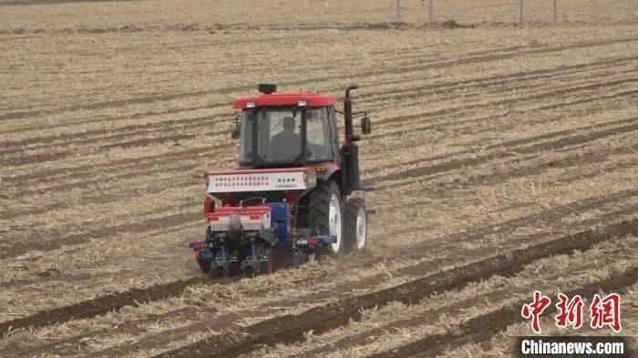
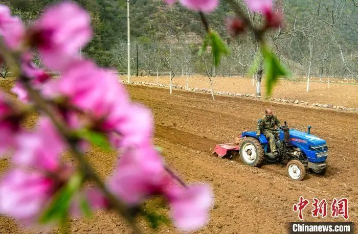

# 粮企现塌方式腐败，围捕“粮仓硕鼠”难在哪里？

春耕正忙，与此同时，粮食购销领域的反腐行动也在持续深化中。相关专家对此表示，粮食购销腐败是近年来问题线索集中、案件高发多发、群众问题反映较为集中的领域，当前粮食购销领域腐败问题存量尚未见底、增量还在发生。

_农民正在操作新一代多功能免耕播种机开展春耕工作。吕盛楠
摄_

**官方持续释放严的信号**

**专家分析反腐已经进入新阶段**

**出逃不到2个月即落网，西安市粮食局原局长李西安在不久前被缉捕归案。** 这一案例从侧面反映出，当前粮食购销领域反腐动作的高压与雷霆。

2021年8月，中央纪委国家监委在全国范围内部署开展粮食购销领域腐败问题专项整治工作。今年4月18日，中国纪检监察报题为《纠治靠粮吃粮》的报道称，对涉粮腐败问题线索开展大起底，一大批粮仓“硕鼠”“蠹虫”被严肃查处，其中
**包括中国储备粮管理集团有限公司原党组成员、副总经理徐宝义和国家粮食和物资储备局原党组书记、局长张务锋2名中管干部，40余名厅局级干部。**

“粮食系统腐败行为虽然在粮食监管、存储、轮换、购销、财务管理等诸多领域都有发生，但粮食购销领域是权力集中、资金密集、资源富集的重点领域。”

北京师范大学法学院教授彭新林告诉中新网，粮食购销涉及收购、入库、出库等多个环节，往往是多人内外勾结实施，该领域存在比较突出的行业性、系统性腐败问题，在相对独立、缺乏监管的环境下，该领域一些乱象难以被及时察觉。

今年以来，官方在深化粮食购销领域腐败问题专项整治上，持续释放严的信号。1月10日，二十届中央纪委二次全会公报公布，特别提到下一阶段党风廉政工作的重点领域，其中包括粮食购销。随后，中央纪委国家监委印发《关于深化粮食购销领域腐败问题专项整治工作的意见》。

“今年粮食购销领域反腐将会进入新阶段，从专项整治走向全面整治。”北京大学廉政建设研究中心副主任庄德水向中新网分析。

_村民驾驶农机犁地。张文军
摄_

**粮企现塌方式腐败**

**纠治“靠粮吃粮”难在哪里？**

“粮仓硕鼠”是中央纪委国家监委网站公布的2021年度十大反腐热词之一。该词汇被解释为，那些 **胆大妄为、贪得无厌的“靠粮吃粮”腐败分子。**

近年来，“靠粮吃粮”的“粮仓硕鼠”频频在各地通报案例中出现。在彭新林看来，主要原因还是监管缺失缺位、内外勾结、执法不严。

**4月12日，安徽省纪委监委通报了安徽省粮食集团有限责任公司原党委书记、董事长关飞、聂军和周新开3任“一把手”严重违纪违法案。**

2002年至2021年，关飞、聂军、周新开连续3任省粮食集团“一把手”带头违纪违法，对班子成员和下属人员违纪违法行为默许纵容，导致省粮食集团发生系统性、塌方式腐败；利用职务便利，在经营粮食业务、项目承揽、工程建设等方面，为他人谋取利益，分别收受贿赂500余万元、330余万元、290余万元，涉嫌受贿犯罪；关飞不认真履行职责，导致巨额贸易融资贷款被非法挪用，造成国有资产损失2.3亿余元；聂军、周新开通过“陈化粮”“转圈粮”“价差粮”等手法“靠粮吃粮”分别骗取国家补贴690余万元、200余万元，涉嫌贪污犯罪。

此外，陕西、辽宁等地近期的通报中也出现多个涉及省粮食集团的“靠粮吃粮”腐败现象。

彭新林表示，实践中，粮食购销领域存在点多、线长、面广、监管不易的问题，传统监督力量和监督手段在一定程度上难以全链条全周期覆盖。如粮食“以陈顶新”能够通关验收、“转圈粮”虚假轮换、擅自动用储备粮进行加工销售等问题多发，无一不与监管不到位或者监管形同虚设有密切关系，且很多与粮储部门及下属企业“一把手”不正确履职、失职失察有重要关系。

_村民赶忙进行春耕。张文军
摄_

**围捕“粮仓硕鼠”**

**如何打出“组合拳”？**

继自查自纠、案件查处、制度建设、智慧粮库、常态化监督后，《纠治靠粮吃粮》一文还披露，加强与公安、司法机关协同联动成为深化专项整治，打出的一套全新“组合拳”。

据文章介绍，山西省纪委监委在查办中储粮集团公司广西分公司原副总经理张东升一案过程中，发现张东升亲属实际控制的企业在政策性粮食收储中，采取虚报政策性粮食收储数量、虚构粮食库存等弄虚作假手段，套取、骗取国家粮食收购资金。中央纪委国家监委第四监督检查室商请公安部指定山西省公安机关依法进行侦查。在公安部经济犯罪侦查局的统筹协调下，山西、辽宁两地公安机关通力合作，成功侦破该起合同诈骗案，全面查清骗取国家政策性粮食专项费用补贴犯罪事实。

“专项领域要持续深化，除了制度建设之外，更重要的是工作机制方面要有新突破。”庄德水表示，三个部门之间的协同推进有利于创新解决整治粮食领域腐败问题的工作机制，能够打破原先各自为战的尴尬局面，对整个粮食领域各个环节实行有效监督。

他还提到，接下来持续深化整治粮食购销领域腐败问题，一方面要对重大腐败案件进行总结和梳理，归纳突出性的廉洁风险问题，另一方面建章立制，针对当前所发生的典型问题，扎牢制度的笼子，减少相关腐败问题发生概率，从源头上阻断粮食购销领域腐败问题的发生。

（韦香惠）

