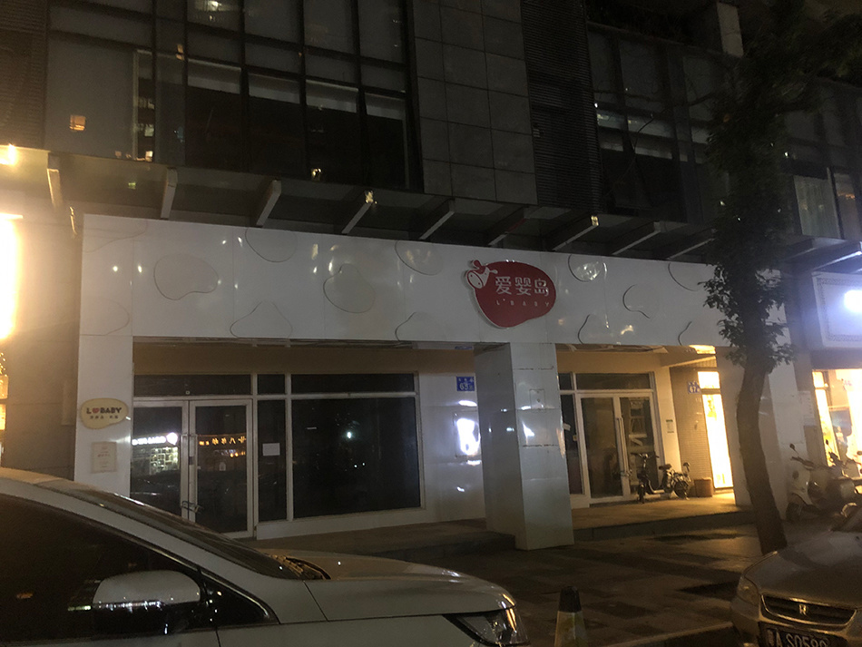
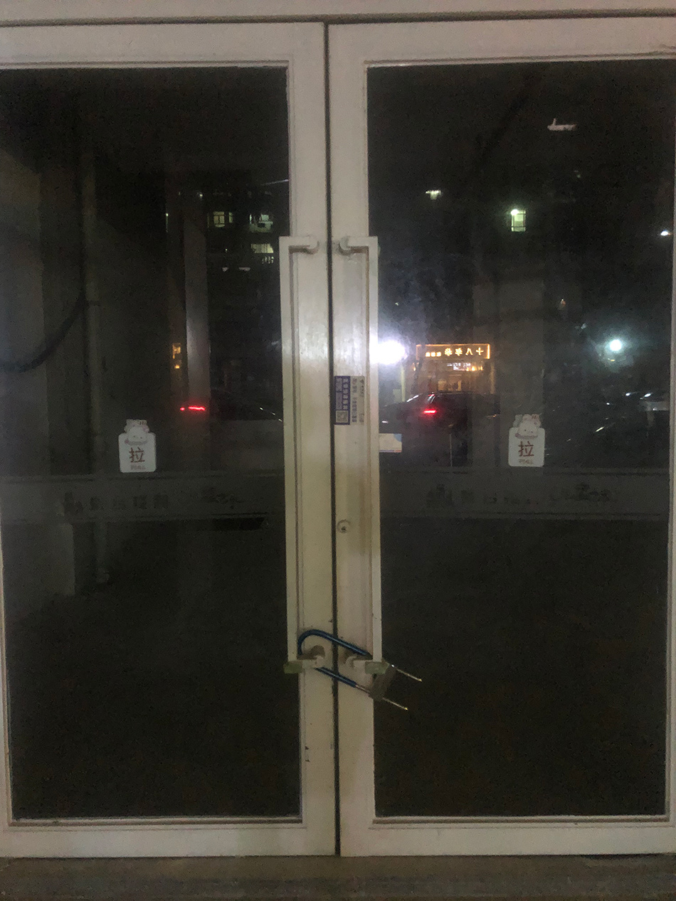
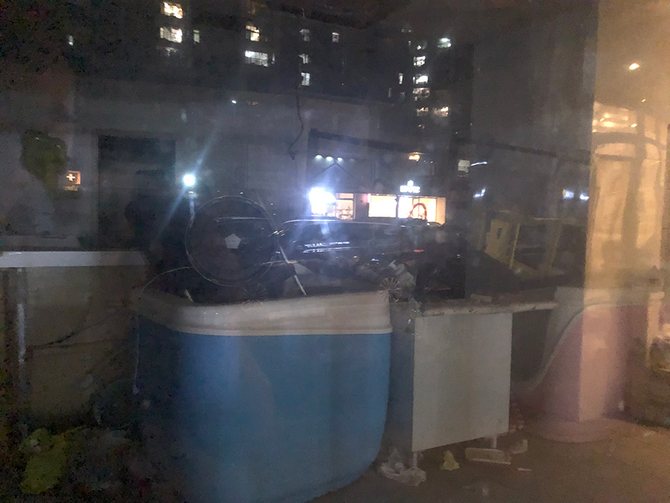

# 网传广州一商铺内有“密室”并发现尸体 警方：正调查中，谣言不可信

_涉事商铺 本文图片均由澎湃新闻记者 庄岸 图_

4月23日下午，针对网传广州番禺一商铺内发现尸体一事，广州市公安局番禺分局工作人员回复澎湃新闻称，目前，警方正在进一步调查中，网上一些谣言不可信，相关情况以警方通报为准。

澎湃新闻走访发现，涉事商铺位于广州番禺区桥某小区，该商铺门口上方贴有“爱婴岛”招牌。目前，商铺大门紧锁，并贴有旺铺转让字样。透过玻璃可见，商铺内已经清场，疑似准备重新装修。

_附近住户称，商铺已关门很久，最近在搞装修_

据多位附近住户、商户介绍，该商铺已经关门很久，一直大门紧锁，最近在装修。今年4月20日，大量警察来到这里，封锁了商铺。后面，有业主看到，警察抬出一个袋子，现场的业主闻到了臭味。事发后，业主之间有互相交流，有人说装修工人发现商铺内有“密室”，并发现了尸体。该说法尚未得到官方证实。

_商铺内已清场，并放有杂物_

4月23日晚，涉事商铺业主张某称，此事与他无关，他也不清楚商铺内的情况。

