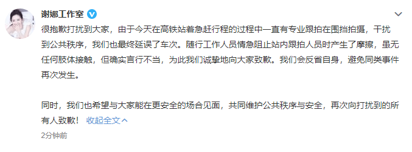

# 网曝随行助理打路人手机？谢娜工作室回应：我们诚挚地向大家致歉

4月22日，张杰、谢娜现身上海火车站，引来不少粉丝围观拍照，在众人走出车站的过程中，张杰谢娜的随行助理突然冲向一名拍摄中的路人，并打断其拍摄，随后谢娜制止了这名工作人员并离开。

稍后，谢娜工作室发文回应了此次冲突事件，表示当时一直有专业跟拍围挡并导致了车次延误，随行的工作人员情急之下和跟拍者产生摩擦，属于不当行为。“我们会反省自身，避免同类事件再次发生。”

编辑：周杨

责编：周尚斗

审核：冯飞

