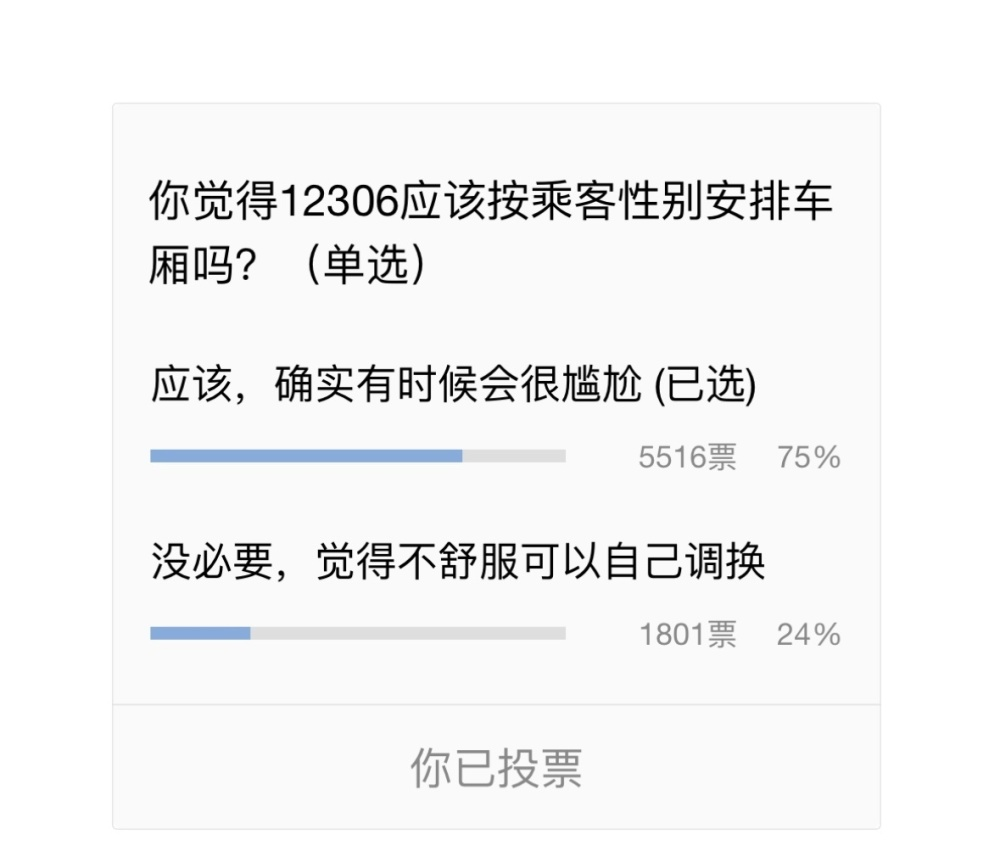

# 铁路软卧能否按性别分配？专家：可考虑在软卧车厢中设置一键报警装置

央广网北京4月23日消息（记者王迟）近日，有女子发帖“吐槽”称自己乘坐软卧过夜车厢时被分配到“3男1女”车厢，四人互不认识，且晚上睡觉时车门会关闭。不少网友也表示，“3男1女”或“3女1男”的车厢分配的确会让人感到尴尬，提出能否按性别选择软卧车厢。

对此，12306回应称暂无这一功能，但会帮忙记录并向上级反馈，如果以后有新规定的话网上会有公告。

根据央广网22日在官方微信公众号发起的“你觉得12306应该按乘客性别安排车厢吗？”投票结果显示，截至当日18点，有7317名网友参与投票，其中75%的网友认为“应该，确实有时候会很尴尬”。

北京交通大学国家交通发展研究院副院长、可持续交通创新中心研究员李红昌表示，这反映了乘客对铁路服务更加精细化的期待，“铁路部门可以通过技术手段实现铁路运输服务质量的不断优化，从而更好地满足不同社会群体的个性化需求。”

他指出，铁路部门可以根据乘客购票时预留的身份信息，通过大数据和算法自动实现相应的票额分配，这需要对现有的售票系统进行一定的优化和改善。“比如是多人同行的一份订单，在票量充足的情况下，系统可以自动分配到一个软卧车厢里。如果是陌生人之间，不能做到男女分车厢的话，可以在男女比例上进行合理分配，尽量避免出现‘3男1女’或‘3女1男’的情况，从而提高乘客的出行体验。”

交通运输部管理干部学院教授张柱庭指出，如今铁路已经实施实名制，相应的服务也应不断提升，从而让乘客能够有更多选择余地。

实际上，12306系统此前就推出了“自动为60岁以上老人优先安排下铺”的功能。铁路12306对网络售票系统进行优化调整，在票量充足的情况下，能自动识别60岁以上的老年旅客并优先安排下铺。如果是多人同行的一份订单，系统也会自动分配相邻座位。

北京交通大学轨道交通控制与安全国家重点实验室首席教授钟章队则指出，在具体操作和实施过程中可能也会遇到一些困难，一方面需考虑成本问题，另外在后续管理上也会比较麻烦。“最简单最直接的方式，就是与其他车厢乘客协商换座。”

此外，李红昌建议，可以考虑在软卧车厢中设置一键报警装置，以此提升乘客的安全感。

（来源：央广网）

