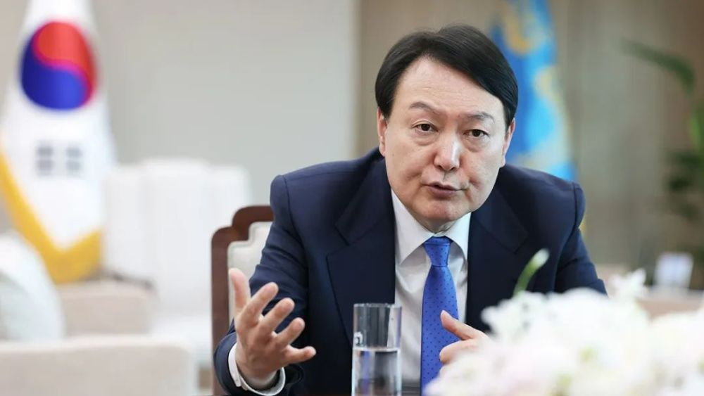

# 韩国在台湾问题上变脸有何企图？媒体：美韩企图把台湾问题国际化

**直新闻：韩国总统尹锡悦就台湾问题发表了错误言论，中国政府已提出严正交涉，但韩国方面还在狡辩，你怎么看？**

**特约评论员 陈冰：**
在尹锡悦即将访美时，提出与美国相同的台海问题立场，超出了中国划的红线，也损害了中韩关系。现在人们有两种推测，一是尹锡悦为了讨好美国，才和美国说同样的话；二是尹锡悦透露出有可能军援乌克兰，引发了舆论漩涡，于是他用更出格的台湾问题表态，来转移舆论焦点。这种解读显然太肤浅，或者说把韩国政府想得太好了。其实，当尹锡悦讲出“反对依靠武力改变台湾问题现状”的言辞后，美国国务院就快速回应，声称美国将继续与韩国协作，来解决台湾问题。很显然，美韩早就在合谋，要韩国加入到美国阵营，努力把台湾问题国际化，把中国内政变成国际事件。也因此，尹锡悦公然声称“台湾问题是全球性问题”，美国国务院则接上话茬，鼓吹美国将和盟国和伙伴协调解决台湾问题。

更为过分的是，尹锡悦居然把台海问题，说成和朝鲜半岛问题一样。朝鲜和韩国虽然同族同种，但是两个国家。这样的比喻，等于认可了民进党当局的“两国论”、“一边一国”等等，是对“台独”的认可，中国当然严厉交涉。

再看看美国财长耶伦的最新讲话，说什么美国将不惜经济为代价，来维护国家安全。加上七国集团外长会上，聚焦台海问题，我们能感知到美国正在撺掇一个把台湾问题国际化的联盟，不惜牺牲与中国的经济联系为代价，实现美国的战略目标。这个计划的第一步，是想让韩国、菲律宾首先悄悄掏空一个中国政策，与美日站到一起，白宫相继接待韩国、菲律宾总统，就是出于此目的；第二步是强化“印太经济框架”，让中国的邻居们减少对华经济和市场依赖，服从于美国战略；第三步是借助七国集团的能量，扩大制约中国的联盟，让韩国和英法德意不必太担心经济损失。意大利总理现在提出考虑是否退出“一带一路”倡议，就是进一步倒向美国的迹象。

在5月广岛举行的七国集团峰会上，七国集团还将推出建立战略性物资供应链的共同文件，保证芯片、稀土等战略物资的供应。广岛峰会很可能把台海问题作为重要议题，拉开企图把台湾问题国际化的帷幕。也就是说，韩国现在在台湾问题上突然变脸，背后显现出的是美国强化“以台制华”策略的险恶用心，要拉起一个团伙来“以台制华”，而不是自己单打独斗。

**直新闻：那么您又怎样看待菲律宾向美国的靠拢，菲律宾不是刚说台湾问题是中国内政，将坚持一个中国政策吗？**

**特约评论员 陈冰**
：没错，菲律宾总统小马科斯在会见中国外长秦刚时说，台湾问题是中国内政，菲方将一如既往恪守一个中国政策。菲方将坚持独立自主，不选边站队，愿深化菲中友好，扩大合作。但是看一个国家的真实立场，要看它怎么做，而不是怎么说。

我们看到的是，菲律宾正和美国快速走近，不仅向美军开放了好几个军事基地，包括在距离台湾最近的吕宋岛北部开放军事基地，而且美菲最大规模军事演习正在进行，目的一是显示美国要在台湾南部区域强化实战能力，为台海局势升级做准备；二是菲律宾与美国合作升级很快，有掺和到台海事务的意图。

我也注意到，小马科斯并没有明确说菲律宾不会介入台海事务，只是说中菲有更多沟通机制。他在尹锡悦访美之后，将对美国进行国事访问，而且菲律宾向美靠拢过于密切，都引起东盟国家的担忧，担心菲律宾卷入台海冲突后，进而把战火引向南海。所以我认为，菲律宾在台海事务上的立场，要通过事实来检验。中国当然已有应对之策，外交部已经向菲律宾发出忠告：一味迎合域外势力，不仅无法维护自身安全，反而将加剧局势紧张，危害地区和平稳定，也必将殃及自身。这话说得很重，但愿菲律宾能听得懂，并且在台海事务中保持正确的姿态。

作者丨陈冰，深圳卫视《直播港澳台》特约评论员

