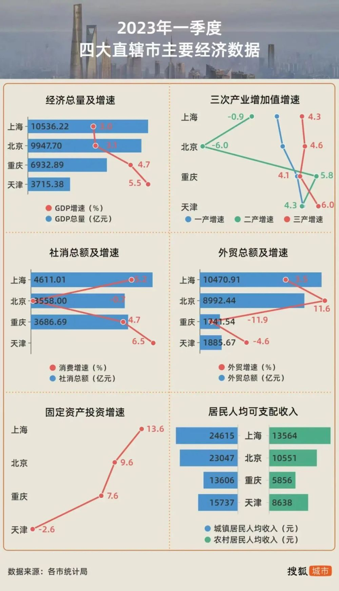
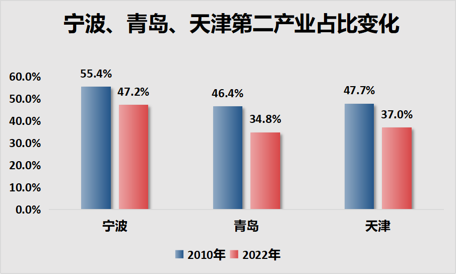
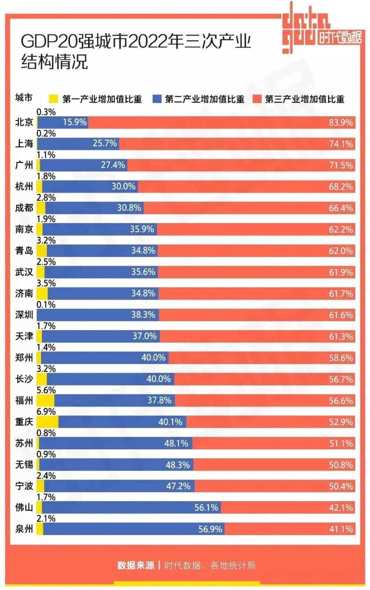

# GDP洗牌！宁波，超天津了

**作者：子非鱼**

**01 | 宁波超天津**

前两天写了天津一季度的GDP增速表现出圈，在四大直辖市中增速第一。

主要是因为，一方面去年一季度天津受疫情影响比较严重，整体基数比较低。

另一方面，天津各项经济指标反弹明显。如一季度，规模以上工业增加值同比增长3.1%，比上年全年回升4.1个百分点；服务业增加值同比增长6.0%，比上年全年加快4.3个百分点；社会消费品零售总额同比增长6.5%，上年全年为下降5.2%。

然而，一季度GDP规模还是被宁波超越了。

_制图：城市财经；数据：宁波、天津统计局_

天津统计局披露：

**一季度天津地区生产总值为3715.38亿元，按不变价格计算，同比增长5.5%，比上年全年加快4.5个百分点。分产业看，第一产业增加值26.62亿元，同比增长4.4%；第二产业增加值1232.56亿元，同比增长4.3%；第三产业增加值2456.20亿元，同比增长6.0%。**

宁波统计局披露：

**地区生产总值3801.8亿元，按可比价格计算，同比增长4.5%。分产业看，第一产业增加值60.5亿元，增长4.9%；第二产业增加值1677.4亿元，增长3.3%；第三产业增加值2063.9亿元，增长5.5%。**

追赶了多年，宁波终于在2023年一季度实现了对天津的超越。这是继2017年对青岛超越之后，宁波位次再一次晋级。

在2017之前，青岛一直领衔宁波，2017年宁波反超青岛15.59亿元，此后的宁波继续扩大与青岛之间的差距，到2022年年末，宁波超青岛783.55亿元。

_制图：城市财经；数据：宁波、青岛、天津统计局_

**02 | 青岛、天津为何会被超越**

其实，在2008年那场全球金融危机之后，受欧美日韩等外围经济低迷拉低需求影响，几乎所有的海运城市发展都开始放缓，如宁波、大连、深圳、苏州、厦门等城市。

然而，深圳在那次危机中，化危机为动力，顺利完成了由基础工业到科创工业的转型，走上了以科创驱动经济发展的道路。此后深圳经济动力更足，在2017年超越了广州，登上了中国内地第三城的宝座。

宁波也迎头赶上，快速化解了这场危机，不断加码传统制造业改造提升，通过培育新动能、重构新模式、激发新活力、腾出新空间，走出了一条破茧成蝶的高质量发展之路，完成了蝶变

青岛和天津则表现得有点后知后觉。

宁波在过去几年里，能够先后超越青岛和天津，主要有两个因素：

**第一，天津主动挤水分，削弱了自身的GDP规模。**

2018年年初，天津官方发布消息，将滨海新区2016年的GDP从10002亿元调整为6654亿元，缩水了三分之一。

本来奔着两万亿而去的天津，在挤水分之后，2018年的GDP从原来18809亿元降到了2019年的14055.46亿元。

排名也从原本全国第六滑落至第十，后来又被南京超越，掉出了前十。

**第二，天津、青岛工业发展受阻，宁波工业强势崛起。**

三座城市都是工业立市。青岛、天津在民国时期一度处在一线城市阵容，与上海组成了“上青天”阵容。

建国后北京作为首都迅速崛起，天津在升格为直辖市后再加上自身厚实的工业底子，经济依旧强劲，北京、上海、天津三座城市再度组成了“京津沪”一线城市阵容。

只不过随着改革开放号角吹响，东南沿海城市强势崛起，广州一路飙升，最终取代了天津，组成了“北上广”一线城市阵容，后来深圳凭借着深圳速度，成功晋级，最终演变成了如今的“北上广深”四大一线城市阵容。

进入新世纪，随着制造业向服务业升级，所有中心城市都开启了疯狂追逐服务业模式。

天津、青岛过去十年位次下降的另一个原因，是脱实向虚速度过快。

数据显示，2010年天津第二产业（广义制造业）占比为53.1%，占总GDP比例超过一半。如今，占比只有37%。

青岛方面，2022年第二产业占比为34.8%，要知道2015年，青岛二产占比还高达43.3%，2010年更是高达48.7%。

同期的宁波，2010年的第二产业占比55.4%，2022年为47.2%，占比合理下滑，广义制造业在经济中占比仍接近一半。

_制图：城市财经；数据：宁波、青岛、天津统计局_

从全球来看，适当缩减第二产业发展第三产业，的确有利于城市的产业升级，有利于城市的可持续发展，但如果过度追求第三产业，放弃第二产业，则是舍本逐末。

制造业是服务业基石，只有两者相互配合，才能相得益彰，否则第三产业便是空中楼阁。

美欧日等发达国家与地区，的确都是依靠第三产业带动经济发展，但是，他们不是不在乎制造业，只是将第二产业迁移到了成本更低的亚洲地区。他们国内负责创新、负责设计，最终的生产放在了其他国家。

这些国家仍拥有强大的工业技术与科技实力，他们不是不追求工业，而是转移了“制造环节”，与之匹配的内容仍在。以美国苹果公司为例，掌握着品牌、设计、标准、专利、营销等等，只是将整个手机产业链上的“制造环节”转移到低成本国家而已。

它们依旧是制造业的霸主，从未放弃过制造业。

所以说，如果只看他们的产业占比数据，必然会被数据所误导。所以说，我们的城市，在追求第三产业的同时，必须始终紧握第二产业，才能步步为营。

在这方面，南方工业城市的表现整体比北方优秀。

青岛、天津最近几年已经觉悟。

**青岛不断造访苏州、深圳等制造业强市，并在“十四五”规划中明确提出，制造业增加值占生产总值比重取代服务业增加值比重。**

天津在2021年发布的《天津市制造业高质量发展“十四五”规划》也明确提出：​

**在新发展阶段将坚持制造业立市，到2025年，天津将基本建成研发制造能力强大、产业价值链高端、辐射带动作用显著的全国先进制造研发基地。**

具体目标是，到2025年，工业增加值年均增长6%以上，目前这个数值为3.6%。制造业增加值占地区生产总值25%，目前占比为21.8%。高技术产业（制造业）增加值占规模以上工业增加值比重40%以上，目前为26.1%。

从数据来看，天津的制造业占比提升较为明显，2020年第二产业占比只有34.1%，2022年已经回升至37%。

青岛则依旧没有多大起色。2020年第二产业占比35.2%，2022年下滑至34.8%。

**03 | 制造业构筑了宁波宽广的护城河**

在青岛、天津迷失的同时，宁波则非常清醒，紧随深圳的脚步，利用新时代的数字技术和5GD技术，开启了大刀阔斧的制造业升级。

过去几年宁波不断培育本土企业特色，学习日本制造业精神，打造单项制造业冠军企业。

和很多综合性企业不同，宁波的企业不是什么都要，而是专攻特长，领域极其细分与专业化。

比如主攻汽车压铸件模具臻至机械，专注于光伏逆变器的锦浪科技，专注商用车发动机冷却风扇总成的雪龙集团，主攻电动窗帘、电动卷帘门电机制造商的杜亚机电，聚焦信息通信用网格式电缆桥架的纬诚科技等等。

宁波的精与专有多厉害？宁波308家单项冠军培育企业中，主导产品市场占有率世界第一的有76家、世界前三的有171家、全国第一的有205家。

简单举几个例子，根据公开资料显示，宁波一家企业生产的安卓手机镜头，市场份额占了全球的33%，相当于每3部安卓手机中，就有1个用的是他们的镜头；宁波一家企业生产智能窗帘电机，年销售额10亿多，全球市场占有率第一；宁波一家企业给全球90%以上缝纫机整机厂配套旋梭，几十年只专注做这一种产品，核心生产设备都是自己研发制造，产量占了全球40%。

正因如此，在工信部发布的前三批次“专精特新”小巨人企业数量排名中，宁波位居全国第三，仅次于上海、北京。在第四批次名单公布后，前四个批次的“专精特新”小巨人企业数量位居全国第四，仅次于京沪深。

_制图：城市财经；数据来源：国家工信部_

**“不求最大，但求最强，不知不觉，不可或缺”的精神，成就了宁波“扫地僧”的美称。**

**也成就了宁波GDP排名不断超越的力量。**

**其实，如果杭州如果不是因为是省会而过度获得了浙江省的资源倾斜，宁波不说超越杭州，至少与杭州的差距不会拉得这么开。**

