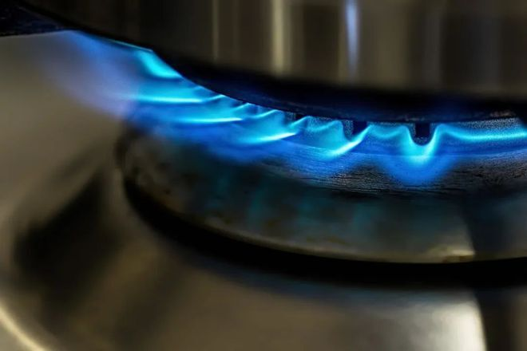
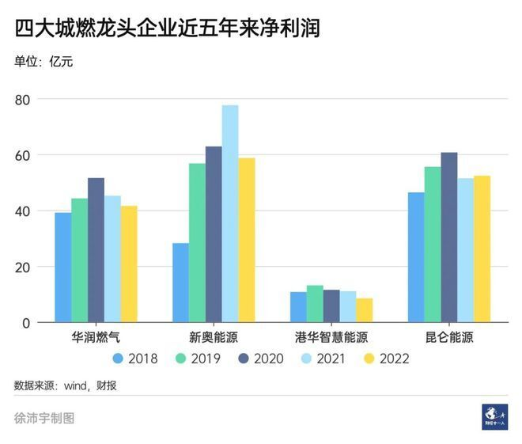
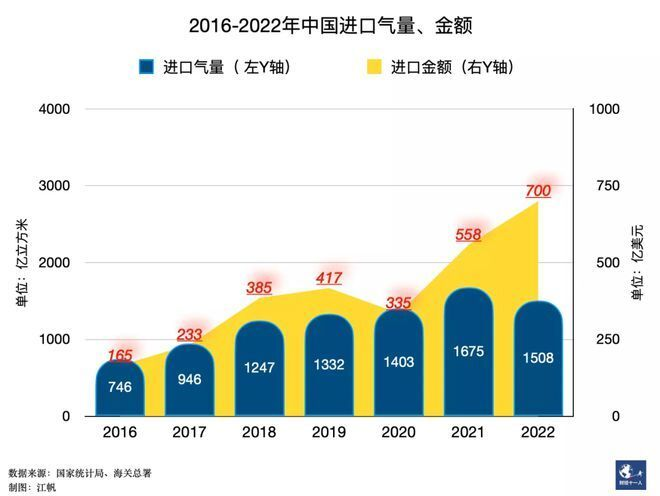
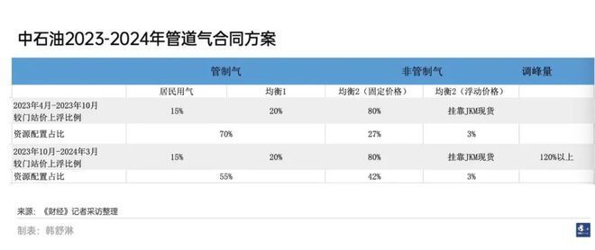
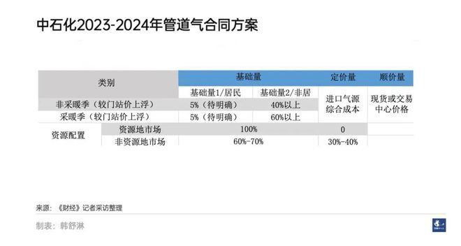
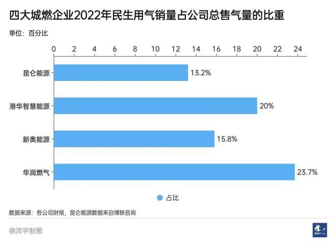

# 上游连年涨价，下游不许提价，燃气公司受不了了

划重点

  * _1_ “三桶油”2023年的销售策略已定，价格比去年上涨15%-80%。燃气公司呼吁政府放开民生用气价格管制，全面实施上下游价格联动。
  * _2_ 由于上游气源价格猛涨，2022年各地燃气公司都利润大降，不少企业还出现亏损，但2023年他们的日子将更加难过。
  * _3_ 多位业内人士表示，国家发改委已在各地调研实施居民用气价格联动机制，近期将考虑出台相关政策。

**文 | 徐沛宇 韩舒淋**

**编辑 | 马克**

由于上游气源价格猛涨，2022年各地燃气公司都利润大降，不少企业还出现亏损，但2023年他们的日子将更加难过。

**《财经十一人》获悉，三大上游企业2023年的销售策略已定：价格比去年上涨15%—80%。**

2023年伊始，中国城市燃气协会一封《关于支持城市燃气企业纾困解难，持续健康发展的建议》 （下称建议）
上呈国家发改委。建议称，2022年是城市燃气发展历史上最惨淡的一年，燃气企业出现大面积亏损，严重影响了城市燃气的安全稳定供应。政府应适时放开民生用气的价格管制，全面实施上下游价格联动。

国内天然气的销售价格分为居民用气和非居民用气两类，前者价格受政府管制，后者基本实现市场化定价。

多位业内人士对《财经十一人》表示，国家发改委已在各地调研实施居民用气价格联动机制，近期将考虑出台相关政策。

但上下游价格联动并不能一药治百病，天然气市场要想发展壮大，还需要深化改革，下一步的重点应该是做好上中游垄断企业的成本监审。

**下游叫苦：“史上最差业绩”**

2022年，城燃龙头企业效益全线下滑：新奥能源 （02688.HK） 净利润同比下滑24.4%，至58.65亿元；华润燃气 （01193.HK）
净利润同比下降26.0%，至47.3亿港元；港华智慧能源 （01083.HK） 净利润同比下滑23%，至9.65亿港元；连中石油旗下的昆仑能源
（00135.HK） 净利润也仅增长了1.7%，为52.28亿元。

**如果没有非天然气销售业务的支撑，龙头企业的业绩表会更难看。**
比如，新奥能源的综合能源业务收入同比增长40.3%，达到109.51亿元；毛利润增加14.0%至15.56亿元。华润燃气的燃气具营业收入为11.49亿港元，同比增长49.6%；安居业务营业额14.44亿港元，同比增长47.0%。

中小城燃企业的效益也普遍下滑，以居民用气为主的城燃企业甚至出现亏损。例如，深圳燃气 （601139.SH） 2022年净利润同比下降19.30%，中华燃气
（08246.HK） 2022年亏损530万元，上海燃气2022年亏损5.89亿港元。

在此情况下，城燃企业一改过去几年积极扩张的态势。比如新奥能源2021年新增城燃项目数量17个，2022年新增项目仅2个。截至2022年底，该公司拥有独家经营权的城市燃气项目总数为254
个。

一家大型城燃企业人士对《财经十一人》说，公司曾以扩大售气规模为首要任务，为此新增、并购了不少项目，现在一般都不谈并购了，而是想怎么出手前两年收购的项目。

**城燃企业效益变差，原因主要有二：一是国际天然气价格上涨，二是疫情下天然气需求下滑。**

中石油经济技术研究院发布的《2022年国内外油气行业报告》显示，2022年，中国进口LNG到岸均价为3.77元/立方米，同比上涨46.3%；进口管道气到岸均价为1.86元/立方米，同比上涨41.3%。

2022年，中国天然气表观消费量3663亿立方米，同比下降1.7%，为历史首次下降。

2022年中国进口LNG进口总量同比下降了19.6%，为近7年来首次下降。

天然气对外依存度下降4.8个百分点，至41.2%，为近5年来最低值。

天然气市场资讯公司来佰特数据科技公司对《财经十一人》分析称，中国天然气消费与GDP呈现高度相关性，
**2022年中国GDP增长3%，那么中国天然气消费理论上至少增长5%，但是实际消费下降1.69%，估算有249亿立方米的需求因为高气价被抑制。**

**上下游签的是不平等合同吗？**

除了国际气价高涨和终端用户需求下降，城燃企业还将矛头指向上游企业。

天然气产业市场化改革之后，合同的签订与执行是上下游企业运营的核心。

中石油与下游企业签订的售气合同里，分为居民用气、均衡一、均衡二和调峰气量。其中，居民用气和均衡一为价格较低的气量，均衡二和调峰气量则价格较高。

2023年，中石油天然气合同方案是：非采暖季里，均衡一管制气和均衡二非管制气的分配比例为70%和30%；采暖季，管制气和非管制气分配比例为55%和45%，其中均衡一较门站价上浮20%，而均衡二的气量有3%的气量为浮动价格，挂靠JKM
（市场机构普氏发布的日韩LNG现货到岸价格） 价格，其余气量较门站价上浮80%。

相比2022年，中石油2023年的居民气价都调整为较门站价上浮15%，而2022年为上浮5%。在非管制气的均衡气量部分，2022年定价分为三档，淡季上浮40%至80%，旺季上浮70%-80%，而2023年则统一调整为上浮80%。此外，全国管道气均有3%的气量挂靠JKM现货价格。
**这意味着城燃企业的2023年的采购成本比2022年更高。**

中石化、中海油的国内自产气资源少于中石油，其销售合同的定价基本上以中石油价格为基准，根据市场行情略微上下浮动。

以中石化为例，其2023年管道气合同方案显示，气量分为基础量和定价增量。基础量中的居民气量上浮5%，基础量的非居气量部分价格相对较低。在非资源地市场，基础量大约占合同总量的60%到70%，但价格为较门站价上浮40%以上
（采暖季） 和60%以上 （非采暖季）
，定价增量则参考进口气的综合成本来定。这意味着合同的大部分气量价格比中石油的均衡一气量价格要高。增量用气价格随行就市，取决于国际天然气市场的价格。

北京世创能源咨询有限公司 （下称世创能源）
副总工程师徐博对《财经十一人》介绍说，中石油制定这种合同范式参考了国外的经验，主要目的是要向下游企业分摊高价进口气的成本，以保证合理收益。年初的时候，中石油方面会预估一下当年的国际气价，以及进口量，然后制定合同里具体的价格条款。

**但下游企业认为，上游企业制定的合同太过复杂，不同气量的划分、价格上浮依据都不透明，且没有议价权。在上一采暖季，河北曾因为价格倒挂、城燃企业经营困难而出现气荒。**

2023年1月中旬，国家发改委要求2月底前，各省有关部门要组织完成本行政区域内天然气中长期合同签订工作，签订有量有价的合同，上游供气企业要与城燃企业单独签订民生用气合同。

据《财经十一人》了解，2月中旬，地方发改部门曾要求城燃上报天然气用气量，其中包括民生用气气量、工商业用气气量和总用气量。上游企业也在同期让城燃企业上报相关气量，再报予地方发改部门，但气量统计上报之后，尚无实质性后续措施出台。

例如，单独签订民生用气合同并没有在目前的合同方案中明确体现，下游企业抱怨的包括煤改气在内的民生用气气量核定和定价，也还有待有关部门进一步的政策落实。

2023年3月的中国发展高层论坛期间，中石化总经理赵东曾对《财经十一人》表示，去年天然气价格主要是受俄乌冲突的短期影响，今年大家都有所准备，而且全年价格应该会比去年低。对于主管部门提出的民生用气合同单签要求，赵东表示“相信主管部门会有进一步协调”。

**除了合同内容和价格，结算方式也招致城燃企业不满。目前，上游企业向下游普遍推行照付不议、偏差结算的合同。**

**照付不议** 是指约定时间内，在卖方履行了照供不误义务的前提下，买方无论是否从卖方处实际提取货物，都有义务按照双方约定的价格和最低提货数量支付价款。

照付不议条款一般要求合同期限大于一年。而国内天然气产业随着市场化的发展，上下游合同往往不满一年，故该条款时常引起上下游之间的纠纷。因此，上游企业改用偏差结算的方式作为照付不议条款的替代。

**偏差结算** 条款的核心是在合同中约定买方在某一时段内 （常以月来确定）
需要提取的最小气量，如果供气时段内买方实际提取气量少于约定的最小气量，则买方必须向卖方支付违约金；作为对应，如果卖方在某个供气时段内未能供应合同规定的最小月气量，卖方就已供气量给予买方一定的优惠计价。

城燃企业认为，上游企业每年单方面制定天然气购销制式合同，且不允许修改，此类条款属于不平等条款。当月度使用量未达约定气量时，会导致实际结算价格高于合同价格，侵害了城燃企业的权益。

阳光时代律师事务所高级合伙人、天然气事业部负责人陈新松对《财经十一人》分析说，照付不议、偏差结算条款都是天然气贸易中常用的模式，一般来说上下游企业的权益和义务是对等的。不过，在气源紧张的时候，上游地位将更加强势。

陈新松说，以合同为准是天然气产业市场化发展的方向。下游企业的选择权在逐渐增加，合同纠纷也在增多。目前中国天然气市场还不成熟，要求企业尊重合同、遵守契约的同时，主管部门也需要加强监管，推动上下游企业签订更平等的合同。

**上下游价格联动管用吗？**

在国际气价高涨的情况下，上游企业日子比下游企业好过的关键在于：上游企业销售的天然气已实现市场化定价，而下游则尚未市场化。居民用气价格受政府管制，鲜少变动；非居民的城市公共事业用户，例如学校医院等用气价格调整也需政府主管部门审核。

2022年，居民和公共服务的城市燃气用气量为972亿立方米。世创能源副总工程师徐博说，这部分用气价格即使仅上调0.1元/立方米，全国城市燃气企业的日子就会好过很多。

《财经十一人》采访的多家城市燃气企业人士呼吁，理顺天然气价格机制，逐步放开下游销售价格管制，实现上下游价格联动。

据城市燃气协会统计，目前，全国30个省、市(20个省级单位和10个省辖市单位)在上下游价格联动机制方面出台了政策。其中，9个单位仅有居民天然气价格联动机制文件，9个单位仅有非居民天然气价格联动机制文件，12个单位同时有居民与非居民价格联动机制文件。

城市燃气协会的上述建议称，国家层面没有对价格联动机制提出统一、规范的要求，更缺乏对价格联动机制的监管，导致各地自行其是。绝大部分地区的上下游价格联动机制形同虚设。有的地方居民气价十年未调整，例如，武汉市居民用气销售价格自2012年以来始终为2.53
元/立方米。

价格鲜少调整的同时，居民用气量在逐年增长。从龙头企业财报看，2022年，华润燃气民用气销量增幅最大，达到11%，新奥能源民用气增幅为9.5%，港华智慧能源民用气增幅为8%。

**多家城市燃气企业人士告诉《财经十一人》，上游提供的低价气不足以覆盖民用气销量，不足部分只能由燃气公司亏本补足。某中型城燃企业称，该司全年民生用气量中约有30%-35%需采购高价气来补充。**

对于民生低价气总量是如何确定的，中石油和中石化均未回复《财经十一人》的问询。

2023年2月，国家发改委在多地调研是否出台天然气产业上下游价格联动政策。多位业内人士对《财经十一人》透露说，近期国家发改委可能会出台上下游价格联动的政策，主要针对居民用气的价格调整。但预计只是一个基准政策，给各地提供一个调价的参考标准，具体的执行情况仍由各地自行决定。

徐博建议，价格主管部门可制定一个居民用气的价格形成公式，参考成品油调价的模式，固定调价周期，比如一个月调整一次，有涨有跌，这在日本等天然气市场成熟的国家已有现成经验。

**徐博说，此前工商业用户承担高价，变相补贴了居民用气，但这削弱了使用天然气的工商企业的产品竞争力。这种交叉补贴短期来看提高了居民消费量，稳定了物价水平，但不符合天然气市场改革的初衷。**
居民用气季节性波动最大，储气设施也主要是应对居民消费的季节性不均匀，这些因素客观上要求居民用气的价格必须及时调整。相反，工商业企业用气稳定，价格弹性小，价格本应更低。如果居民用气取消价格限制，工商业用气的价格就有条件下调，这有利于提振整体的天然气需求。

若国际气价继续上涨，价格联动实施后将如何保障弱势群体的利益？

来佰特数据科技报告称，可借鉴欧盟的做法补贴弱势群体。例如，2022年德国出台2000亿欧元的《一揽子能源价格刹车方案》，精准发放相关补贴，包括：上调退休金、对贫困人员发放取暖补贴，对儿童、学生发放补贴等。

**应加强垄断企业的成本监审**

上下游价格联动是目前政策上唯一能做的，但这不能解决所有问题，因为当国际气价格特别高时，价格不可能完全顺到消费端。

**《财经十一人》综合多位业内人士的观点如下：要扩大天然气的市场规模，需要降低整个产业链的成本，下一步的监管重点应该是上游和中游的成本监审。**

一家中型城燃企业负责人表示，公司的工业用户多为初加工、附加值低的企业，天然气价格承受能力较弱，当前的气价已超出终端用户的承受力。特别是用气量大或对气价敏感的工业用户，已经着手寻找替代能源来降低生产成本。

**中国石油大学教授刘毅军说，在中国天然气市场，需求方的话语权相对较弱，上游供应方处于强势地位，因此上游比较容易向下游传递高价。**
但上游应该传递多少，或者说上游的利润率多少合适，这就需要政策监管部门做好成本监审和价格监管。

**一位不愿具名的城燃人士抱怨说，上游企业一直说进口气价格太高，具体是高多少，你成本控制如何？外界都不知道。**

多位业内人士还对国家油气管网公司的运营提出了质疑：管网作为中游，独立运营后，管输费不降反增，加重了下游企业的负担。作为公用事业性质的国家油气管网公司，利润率不应该太高。

2022年，国家油气管网公司实现主营业务收入1122亿元、同比增长11.2%，净利润319亿元、同比增长7.2%。粗略估算其净利润率接近30%。

自2022年1月1日起实施的《天然气管道运输价格管理办法(暂行)》指出，国家油气管网公司下属管道的准许收益率按照8%确定，后续统筹考虑国家战略要求、行业发展需要、用户承受能力等因素动态调整。

**工业部门是天然气消费的主力，对天然气价格变化更加敏感。**
在控碳、降碳的目标下，经济社会发展还需加大天然气的使用规模，这就需要天然气价格有所降低。那么，上游、中游以及下游城市燃气行业的成本监审都需要加强。

如果国际气价继续上涨，且完全向下游传递的话，部分中国工业企业的竞争力将受到影响。这一幕在欧洲已经发生。

国际能源巨头壳牌集团近日发布的《液化天然气（LNG）前景报告2023》称，由于俄乌冲突导致欧洲进口天然气价格猛涨，欧洲天然气需求被抑制。这对欧洲工业造成了较大打击，化肥、化工、钢铁、水泥等工业部门产量都有不同程度的减少。

