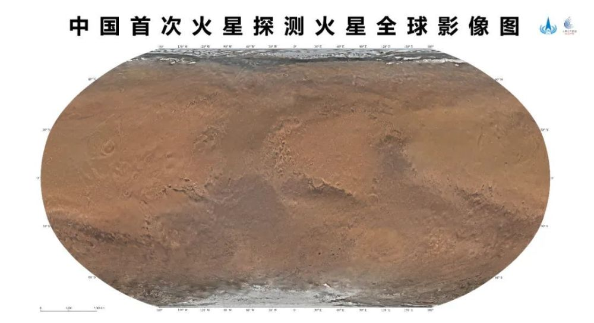
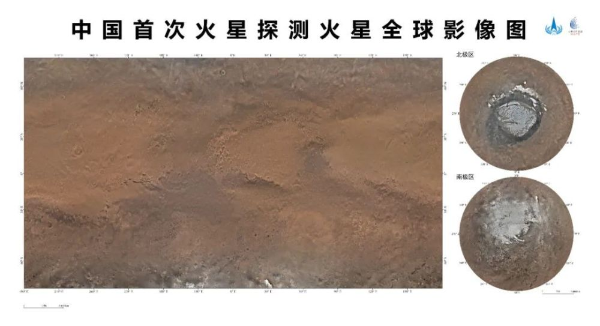

# 中国发布火星全球影像图，火星上也有了西柏坡、天柱山、漠河

4月24日，在2023年“中国航天日”主场活动启动仪式上，国家航天局和中国科学院联合发布了中国首次火星探测火星全球影像图。

本次发布的影像图为彩色，包括按照制图标准分别制作的火星东西半球正射投影图、鲁宾逊投影图和墨卡托投影加方位投影图，空间分辨率为76米，将为开展火星探测工程和火星科学研究提供质量更好的基础底图。天问一号任务获取的包括影像图在内的一批科学探测数据，将为人类深入认知火星作出中国贡献。

天问一号任务环绕器中分辨率相机，于2021年11月至2022年7月历时8个月，实施了284轨次遥感成像，对火星表面实现了全球覆盖。地面应用系统对获取的14757幅影像数据进行处理后得到火星全球彩色影像图。

_东西半球正射投影图_

_鲁宾逊投影图_

_墨卡托投影加方位投影图_

科学研究团队通过火星高分影像，识别了着陆点附近大量的地理实体，国际天文联合会根据相关规则，将其中的22个地理实体，以中国人口数小于10万的历史文化名村名镇加以命名。将中国标识永久刻印在火星大地。

_22个地理实体分布图_

天问一号探测器于2020年7月23日成功发射，经历202天的奔火飞行，成功进入环火轨道。

2021年5月15日，着陆巡视器降落在目标着陆点，祝融号火星车开展巡视探测。

至2021年8月15日，火星车完成90个火星日的既定探测任务后，继续实施拓展任务，已累计巡视探测358个火星日，行驶1921米，目前仍处于休眠期。

至2022年6月29日，环绕器实现了全球遥感探测，目前已运行超过1000天，状态良好，继续在遥感使命轨道开展科学探测，积累原始数据。

**首次火星探测任务一步实现火星环绕、着陆和巡视探测目标圆满完成。**

**任务携带的13台载荷累计获取原始科学数据1800GB，形成了标准数据产品。** 科学研究团队通过对一手科学数据的研究，取得了一批原创性科学成果。

利用环绕器高分辨率相机获取的着陆区亚米分辨率地形数据对着陆区分布的凹锥、壁垒撞击坑、沟槽等典型地貌开展的综合研究，揭示了上述地貌的形成与水活动之间存在的重要联系。

通过相机影像获取的火星车车辙图像数据研究，获得了着陆区土壤凝聚力和承载强度等力学参数，揭示了着陆区表面物理特性。

通过对火星表面成分探测仪数据研究，发现巡视区近期水活动证据，揭示晚亚马逊纪（7亿年前）火星水圈比传统认知的更加活跃。

通过对火星车双频全极化雷达获得的着陆区地下分层信息研究，发现火表数米厚的风沙尘下约30米和80米存在两套向上变细的沉积层序，揭示距今30亿年以来多期次水活动相关的火星表面改造事件和地质过程。

通过对火星车导航地形相机、火星表面成分探测仪和火星气象测量仪获取的数据开展综合分析，发现了巡视区存在距今约7.6亿年的盐水活动和现代水汽循环的证据。

上述原创性成果已在《自然》（Nature）、《自然-天文学》（Nature Astronomy）、《自然-地球科学》（Nature
Geoscience）、《科学进展》（Science Advances）、《国家科学评论》等国内外权威学术期刊发表。

文字｜杨璐 李佳威

设计｜毛京东

编辑｜王舒颖 李嘉欣

