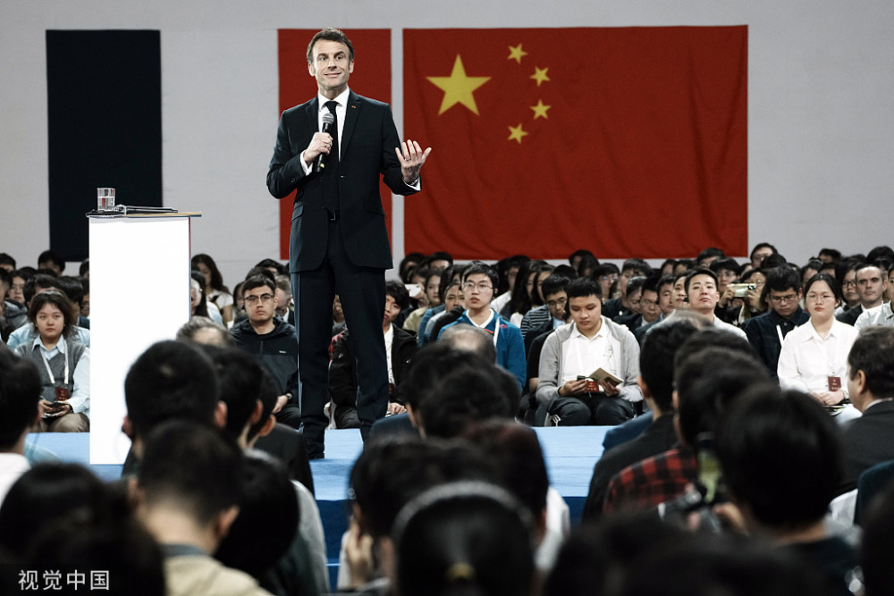
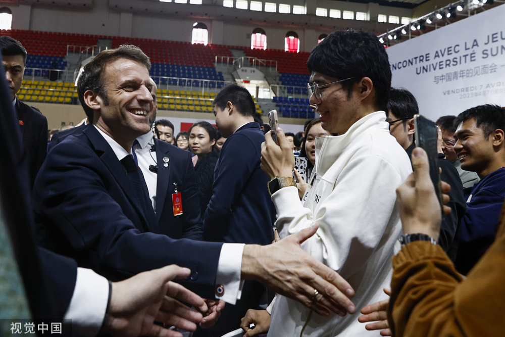

# 中国驻欧盟使团团长傅聪：中俄关系“无上限”，中欧同样如此

中国和欧盟国家之间的互动近期密切起来。四月初，法国总统马克龙和欧委会主席冯德莱恩联袂访华，将中欧最新一轮接触推向了高潮。

在此次访华途中接受法国和美国媒体采访时，马克龙数次强调：欧洲应当追求战略自主，而不应只是去“适应世界上其他地区的人的议程”。他还说，为了避免欧洲沦为“附庸”，欧洲国家应该在未来几年加大对军事国防、科技、能源的投入，让欧洲成为美国和中国之外的世界“第三极”。

_2023年4月7日，广州，法国总统马克龙在中山大学发表演讲。视觉中国
图_

尽管马克龙的表态并没有在中美之间“选边”的意味，但仍迅速在大西洋两岸引起热议。欧洲内部和美国的一些批评声音质疑其“对华软弱”；但也有支持者认为马克龙的表态符合法国外交传统政策。

在马克龙和冯德莱恩以及随后德国外长贝尔伯克的访华议程中，中欧双方在乌克兰问题上的讨论受到外界重点关注。俄乌冲突爆发已超过一年，中国前不久正式发布了《关于政治解决乌克兰危机的中国立场》。自那之后，中国外交官员已在多个渠道反复强调，中国愿继续就劝和促谈、政治解决冲突，同包括欧方在内的各方一同努力。这个中国立场在本轮中欧中法的最高级别接触中，也得到了欧方和法方的正面回应。

中国驻欧盟使团团长傅聪大使近日接受了澎湃新闻（www.thepaper.cn）专访，谈及了欧盟谋求“战略自主”，乌克兰问题上中欧的沟通以及中方立场等多个话题。

_傅聪 中国驻欧盟使团提供_

在专访中，傅聪大使谈到，中欧关系是多面向的，不是单一议题的；中欧关系不针对、不依附、也不受制于第三方，不应将中欧关系与乌克兰问题捆绑。

“对于（中俄关系）‘无上限’的提法，欧方也应正确理解。中国一贯坚持在和平共处五项原则的基础上同各国发展友好合作关系。我们也始终认为，各国友谊与合作是无止尽的，不应该人为设限。中俄合作是‘无上限’的，中欧同样如此。”傅聪大使说。

“要对利用中俄关系挑拨中欧关系的图谋保持警惕。”傅聪大使说，“一些国家、一些人士反复编造炒作所谓中国‘事先知情’、中俄合作‘无上限’、中国提供武器等虚假信息。他们的目的就是造谣抹黑中国、挑拨中国同其他国家关系，实现其不可告人的目的。”

**采访全文如下：**

**中方支持欧洲联合自强，坚决反对搞阵营对抗**

**澎湃新闻：**
马克龙总统访华期间受到中方礼遇，也引起国内外广泛关注。他再度强调欧洲应谋求战略自主，而非在与欧洲并无直接关联的国际问题上紧紧跟随美国。但此番表态遭到美英媒体、一些政府官员和智库人员的猛烈批评，中方对这种舆论反应是否已有预计？这类舆论上的干扰和杂音有没有让中方调低对马克龙访华后成效的预期？

**傅聪：**
今年是中欧建立全面战略伙伴关系20周年。4月5日至7日，法国总统马克龙和欧盟委员会主席冯德莱恩一道访华，体现了欧方发展对华关系的积极意愿，符合中欧共同利益。在访问中，习近平主席同两位领导人进行深入交流，强调中方始终视欧洲为多极化世界的独立一极，支持欧洲实现战略自主，坚持中欧关系不针对、不依附、也不受制于第三方。

我注意到欧洲就“战略自主”展开了热烈的讨论。作为启蒙运动的发源地，欧洲不乏有识之士，针对当前局势发出了坚持战略自主、避免卷入集团对抗的声音。中方支持欧洲联合自强，坚决反对搞阵营对抗。

中国有句古话：“自助者人恒助之。”作为国际舞台上的一支重要力量，欧洲保持独立自主才能行稳致远，才能赢得更多尊重和更多朋友，才能为世界的和平与繁荣做出贡献，这是不言自明的道理，我相信越来越多的欧方人士会对此有清晰的认识。

**澎湃新闻：**
在一些西方媒体看来，马克龙总统和冯德莱恩主席在华的接待规格、媒体关注度和话题度上存在所谓“温差”，他们进而暗示中方在与单个欧盟成员国和欧盟机构打交道时有意采取了不同策略。实际上的情况是怎样的？如今欧盟方面对自身是否能“用一个声音说话”日益敏感，中方怎样解读这种敏感性？

**傅聪：**
欧盟委员会主席冯德莱恩此次访华，是继去年12月欧洲理事会主席米歇尔访华之后，中国同欧盟之间又一次重要的战略沟通，延续了近期中欧高层交往的良好势头。习近平主席同冯德莱恩主席会见，并同马克龙总统和冯德莱恩主席共同举行中法欧三方会晤。李强总理同冯德莱恩主席举行会见。中欧领导人深入交流，坦诚沟通，取得积极成效。此访发出了中欧加强沟通接触，推进双、多边对话合作，建设性管控分歧的积极信号，有利于中欧全面战略伙伴关系稳定发展，有利于为国际局势注入稳定性。欧方对此访中方的接待表示满意。

中欧关系具有全球影响和世界意义，值得双方努力维护好、发展好。中欧关系保持向前向上势头，坚持互利共赢符合中欧和国际社会的共同利益。中方始终从战略高度和长远角度看待中欧关系，希望欧方形成更为独立、客观的对华认知，奉行务实、积极的对华政策，同中方一道，推动中欧关系行稳致远。

_2023年4月6日下午，北京，国家主席习近平在人民大会堂同法国总统马克龙（中）、欧盟委员会主席冯德莱恩（左）举行中法欧三方会晤。视觉中国
图_

**不应将中欧关系与乌克兰问题捆绑**

**澎湃新闻：**
目前在欧盟层面，对华关系的方方面面都被放到乌克兰危机的背景下来审视。对于乌克兰问题在中欧关系中的重要或优先程度，博雷利高级代表在他近期的文章中也有所提及。您的看法是什么？能否用乌克兰问题来框定中欧关系？

**傅聪：** 乌克兰危机确实是欧洲国家当前最关心的事情，也是欧洲人看待其他问题的“背景板”。欧方很多人的确从乌克兰问题的棱镜看待中欧关系。

去年底到任以来，我反复向欧方强调，正如中国同任何国家的双边关系一样，中欧关系是多面向的，不是单一议题的，中欧关系不针对、不依附、也不受制于第三方，不应将中欧关系与乌克兰问题捆绑。
**中国既不是乌克兰危机的制造者，也不是危机的当事方，中国也是这场危机的受害者，在乌克兰危机上指责中方完全站不住脚。**
事实上，欧方有识之士也是这样认为的。欧委会主席冯德莱恩访华期间明确表示，中方不是乌克兰危机的制造者，欧方赞赏中方为推动政治解决乌克兰危机所做努力，期待中方发挥更加重要作用，愿同中方合作，找到劝和促谈的办法。总而言之，双方日益认识到，乌克兰问题不应成为中欧之间的问题，更不应成为双方交流合作的障碍。

我也不断向欧方介绍了中方的立场。中方在乌克兰问题上的立场是一贯、明确的，发布了关于政治解决乌克兰危机的中国立场文件，核心就是劝和促谈、政治解决。正如习近平主席近期会见法国总统马克龙时所强调的，化解危机没有灵丹妙药，需要各方从自身做起，通过积累互信创造止战和谈条件。中方支持欧方从自身根本和长远利益出发，推动尽快重启和谈，兼顾各方合理关切，构建均衡、有效、可持续的欧洲安全框架。

**澎湃新闻：**
中国已经通过立场文件传达出一种不同于西方的、以和平为指向的平衡立场。但欧洲一些人士对停火实现和平的提法有所质疑，称若是现在停火等于坐视俄罗斯击败乌克兰。您对这种观点有何看法或回应？

**傅聪：**
确实，我们的立场是平衡的、正义的，始终站在和平一边，也同大多数国家站在一起。我们的目标就是实现和平，方式就是劝和促谈。我们认为，任何冲突都没有赢家。在俄乌冲突中，现在每天都有许多士兵和平民遭到无谓杀戮，这令人痛心。因此，当务之急是停火止战、挽救生命。事实上，很多欧方官员都强调，
**无论中欧有何分歧，但有一个“公约数”，那就是应尽最大努力实现和平。** 我认为这是中欧共同努力的基础。

值得注意的是，现在有一些势力和人士极力主张彻底击溃俄罗斯，似乎为此不惜流尽乌克兰人民的最后一滴血。他们对于支持和谈的倡议一律拒绝，在这些人的字典里恐怕没有“和谈”这个词。我们则认为，通过谈判政治解决是唯一正确出路。各方都应坚持外交努力，回到谈判桌，寻找各方都能接受的解决办法。当然，我们对于乌克兰危机的复杂性、艰巨性有着清醒认识，和平的实现需要诸多利益相关方的基本共识。但办法总比困难多，无论问题多复杂、挑战多尖锐，只要双方坐下来对话，和平就多了一分希望。中方将继续为停火止战、缓解危机、恢复和平发挥建设性作用，期待着其他国家也朝这一方向共同努力。

_2023年4月7日，广州，法国总统马克龙访问中山大学。视觉中国
图_

**澎湃新闻：**
欧方在提及乌克兰危机的时候反复引用中俄两国关系“无上限”的提法，从而质疑中方的立场是否是中立的。您在工作中是否受到这个问题的困扰？您是如何对他们解释的？

**傅聪：**
欧方一些人士此前曾反复提及这个问题，存在一些误解和偏见，我也就此做了不少阐释。首先，欧方应正确看待中俄关系。中俄互为彼此最大邻国，两国发展长期睦邻友好关系，符合历史和现实逻辑，符合双方人民利益，也符合国际社会的期待。中俄关系坚持不结盟、不对抗、不针对第三方，坚持相互尊重、相互信任，不仅促进各自发展振兴，也努力维护国际公平正义，树立了新型大国关系典范。习近平主席上月成功对俄进行国事访问，进一步擘画了中俄关系的发展蓝图。对于“无上限”的提法，欧方也应正确理解。中国一贯坚持在和平共处五项原则的基础上同各国发展友好合作关系。
**我们也始终认为，各国友谊与合作是无止尽的，不应该人为设限。中俄合作是“无上限”的，中欧同样如此。**

同时，我们也要对利用中俄关系挑拨中欧关系的图谋保持警惕。乌克兰危机发生以来，中国到底做了什么、没做什么，我们光明磊落、坦坦荡荡。但我们看到，一些国家、一些人士反复编造炒作所谓中国“事先知情”、中俄合作“无上限”、中国提供武器等虚假信息。他们的目的就是造谣抹黑中国、挑拨中国同其他国家关系，实现其不可告人的目的。令人高兴地是，越来越多欧方人士开始看清这些人的虚伪面目和险恶用心，努力在中欧关系上保持客观理性态度。

**沙伊“破冰”，对解决乌克兰危机具有重要借鉴意义**

**澎湃新闻：**
最近中国在外交舞台上的表现活跃，例如沙特和伊朗代表团在北京签订了关于恢复外交关系的协议。这些都引发世界舆论对乌克兰问题之外的一些国际热点议题的关注。“世界上不只有乌克兰危机”，这是否成为中方向欧盟传递的一个有力信号？欧盟方面对此如何考量？

**傅聪：**
根据习近平主席同沙伊两国领导人达成的重要共识，在中方积极斡旋下，沙特和伊朗在北京举行对话并取得重大成果，双方宣布恢复外交关系。这掀开了沙伊关系新的一页，引发了周边国家的积极连锁反应。正如中央外办主任王毅、国务委员兼外长秦刚指出，这是对话的胜利、和平的胜利，沙伊握手言和的一小步，也是人类跨越冲突、实现和解的一大步。习近平主席提出构建人类命运共同体的重大理念，去年又提出全球安全倡议，我想这次重要外交行动正是将它们由理念转化为行动的一次非常成功的实践。

国际各方对此高度关注。联合国、阿拉伯国家联盟等国际机构等高度评价这一“外交突破”。德国、法国、意大利等欧洲主要国家以及欧盟等发表声明表示欢迎，赞赏中方发挥的积极作用，强调这对缓解地区紧张局势具有重大意义。有评论认为中国“把看似不可能变成可能”。也有评论认为，这充分证明中国是“多边对话的可靠中间人和支持者”，体现了负责任大国的担当。

**沙伊关系历经七年终于重新“破冰”和解，这对解决包括乌克兰危机在内的其他国际热点问题具有重要借鉴意义。**
一是要坚持政治解决、谈判解决。越是困难重重，越要为和平留下空间；越是矛盾尖锐，越不能放弃对话努力。二是要坚持减压降温，避免火上浇油。在乌克兰危机上，要鼓励和支持一切有利于缓和局势的努力，但也看到，一些国家仍然不断拱火递刀，同时从中牟利、大发战争财，这显然无助于危机解决。三是要合作应对外溢效应。正如你提到的，乌克兰危机引发许多“次生问题”，也加剧了既有的问题和困难，发展中国家受到的冲击和影响尤甚。我注意到，在今年慕尼黑安全会议等国际场合，一些非洲、南美国家领导人都认为，这场冲突正在消耗西方的时间、金钱和注意力，而忽视了其他紧迫问题。欧盟领导人最近反复提到，需要更多倾听发展中国家的声音，我希望欧方能言出必行。

**澎湃新闻：**
自从俄乌冲突爆发以来，美国因素在欧盟的对外关系中表现得越来越明显。同时我们也看到，欧盟和成员国领导人多次在口头上强调战略自主，欧盟是否做到了言行合一？在中方看来，欧方做出什么样的具体行动，会增强其战略自主提法的说服力？

**傅聪：**
你的问题提到了中欧关系的两个外部因素，一是乌克兰危机，二是美国对欧盟的影响。我想强调的是，中国对欧政策保持长期稳定，将欧洲视为战略伙伴，认为中欧是两大力量、两大市场和两大文明，坚持对话与合作对世界意义重大。
**欧方不应透过乌克兰危机的棱镜看待中欧关系，更不能以牺牲中欧关系和中国利益为代价发展对美关系。**
近期，越来越多的欧洲政治家对欧洲战略自主表示支持和认同，呼吁重视对华关系，反对盲目追随美国对华政策。我们希望并相信，欧盟有勇气、有智慧、有能力实现真正战略自主。

**澎湃新闻：**
冲突延宕至今已经一年有余，在西方媒体渲染欧洲大力军援乌克兰的叙事之外，我们也看到西欧民间已流露出一些对战火持续的不满情绪。您赴任大使以来看到的欧洲社会的实际情况是怎么样的？

**傅聪：**
应该说，俄乌冲突导致欧洲大陆重燃战火，对欧洲来说是一次重大的地缘政治事件，欧洲领导人称其为“紧要关头”、“分水岭”或是“转折点”（Zeitenwende）。有评论认为，二战后延续近70年的和平红利正在消失，地缘政治回归欧洲大陆，安全问题重新成为欧洲的主导议题。因此，一段时间以来，乌克兰危机成为欧洲各界关注的首要议题。

目前，危机延宕已经一年有余。从我的观察看，挺乌仍然是欧洲主流的“政治正确”，但反思的声音确实在增多。一些人在思考这场危机爆发的深层原因，积极探寻解决思路。不少人关注危机所带来的外溢效应，包括粮食、能源、移民、产业链等领域的问题，呼吁采取切实措施予以解决。

同时，我也很高兴看到，对中方立场的认同和理解也在增多。法国总统马克龙、欧委会主席冯德莱恩刚刚访华，都积极赞赏中方为推动政治解决乌克兰危机所作努力，期待中方发挥更大作用。我接触的不少欧洲政商学界人士也表达了同样的观点和期待。

**澎湃新闻：**
建立在此次访问的基础之上，作为驻欧盟大使，您认为下一步推进中欧关系的抓手在什么领域？您希望下阶段欧盟方面以及国内各界能够在中欧关系发展方向上如何抓住机遇和避免误判？

**傅聪：**
当前，中欧关系发展迎来暖春，面临新的契机。到任这几个月来，我深切感受到欧方各界对于推动中欧对话合作的热情和期盼，令我倍受鼓舞，也深感责任重大。我有信心在中欧领导人的战略指引和各界共同努力下，双方将进一步密切交流合作，推动中欧关系取得更大发展。下阶段，中欧还有很多重要的积极议程要推进。双方要相向而行，加快落实领导人达成的重要共识，全面重启各领域交流对话，稳固中欧友好合作主基调。

**举办新一次中欧领导人会晤是今年中欧双方最重要的政治议程，目前双方正加紧对接，积极推进各项筹备工作。**
相信本次领导人会晤将达成更多共识和成果，为中欧关系发展注入新动能。中欧合作具备坚实基础，拥有广阔前景。双方要进一步拓展合作机遇，深化更高水平合作，共同做大合作的蛋糕，实现互利共赢。双方还要以建设性态度加强沟通协商，秉持正确认知，妥善管控分歧，保持中欧关系沿着正确的轨道向前发展。

