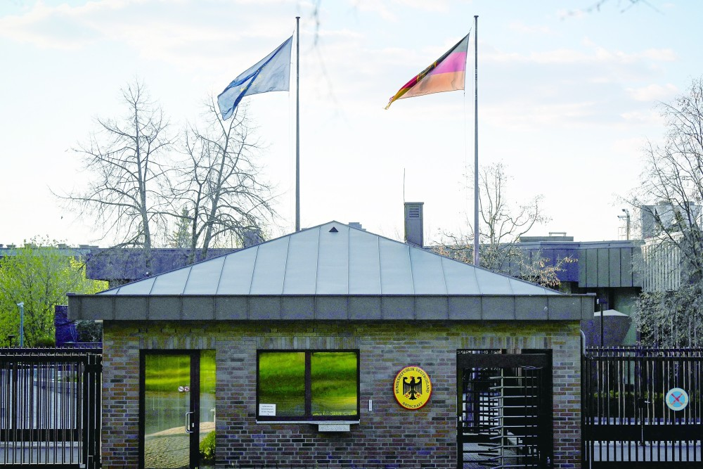

# 互逐数十外交人员，压缩俄欧沟通空间，“外交官驱逐战”加剧俄德紧张

【环球时报综合报道】德国和俄罗斯之间的外交紧张局势骤然升级。俄罗斯外交部22日在其网站发表声明称，鉴于德国政府再次大规模驱逐俄驻德外交人员的敌对行为，俄方决定驱逐德驻俄外交官作为对等回应措施，并将大幅限制德驻俄外交人员数量。对此，德方并未立即予以证实。德媒消息称，一架抵达柏林的俄罗斯政府飞机或与俄外交官离开德国有关。多年来，德国一直与俄罗斯保持着密切的经济联系，特别是在能源领域，德国依赖俄罗斯的天然气。然而，俄乌冲突爆发后，随着柏林增加对基辅的财政和军事支持，两国关系恶化。俄分析人士认为，此次俄德之间发生的激烈“外交官驱逐战”以及近日双方之间的外交论战，是德国与俄罗斯对抗升级的表现，两国关系跌入低谷。在外交政策方面，德国越来越追随美国，逐渐丧失自主性，此次“外交官驱逐”事件就是有力体现。在俄乌冲突延宕背景下，两国关系转圜面临重重阻碍，前景黯淡。与此同时，此事反映了俄罗斯与西方国家之间的深刻分歧和不信任，或将导致俄罗斯与西方整体博弈进一步升级，并使俄乌冲突持续激化，政治解决前景面临更多不确定性。

_俄罗斯外交部当地时间4月22日宣布驱逐德驻俄外交官，作为对柏林大规模驱逐俄外交人员的对等回应。图为德国驻俄罗斯大使馆外景。
（法新社）_

**一架飞往柏林的专机**

“22日上午，一架俄罗斯政府专机经特别许可从莫斯科飞往柏林。当天下午，这架飞机又降落在莫斯科伏努科沃机场。”德新社22日报道称，德国联邦政府在过去几周与俄罗斯就各自外交使团的存在问题进行了会谈，“目的是减少俄罗斯在德国的情报存在”。该媒体引述消息人士的话称，这架俄罗斯专机与上述德俄会谈有关。

德媒称，由于欧盟于2022年2月对所有俄罗斯航空公司关闭机场和领空，飞往欧盟国家的俄罗斯飞机数量变得稀少，因此降落在德国的这架俄罗斯政府专机立即引发广泛关注。德国空军发言人22日对德新社表示，这架飞机获得了外交许可。舆论猜测，这架飞机运载的可能是此前被德方驱逐的俄外交官。

同一天，俄罗斯方面发布的信息为上述猜测提供了更多依据。俄外交部发言人扎哈罗娃22日在俄红星电视台直播节目中表示，俄方驱逐了20多名德外交人员。她还称，被德国驱逐的俄外交官已经返回俄罗斯。据俄新社22日披露，此次德方驱逐的俄外交官超过20人。

俄外交部22日发表声明称，俄外交部对德方（驱逐）行为表示强烈谴责，认为这将破坏所有层面的俄德关系。声明同时称，俄外交部已于4月5日召见德驻俄大使并通知俄方（驱逐德外交官）相关决定。

扎哈罗娃22日还透露，俄德当局最初曾达成默契，不对外公开此事。但大约几周前，有关这件事的一些消息却出现在德国媒体上。她表示，德国当局向记者泄露了有关信息。

俄外交部22日的声明也指出，此前德方多次表示不会公开宣布这些信息，却违背承诺。这表明德国经常利用类似行为来组织“有控制的泄密”和传播虚假消息。

据塔斯社22日报道，德国《焦点》周刊早在3月25日就援引德外交部消息人士的话报道称，德国外长贝尔伯克拟宣布俄驻德30余名外交人员为“不受欢迎的人”并驱逐出境。该媒体报道称，德安全部门认为，这些俄外交官涉嫌“利用外交身份非法获取政治、经济、军事和科学信息，并用于破坏活动和传播虚假信息”。

俄《观点报》22日认为，德国意图借驱逐外交官进一步加剧与俄罗斯的对抗和冲突。俄“news.ru”新闻网22日引述俄专家的话称，在当前俄乌局势没有出现明显转变的形势下，德国对俄立场很难做出改变。两国之间外交人员的减少，将使俄罗斯同德国乃至西方进行接触交流、获得客观信息、发展关系的可能性进一步降低。未来双方在各层面的较量和冲突将更趋激烈。

**俄德关系不断恶化的背后**

德国新闻电视台22日称，德国和俄罗斯已多次相互驱逐外交官，上一次是在去年4月。当时，德国驱逐40名俄外交人员。随后俄宣布40名德国外交官为“不受欢迎的人”，并下令驱逐。俄《消息报》网站报道称，此次互相驱逐外交官事件结合德国防长皮斯托里乌斯近日发表的涉俄言论，更加凸显俄德关系的紧张。皮斯托里乌斯日前称，乌军对俄领土的有限打击是可以接受的，只要不对城市、平民和居民区发动袭击，就必须视为一种必然。俄政治观察家鲍里索夫认为，在德国采取一系列对俄敌对举动的背景下，俄德关系恶化是自然的。德国不断深度参与俄乌冲突，加大对乌军事、财政等援助，同时积极对俄实施诸多制裁。未来，甚至不排除俄德关系破裂的可能性。

路透社22日提到，德国曾经是俄罗斯石油和天然气的最大买家之一，但自莫斯科于2022年2月向乌克兰派遣武装部队、西方以制裁及向乌克兰提供武器作为回应以来，两国关系呈不断紧张态势。

多名俄分析人士认为，在外交政策上，德国越来越屈从附和美国，在俄德关系中不断采取不具建设性的举措。近年来，华盛顿非常担忧俄德关系回暖，美需要德国站在攻击俄罗斯的最前沿。俄乌冲突为美达到目的提供了重要契机。德国在“北溪”天然气管道爆炸事件中的涉美立场也表明，比起自身利益，其更愿意服从美国指挥。受此影响，在可以预见的未来，俄德关系转圜面临巨大阻碍。

**或影响俄乌和谈进程**

最近两个月，德国各地掀起反战浪潮。在西方复活节期间，德国柏林等70个城市举行反战大游行。成千上万的德国人走上街头，要求德国等北约国家停止向乌克兰输送武器，取消制裁俄罗斯，促使乌克兰和俄罗斯进行和平谈判。还有德国人到驻德美军基地前抗议，要求美军撤离德国。

瑞士《新苏黎世报》此前评论说，面对俄乌冲突，德国总理朔尔茨希望德国成为推动跨大西洋关系的典范，但德国的安全政策完全依赖美国。尽管紧密联盟可能有用，但从长远来看，柏林必须发展自己的战略领导力。

中国国际问题研究院欧洲研究所所长崔洪建23日告诉《环球时报》记者，德国内部无论是对俄政策还是对外政策分歧都很大。此次“驱逐外交官”事件不能排除受美国影响的可能性，但站在德国立场上，也有基于德国利益的考虑。崔洪建认为，俄乌冲突爆发后，德国受外界压力影响，逐渐放弃了可以缓和与俄罗斯关系的新东方政策。“北溪”天然气管道被炸事件发生后，德国全力摆脱对俄能源依赖，双方此前的长期合作关系基本瓦解，在这种情况下两国关系的基础发生重大变化。不过，德国还是想尽量维持某种平衡，以避免与俄罗斯的关系失去控制。

俄连塔网23日报道称，今年以来，奥地利、荷兰、挪威等相继对俄外交人员采取过驱逐举动。这些都将显著压缩俄欧保持对话沟通的空间，后续若出现更多反俄举措，俄欧将面临更激烈对抗。莫斯科国际关系学院专家阿列克谢·祖金认为，欧洲当前在包括信息、经济等各层面对俄发动“战争”。据塔斯社报道，欧盟或将对俄实施第十一轮制裁，内容可能包含过境禁令，禁止多数商品经俄过境运往第三国等。

俄科学院世界经济与国际关系研究所高级研究员别利斯基认为，德方此次举动损害了各方未来在俄乌冲突政治解决问题上达成协议的可能性。当前形势下，各方都已做好相互施压到底的准备，这将对俄乌和谈进程带来显著影响。

【环球时报驻俄罗斯、德国特派特约记者 肖新新 青木 环球时报记者 倪浩环球时报记者 王 逸 柳直】

