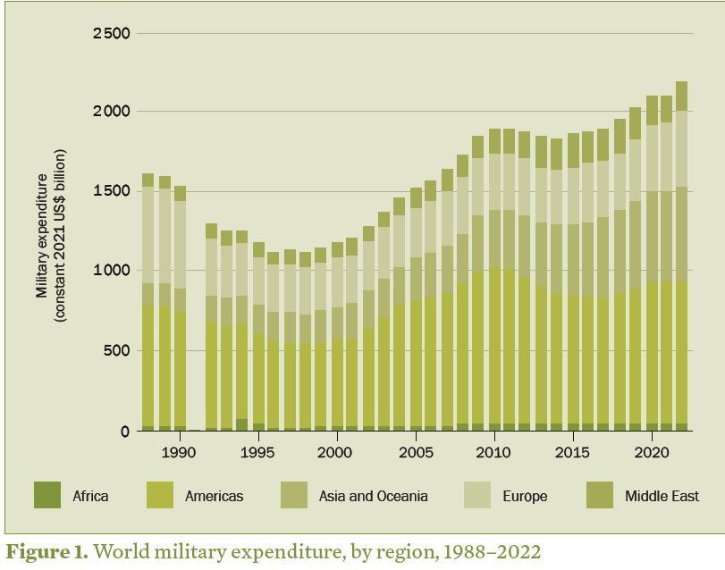

# 全球军费开支创纪录：美国独占全球39％，日本达1960年以来最高

记者 | 安晶

瑞典斯德哥尔摩国际和平研究所（SIPRI）4月24日发布的年度报告显示，出于对安全环境的担忧，全球大部分国家都加大了军费开支，且开支上涨的趋势将在短时间内持续。

2022年，全球军费开支升至2.24万亿美元，创下有记录以来最高。俄乌冲突让欧洲成为了军备热点地区。欧洲军费支出增幅为各地区中最高，中欧和西欧国家军费达到了冷战结束以来最高。

美国依然是全球军费开支最高的国家，占全球总额的39%，为中国的三倍以上。虽然美国是军事支援乌克兰的第一国，但对乌支援仅占美国军费支出的2.3%，其余大部分为发展本国军事实力。

在亚洲地区，日本的军费开支达到1960年以来最高；非洲的军费开支则出现2018年以来的首次下降，刚结束内战的埃塞俄比亚成为非洲军费支出增长最大的国家。

欧洲军费开支猛增

报告指出，俄乌冲突是2022年全球军费开支上涨的主要原因，全球军费开支同比上涨3.7%，总开支占全球GDP的2.2%。

_图片来源：SIPRI_

从军费开支增幅来看，欧洲地区的军费开支上涨13%至4800亿美元，为各地区中增幅最高，也创下冷战结束后欧洲地区的最高年度增幅。在欧洲之后，开支增幅最大的分别为中东（3.2%），亚洲和大洋洲（2.7%）以及美洲（0.3%）。

去年，东欧地区的军费开支上涨58%至1350亿美元，该地区军费开支的97%都来自乌克兰和俄罗斯。乌克兰的军费开支暴涨至440亿美元，同比上涨640%，为SIPRI有记录以来的最大年度增幅。这些开支中还不包括各国对乌克兰的军备和资金援助。

俄乌冲突前，乌克兰的军费开支不到俄罗斯的十分之一。但去年，乌克兰的开支已经达到俄罗斯的约一半。乌克兰军费开支在该国GDP中的占比也从2021年的3.2%升至去年的34%。

俄罗斯的军费开支上涨9.2%至864亿美元，相当于俄罗斯GDP的4.1%。俄罗斯军费中大部分都用于国防，以名义价值计算，去年俄罗斯在国防领域的开支比2021年的预算金额高出34%。

SIPRI军费和武器生产研究项目主管贝劳德-苏德雷乌（Lucie Béraud-
Sudreau）表示，俄罗斯预算与实际军费开支存在差别意味着俄乌冲突的开销比俄此前预期的要高。

在俄乌两国军费开支上涨之时，中欧和西欧国家也在集体加大军事投入。中欧和西欧的军费开支升至3450亿美元，首次超过1989年水平，而1989年正是冷战结束之年。

在报告统计的36个中欧和西欧国家中，有23国都在去年提高了军费开支，增幅最大的包括芬兰（36%）、立陶宛（27%）、瑞典（12%）和波兰（11%）。与俄罗斯拥有漫长边境线的芬兰已于本月初正式加入北约，瑞典还在等待土耳其的松口。立陶宛和波兰都与俄罗斯接壤。

在西欧，英国的军费开支上涨3.7%至685亿美元，为连续第六年上涨。在俄乌冲突中，英国是仅次于美国的第二大援乌国，对乌克兰的军事援助达到25亿美元。

德国则成为对乌援助的第三大国，贡献了价值20亿美元的军事援助。该国去年军费开支上涨2.3%至558亿美元，SIPRI预计近几年德国军费开支还将继续上涨。

美国继续霸榜、日本加大投入

去年，全球军费开支最高的国家依然是美国，按实值计算同比上涨0.7%至8770亿美元，占全球军费总开支的39%。报告指出，如果不考虑通胀，美国去年的军费开支增幅达到8.8%，为1981年以来的最大增幅。

排在美国之后的分别为中国、俄罗斯、印度和沙特阿拉伯。而这四国的军费开支总和依然远低于美国，美国的开支比第二名中国高出三倍以上。

在俄乌冲突中，美国去年为乌克兰提供的军事援助价值达到199亿美元，成为了乌克兰的最大军事援助国。但对乌军事援助仅占美国军费开支的2.3%，大部分开支用于发展美国自己的军事能力。

报告统计，去年美国在军备现代化、武器采购、研发等领域投入了2640亿美元，占总开支的30%；装备维护和执行任务占总开支的34%，人力成本投入占19%。

在亚洲地区，日本和韩国的军费开支出现了新变化。韩国军费开支下降2.5%至464亿美元，结束了持续22年的增长，报告指出开支下降并非政府投入减少，而是受通胀影响。

日本的军费开支则上涨5.9%至460亿美元，占日本GDP的1.1%，为连续第三年超过1%，达到1960年以来最高。此前日本的军费开支在GDP中的占比为1%，但岸田文雄政府去年宣布将在2027年将军费占比提高到2%，向北约看齐。

在中东地区，沙特的军费开支上涨16%至750亿美元，为该国自2018年以来首次年度增长。去年沙特军费开支占GDP的比例达到7.4%，为全球除乌克兰之外，占比最高的国家。

当全球各地区军费开支上涨之时，非洲地区去年的军费开支出现了自2018年以来的首次下跌，同比下降5.3%至394亿美元。

在北非，军备双巨头之一阿尔及利亚的军费开支下降3.7%至91亿美元，摩洛哥则维持在50亿美元没有变化。

在撒哈拉以南非洲，尼日利亚和南非的军费开支明显下跌。虽然恐怖袭击威胁加大，但尼日利亚去年的军费开支跌幅达到38%。报告指出，尼日利亚去年遭遇的洪灾是军费开支减少的主要原因。

各国中，埃塞俄比亚的军费开支暴涨88%至10亿美元，为涨幅最高的非洲国家。埃塞政府与北部提格雷人民解放阵线自2020年开始就陷入内战，到2022年11月才达成停火协议。

SIPRI军费和武器生产研究项目高级研究员Nan
Tian表示，近年来全球军费开支不断上涨说明“世界越来越不安全”。各国纷纷增强军事实力以应对恶化的安全环境，并且目前各国不认为这种恶化在短期内会有所改善。

