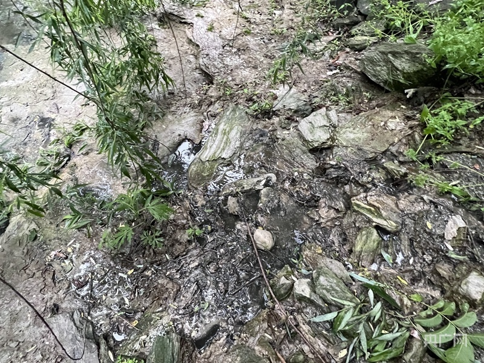

# 南水北调中线工程水源区探访：黑臭污水暗管偷排 灰白泥浆明渠入河

央广网十堰4月24日消息（总台记者管昕凌姝江晓晨）湖北省十堰市是南水北调中线工程源头丹江口水库的核心水源区，肩负着保护国家战略水资源安全的历史使命。发源于十堰市茅箭区的泗河，是汉江的一级支流，是十堰市五个入库河流之一，它流经十堰市多地最终汇入丹江口水库。

中国之声记者近日采访发现，在泗河流经的十堰市茅箭区和丹江口市交界处，有企业将生活污水和生产废水违法偷排进泗河，就在一个排污口旁边还竖着湖北十堰泗河国家湿地公园的界标，而这里距离丹江口库区仅十余公里。从现场来看，这种偷排行为至少已持续数月。

时间：4月20日19时，地点：湖北省十堰市茅箭区泗河大桥下。

记者在现场看到，泗河桥下竖着湖北十堰泗河国家湿地公园的界标，而就在界标的旁边，便是一个排污口，目测直径一米左右。此时并未下雨，排污口流出的污水呈白灰色，直接排进泗河，入河的污水与河水形成鲜明对比。

顺着排污口向上寻找源头，记者看到山坡上是一家叫隆泰混凝土的企业，污水流经山坡的地方沉淀了一层厚厚的白灰色泥浆，覆盖在绿色植被上。

“乳白色，就像白泥浆的那种颜色。当时我看到的是至少排了十几分钟，整个河流都变成乳白色的，比较严重。你看，很明显的，水里面含有固体杂质，这里面应该有水泥浆，有一部分就沉淀成这种颜色。”当地群众告诉记者。

_污水直排入泗河（记者江晓晨摄）_

实际上，早在去年12月底，就有群众向环保部门举报当地两家混凝土生产企业违法排污。根据记者掌握的相关视频和图片，当地群众拍到的排污现场触目惊心，污水流经的河道堆满了白灰色沉积物，泗河部分河段被染成了白色。当地环保部门今年2月回复群众举报，否认其中一家企业排污，称另一家企业也不是生产排污：而是涉事企业清理厂区时，厂区地面冲洗废水和沉淀池改造过程中的积水进入雨水管道，流入厂区外道路另一侧的泗河。

时间：4月21日8时37分，地点：泗河沿岸。

记者在现场看到，泗河沿岸有多家混凝土企业。其中一家名为惠豪商砼，这家企业附近的排污口正在排放白灰色的生产废水。废水流经的河道出现大量灰白色泥浆。

当地群众告诉记者：“肯定有问题，做混凝土的企业，你看这水比较浑浊，从河道流过去有明显的痕迹。去年是在下游两公里的地方，也是一家混凝土企业排放的，应该也和这里一样，但比这肯定要更严重。”

时间：4月21日9时，地点：惠豪商砼厂区附近。

记者顺着惠豪商砼厂区外的排污管道向下寻找，穿过茂密的杂草，发现一处正在排放黑臭污水的暗管，暗管直径约有30厘米，隐藏在杂草丛中，很不容易发现。

记者看到，这里排放的污水是非常黑的，就像黑墨水一样，而且在现场可以闻到非常刺鼻的气味，这些“黑墨水”被直接排放进了泗河里面。而且，记者在河道岸边，也可以看到大量黑色沉积物，河水和黑色的污水在这里形成鲜明的对比。

_隐藏在杂草里的排污暗管（记者江晓晨摄）_

家住泗河岸边的村民们告诉记者，今年以来，他们已多次发现周边企业向泗河违法排污的情况。尤其是早晨起床时，经常看到门前流淌的泗河水与平常明显不一样。

一位村民告诉记者：“河里水好脏，排污口肯定有，要想逮就逮得住，早上一看河水都看得出来，比如说它排放了，这河里的水都是很脏的，很浑。这水肯定是要流到丹江口（库区）的。”

附近村民说，岸边企业往泗河里排放污水，因为害怕被发现，多是没有规律地间歇性排放。老百姓的生产生活受到很大影响。

“它肯定是要么晚上排，要么很早排，就像是山洪暴发那种水，是黄色的，我们灌溉用的就是这些水，比如说吃菜，都是抽这河里的水，没办法。”附近的村民说。

就在本月初，生态环境部刚刚来到湖北十堰调研南水北调中线工程水源区生态环境安全工作。上级环保部门刚走不久，为何又出现黑臭污水和生产废水偷排泗河的情况？

记者就发现的问题拨打了环保举报热线12369。赶到现场的当地环保部门工作人员告诉记者：“按道理说，这个行业的水是回收利用的，因为它本来就要用水，不存在外排的。”

_暗管里排出的污水黑如墨汁（记者江晓晨摄）_

而记者在现场看到，4月20日、21日，相关企业均有外排生产污水的情况。

环保部门工作人员赶到现场时，正好遇到下雨。对于环保部门的突击检查，相关企业负责人矢口否认，说企业外排的不是污水而是雨水。

“这都是下雨的雨水，这是一个排雨水的口子。今天早上下雨，我们生产用水全部沉淀回收就行了。”这位负责人说。

企业以下雨为由辩解，但根据记者在不同时段，尤其是未下雨情况下，拍摄到的图片、视频，可以明显分辨是雨水还是污水。

环保部门的工作人员按照记者所指，又来到排放黑臭污水的暗管处。工作人员现场判断，黑臭水体应是生活污水。距离这里较近的也是一家混凝土企业，名为丹江口市建鑫建筑材料有限公司。

环保部门工作人员：“这家企业已停产了。”

记者1：“那（黑臭污水）水从哪来的呢？”

记者2：“我拍视频的时间是8:58，你看这是不是跟黑墨水一样，跟现在的水还是不一样的。”

环保部门工作人员：“它就算生产的话，也不至于有臭水。”

4月21日下午，当地环保部门向记者反馈，泗河污水处理厂附近两个工厂污水入河问题，基本属实。涉嫌排水的两家企业十堰惠豪新型建筑材料有限公司、十堰隆泰新型建筑材料有限公司分别位于丹江口市六里坪镇、茅箭区东城开发区，从事商业混凝土生产销售经营。目前已对两家企业立案调查，并要求立行立改。4月21日当天，两家企业已部分停产，排水行为已停止。但是，刺鼻的黑臭污水究竟来自哪里？为何会偷排进泗河？截至记者发稿时，当地环保部门的反馈回避了这一问题，尚未给出明确答复。

多位受访专家对记者表示，生活污水和生产废水直排泗河，或将对河流的水生态带来影响。

长期关注流域水生态保护的复旦大学发展研究院青年研究员李琴告诉记者：“这些污水直接排入河道当中，水体当中的氮、磷和酸碱无机盐等肯定是会增加的，这些也是引起水体富营养化和水质变差的一个直接因素。首先影响的就是微生物、藻类等水生植物，特别是随着温度增加，可能会造成局部藻类暴发，进而影响水生生物诸如鱼类的死亡，还会造成一些局部的水体发臭。其实河道两岸的河漫滩生境对于水生态的保护非常重要，一些污染物会造成河道的板结和河道淤积堵塞等等，湿地土壤也会受到影响。”

李琴认为，结合泗河流域的特征和具体情况，泗河不仅存在来自城市生活污水和工业企业的点源污染，也存在面源污染的综合治理短板。由于这里距离丹江口水库较近，这些污染物的排放是否会对库区带来影响，还需进一步评估。

西北政法大学环境法律与政策研究中心主任丁岩林对中国之声表示，从记者采访的情况来看，违法排污涉及两类水体，一是生活污水，二是生产废水。

“一个怀疑是生活污水，黑臭的、发黑色的；发白色的那地方，应该是企业生产过程中产生的一种废水，有可能是清洗它的罐车所产生的，直接排到了雨水管网，因为这种企业的废水是不外排的。现在我们见到的多个排污口应当是通过雨水管网偷排的。”丁岩林说。

根据《中华人民共和国水污染防治法》第83条规定，利用渗井、渗坑、裂隙、溶洞，私设暗管，篡改、伪造监测数据，或者不正常运行水污染防治设施等逃避监管的方式排放水污染物的，由县级以上人民政府环境保护主管部门责令改正或者责令限制生产、停产整治，并处十万元以上一百万元以下的罚款；情节严重的，报经有批准权的人民政府批准，责令停业、关闭。

此外，《中华人民共和国环境保护法》也有类似规定，由县级以上人民政府环境保护主管部门或者其他有关部门将案件移送公安机关，对其直接负责的主管人员和其他直接责任人员，处十日以上十五日以下拘留；情节较轻的，处五日以上十日以下拘留。

丁岩林说，相关企业涉嫌通过暗管或逃避监管的方式偷排污水。“我国的水污染防治法是禁止通过暗管或者通过逃避监管的方式来外排的，因为当时给它审批环评，规定的都是不外排，它实际上改变了污染物的排放方式和排放去向。应当对直接管理人员和主要负责人实施拘留，并且根据水污染防治法的规定，应对其予以十万元到一百万元的罚款。”

确保一渠清水永续北上，当地环保监管如何堵住漏洞？丹江口库区其他汇水区域还有没有这种现象？有关事情进展，中国之声将持续关注。

（来源：央广网）

