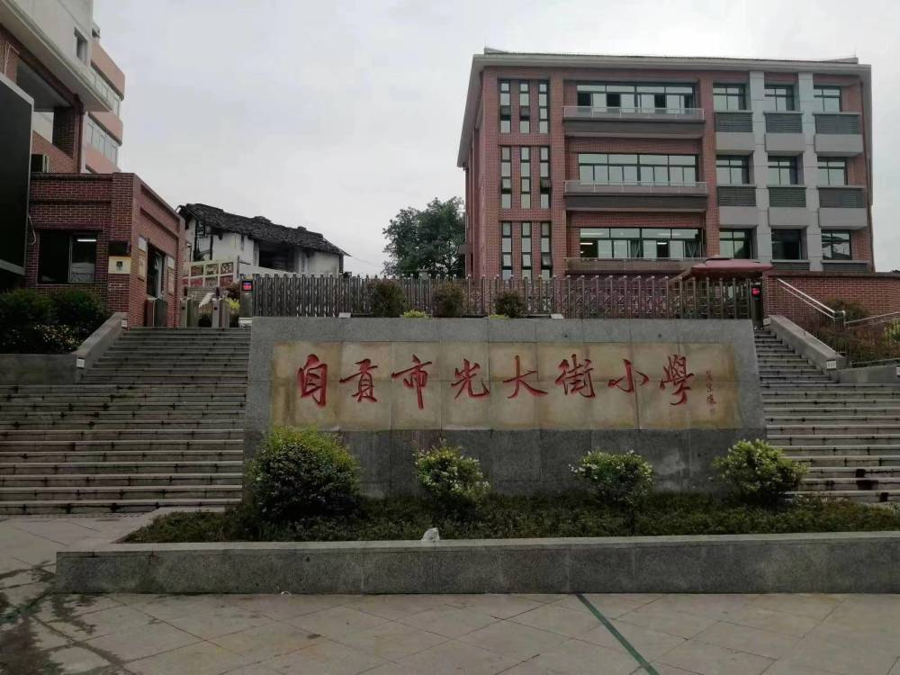
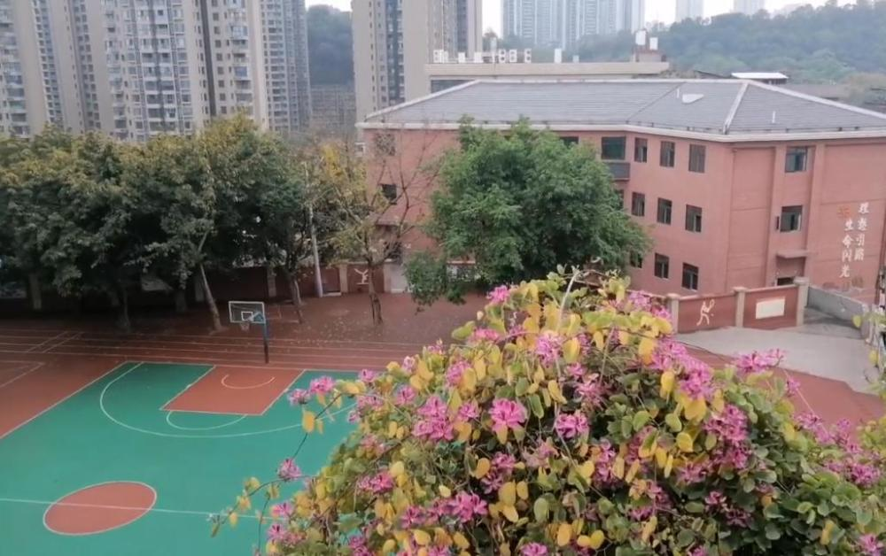

# 四川一教师实名举报16名同事副高级职称作假，人社局回应

作为教师，他为什么要以一己之力举报16名同事？

被他举报的主要有前校长、前书记、前副校长、时任校长和副校长、工会主席以及财务主任、党办主任等。

四川自贡市人社局回应称已查处1人被取消资格，其他人是被冤枉的吗？若举报不实，他又该担何责？

**教师认为学校侵害了公平竞业权，用表格实名举报16名同事副高级职称作假，其中大多数人有行政职务**

涉事学校是四川省自贡市光大街小学，位于自贡市自流井区光大街15号，在当地系明星学校。

_自贡市光大街小学校门
受访者 供图_

举报人柳一朝（化名）今年55岁，该校在职教师。

他告诉记者，他以前是自贡市某县城的一名中学老师，拥有中学一级职称，后来调到该校任教，每年评副高级职称时，学校要求提供真实材料打分排名进行初选，然而有些老师提供的虚假材料居然被领导审核通过，“这种做法侵害了相对人的公平竞业权，职称工资在整个工资中的比例较大，他们用骗来的副高级职称资格骗取国家财税，侵害了国家利益和人社局的公信力。”

柳一朝说，自2020年11月开始，他愤而向有关部门实名举报，希望查处。他说，这些年来他曾向四川省教育厅、自贡市教体局、自贡市人社局等单位实名举报过，“2022年3月下旬的一天，我在自贡市教体局局长黄如贝办公室，亲自将一封举报信交到他手中。”

记者在柳一朝留存的举报信中看到，他以表格形式列举了自贡市光大街小学“16名高级教师在相应年份职称评审中弄虚作假的部分问题点”，他列举的问题点主要有“学科教学工作及业绩”“市级公开课”“支教要求”“指导培养”等。

记者发现，该表格备注栏显示，柳一朝举报的这些人主要有前校长、前书记、前副校长、时任校长和副校长，工会主席，以及财务主任、党办主任等，他们大多数有行政职务。

举报称有校领导课时量为零仍被评上副高级职称，有人借调出去多年根本没上课依旧获评

记者检索发现，2021年6月，自贡市教体局和人社局关于印发《自贡市中小学教师职称申报评审基本条件》的通知称，中小学教师职称设初级、中级、高级职称。初级设员级和助理级，高级设副高级和正高级。员级、助理级、中级、副高级和正高级职称名称依次为三级教师、二级教师、一级教师、高级教师和正高级教师。

该通知中的基本申报条件包括教师资格及相关要求、继续教育要求、信息技术应用能力要求、支教工作要求等，要求任现职以来年度考核“优秀”2次或其他。此外高级教师（副高级职称）要求教学经验丰富，教学业绩显著，承担县级以上网课、示范课、公开课、研究课、优质课或观摩课等。

该通知还特别提到，兼任教育教学工作的中小学校级干部评审教师职称，除须达到本标准条件规定的相应教师职务任职条件外，申报学科教学工作量应达到专任教师三分之一以上或每周任教不少于4课时等。

记者注意到，该通知同时还称，对申报材料查实的学历、资历、学术、业绩、经历造假等弄虚作假行为，实行“一票否决”，一经发现，取消评审资格，3年内不得申报。

自贡市人社局专技科相关人士告诉记者，小学副高级职称的评定几年前由省级部门下放到市级部门，正高级职称的评审权限仍然在省级部门。

她介绍说，副高级职称的评审流程是，学校初选后将符合申报条件的教师逐级上报至市教体局，再由市教体局牵头评审，评审通过后要公示，最后由市人社局颁发职称证书。

柳一朝说，被他举报的这些人中单是学科教学和教学工作量，就有多人存在作假嫌疑。

他告诉华商报大风新闻记者，学校前校长杨某教学工作量为零，没有市级公开课，也没有支过教，居然被评上了副高级职称，而评审条件中明确规定，评审职称必须达到相应学科的课时量。

他还说，学校一名前领导，多年前就借调出去了，根本没有在学校上过课，更莫说上过市级公开课等，但依然评上了副高级职称，对此一些老师敢怒不敢言。

学校和区教体局均称举报不属实

柳一朝所举报的内容是否属实？

记者辗转联系上了一名被举报人，对方不愿多说，“你采访学校吧。”

_自贡市光大街小学_

自贡市光大街小学校长万波告诉记者，几年前柳一朝开始举报，后来自贡市教体局和市人社局曾到学校调查核实过，结果是“不属实”，同时将调查结果反馈给了举报人柳一朝，但他不接受。

万波举例说，关于评职称要求的市级公开课，柳一朝认为要有通知、文件、签到册和教案等，如果缺其中一样资料就被他认为是在弄虚作假。

2021年3月，自贡市自流井区教体局曾书面回复柳一朝说，截至当年，自贡市光大街小学参加副高级职称评审人员共有14人，他们均有市级公开课，不存在弄虚作假。同时称，该校申报参加副高级职称评审人员所有资料均按相关文件要求提交，经学校初审上报，主管局复审后报市中小学高级教师职务评审委员会，不存在作假。对柳一朝的举报，区教体局成立了由分管副局长、人事股、办公室组成的调查组进行调查，在调查结束后当面回复了他本人。

自贡市人社局回应已核查出1人，决定取消其任职资格

然而，与校方和自流井区教体局的调查结论不一样的是，截至目前自贡市人社局已核查出1人。

2023年4月21日上午，自贡市人社局相关人士告诉记者，当初接到柳一朝举报后，他们高度重视，立即展开深入调查，根据职称评审管理权限，由市教体局对自贡市光大街小学近10年参加副高级职称评审通过人员的申报情况进行了专项检查。

该人士称，经过核查，目前已查出1名教师不符合副高级职称任职资格条件。经研究，决定取消他的副高级教师资格，“我局在职称评审过程中，严格贯彻执行国家和省职称工作要求，经谨慎自查，暂未发现有违纪违规行为。”

自贡市教体局人事科一名工作人员印证了市人社局相关人士的说法。他告诉记者，当初他们也接到了柳一朝的举报并展开调查，最后将查处情况通报给了市人社局处理。

另据知情人士介绍，被查处的该人士系数年前评上副高级职称的，当时他借调到自流井区教体局工作，没有在自贡市光大街小学上课，查处后遭取消了副高级职称资格，后来回到学校上课。

认为两市级部门不正确履职起诉至法院，因请求不符合行政案件受理范围被不予立案

柳一朝说，他举报了16人，但目前只查处了1人，认为相关职能部门没有正确履职。

于是，他将自贡市教体局和自贡市人社局起诉至自贡市自流井区法院，请求判决这两家单位宣布该校16名副高级教师职称评审结果无效，撤销资格并追责。同时称，这两家单位在被检举等行政行为中不正确履职，对他的公平竞业和人身安全与健康构成威胁，请求保护，请求判决该两单位给予他5000元赔偿。

自流井区法院经审查认为，柳一朝所诉请求不符合法院行政案件的受案范围，遂出具行政裁定书称，对他的起诉不予立案。

柳一朝不服，上诉至自贡市中级法院，称一审裁定适用法规不当。

该中院审查后认为，柳一朝未提供证据证明他与所举报的问题之间存在法律上的利害关系，不具备原告主体资格，其起诉不符合起诉条件。

2022年11月22日，自贡市中级法院作出裁定，“驳回上诉，维持原裁定。”

柳一朝还是不服，向四川省高院申请再审。

2023年3月20日，该院审查后出具行政裁定书称，他的再审申请不符合相关规定，遂裁定驳回他的再审申请。

新闻延伸：

举报必须实事求是，否则易侵犯名誉权

河南泽槿律师事务所主任付建认为，市民发现他人存在违法违规行为，有权向有关部门举报，但不能无中生有地构陷他人，否则很有可能构成名誉侵权。

他说，该教师实名举报16名同事评副高级职称作假，当地人社局目前已查处1人，说明他的举报属于有一定事实依据的合理怀疑，并不违法，即使有一定程度上的错告或者检举失实，只要他主观上不具有相关恶意，也不构成名誉侵权或其他违法行为，不需要承担法律责任。

付建主任进一步解释说，如果该教师认为评职称过程中存在违规情形，他有监督举报权利，但应当提交相关证据材料。如果违背客观事实，恶意举报，或将缺乏事实依据的举报材料在互联网上公开传播，损害他人名誉，不仅要承担行政责任，还可能涉嫌侵犯他人名誉权，对于造成损害结果后，需承担民事侵权责任。

华商报大风新闻记者 黄平 编辑 董琳

