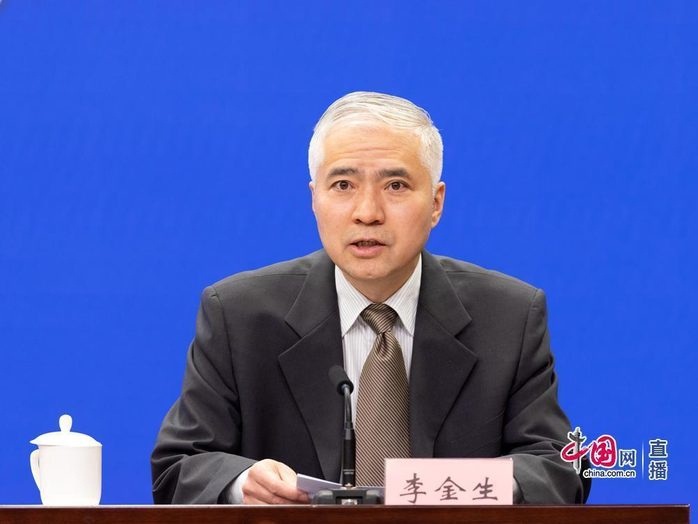

# 如何判断全年就业走势？第一季度就业形势怎么样？人社部最新回应

每经编辑：李泽东

今天（24日），人力资源和社会保障部举行新闻发布会，据介绍，1—3月城镇新增就业297万人， **3月份全国城镇调查失业率为5.3%**
，同比下降0.5个百分点，环比下降0.3个百分点。就业形势逐步改善，保持总体平稳。 **随着经济恢复，用工需求扩大，就业形势向好态势有望持续。**

据人社部介绍，截至3月底， **全国基本养老、失业、工伤保险参保人数分别为10.52亿人、2.37亿人、2.89亿人。工资收入分配工作稳步推进。**
人才队伍建设不断加强。劳动关系保持总体和谐稳定。系统行风建设持续强化。

1—3月三项社会保险基金总收入2.04万亿元、总支出1.7万亿元，3月底累计结余7.75万亿元。全国社保卡持卡人数13.7亿人，覆盖97%人口。电子社保卡领用人数7.64亿人，覆盖54.1%人口。

此外，发布会上提出多项优化就业措施。

**调整优化稳就业政策措施。**
总结评估稳就业阶段性政策实施成效，会同有关部门有针对性优化调整阶段性政策并加大薄弱环节支持力度。阶段性降低失业、工伤保险费率政策延续实施至2024年底，预计年均为企业减负1800亿元。加大政策落实力度，推动就业补贴政策直补快办。

**促进高校毕业生等青年就业。**
实施高校毕业生等青年就业创业推进计划，推出十项专项行动。组织开展大中城市联合招聘、中央企业专场招聘等活动，搭建供需对接平台。截至4月中旬，大中城市联合招聘春季专场提供岗位420万人次，活动主会场推出197场各类特色服务活动，重点推出16场跨区域巡回招聘会。

**加强农民工、就业困难人员等群体兜底帮扶。**
联合10部门开展春风行动暨就业援助月活动，实施稳岗政策、开展招聘服务、密集组织劳务输出，集中帮扶农民工、就业困难人员等劳动者就业创业，累计举办各类招聘活动5.8万场，发布岗位3800万个。组织开展2023年春节期间“春暖农民工”服务行动，全国累计“点对点”运送农民工202.5万人次返岗复工。进一步做好就业帮扶工作，全力稳定脱贫人口就业，截至3月底，脱贫人口务工规模3074万人。

**做实做细就业服务。**
扎实开展职业技能培训，一季度发放职业培训券超过261万张，全国开展补贴性职业技能培训350万人次。支持创业带动就业，深入开展重点群体创业推进行动，推动各地建设规范化零工市场，建立“即时快招”服务模式，更好促进劳动者灵活就业和创业。印发加强重点企业用工服务的通知，加强专员联系常态化服务，一季度累计帮助3.4万家重点企业解决用工需求52万人次。启动公共就业服务能力提升示范项目第二批城市申报，发布公共就业创业服务示范城市创建名单。

第一季度就业形势是怎么样的？对全年就业走势应该如何判断？

记者提问：政府工作报告明确了今年的就业目标，全国城镇新增就业1200万人，调查失业率是5.5%左右。我的问题有两个，第一季度就业形势是怎么样的？对全年就业走势应该如何判断？谢谢。

就业促进司陈勇嘉副司长陈勇嘉:

一是就业主要指标运行平稳。1-3月，全国城镇新增就业297万人，同比增加了12万人。3月份，城镇调查失业率为5.3%，同比下降了0.5个百分点。

二是线下招聘需求有所回暖。各地全面铺开了“春风行动”，累计举办招聘活动5.8万场，发布岗位3800万个、同比增加12%。

三是困难群体就业得到积极保障。3月末，脱贫人口务工规模3074万，超过3000万人的年度目标任务。失业人员再就业，就业困难人员就业，分别达到118万人和40万人，同比分别增加10万人和2万人。

随着经济运行整体好转，就业优先政策落实落细，我们有条件、有基础实现全年预期目标。与此同时，国际环境仍然复杂，经济发展不确定性依然较多，一些劳动者在求职就业中还面临着急难愁盼问题，部分青年特别是高校毕业生仍在寻找合适的工作，这些都是就业工作努力要解决的实际问题。

下一步，我们将认真落实中央经济工作会议和全国两会精神，强政策、拓空间、保重点、促匹配， **努力完成全年就业目标任务，全力确保就业局势总体稳定。**

人社部：将培养一大批高水平创新型数字技术工程师

**记者提问**
：我们都知道，人才短缺是制约数字经济发展的重要因素。我们注意到，人社部门正在实施数字技术工程师培育项目，请介绍一下项目相关规划和发展情况。谢谢。

**专业技术人员管理司司长李金生** ：近年来，我国数字经济发展较快，成效显著，数字经济规模已经连续多年位居世界第二。

数字经济的创新驱动实质上是人才驱动，推进数字产业化、产业数字化，关键都在人才。高水平数字技术工程师是我国人才队伍的重要组成部分，是我国数字经济发展的基础性支撑。加快培育高水平数字技术工程师，是加快数字技术技能人才培养、支持战略性新兴产业发展、助力数字经济和实体经济深度融合的必然要求。

数字技术工程师培育项目重点围绕智能制造、大数据、区块链、集成电路等数字技术领域的新职业，以技术创新为核心，以数据赋能为关键，以国家职业标准为依据，以新职业培训教程为基础，分职业、分方向、分等级开展规范化培训、社会化评价，探索建立数字技术工程师认证制度，每年培养培训数字技术技能人员8万人左右。

目前，这个项目初步搭建起了项目框架的政策体系、组织体系、标准体系、培训体系和评价体系。

一是健全制度机制，加强监管宣传，规范项目实施，提出了继续教育学时认定、专业技术等级证书与职称衔接认定、领取职业培训补贴等相关支持政策。

二是《国家职业分类大典（2022年版）》新增了“数字技术工程人员”小类，发布了智能制造、大数据、区块链、集成电路工程技术人员等数字技术类新职业13个，并且制定颁布了国家职业标准，我们也出版了10个职业的初级培训教程35本，为数字技术人才培养培训奠定了基础。

三是发挥社会机构的主体作用，遴选建立培训机构和评价机构目录，纳入各地职业技能培训“两目录一系统”进行全过程监管，坚持公平公正和质量第一，实行考培分离，开发专业技术等级证书管理系统，为人才培训和评价搭建了平台。

四是推广天津、重庆等地的培训经验，指导各地尽快出台配套政策，推动项目落地见效。

数字技术工程师培育属于创新性项目。下一步，我们将紧贴党和国家事业发展的需要，把握数字技术工程师成长规律，制定颁布国家职业标准，组织开发新职业培训教程，实施规范化培训、社会化评价。通过培训项目的推进，吸引更多青年学习数字技术，从事数字职业，
**培养一大批高水平创新型数字技术工程师，推动数字经济和实体经济融合发展** ，努力闯出一条数字技术人才自主培养的新路。

每日经济新闻综合人力资源和社会保障部新闻发布会、中国网直播

每日经济新闻

