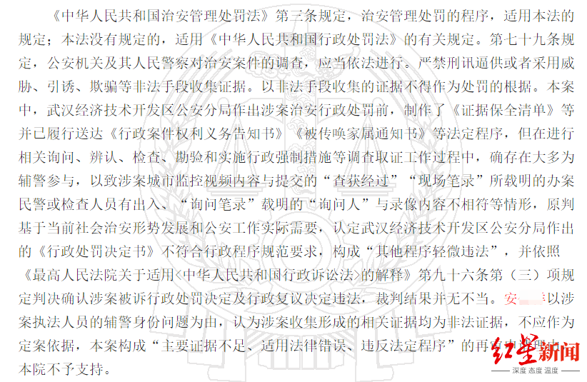

# 嫖客被抓反告民警并胜诉 法院：存在嫖娼行为，但警方行政处罚违法

4月22日，据媒体报道，一嫖客安某被抓反告民警执勤时程序违法，后法院判其胜诉，确认民警行政处罚违法。随后，相关词条登上热搜，对于该案折射出的程序正义与实体正义之辩，网友热议并进行探讨。

有网友表示，民警行使行政执法权控制嫖客，因程序执行不当是否能作为嫖客上诉的理由？也有网友担忧，是否可能有更多涉案者以行政瑕疵为由，影响执法人员执法。

_资料图片
图据IC photo_

通过查询公开文书，红星新闻记者了解到，因案情复杂，该案经历了一审、二审和湖北省高级人民法院的再审。

此前，武汉经济技术开发区公安分局（下称武汉经开公安分局）沌阳派出所认定安某实施的行为系嫖娼行为，对其处以行政拘留十日的行政处罚；行政复议时，市政府亦维持该行政处罚决定书的决定。一审中，安某作为原告，要求依法确认经开公安分局作出的相关行政处罚决定违法，撤销被告市政府作出的相关行政复议决定，法院判决驳回其诉讼请求。而二审中，法院撤销一审法院对安某作出的行政判决，确认武汉经开公安分局作出的行政处罚违法。

再审时，安某诉称，涉案行政行为违法，涉案证据不足以证明其违法嫖娼。最终，2020年11月25日，湖北省高级人民法院就安某诉武汉市公安局武汉经济技术开发区（汉南区）分局、武汉市人民政府治安行政处罚、治安行政复议一案作出再审判决。法院认为，当地公安认定安某存在嫖娼行为并对其作出治安行政处罚，具有事实依据，证据确凿充分。对安某处以行政拘留十日的行政处罚，适用法律正确，处罚幅度适当。此外，法院认定当地公安作出的《行政处罚决定书》不符合行政程序规范要求，构成“其他程序轻微违法”。

**案情回顾：**

**一审据警方行政处罚决定书作出行政判决**

**二审撤销原判决，确认警方行政处罚违法**

判决书显示，2019年3月4日，安某步行至武汉经济技术开发区一家休闲店内，与案外人熊某约定以100元一次的价格发生性关系。双方使用避孕套发生性关系后，安某向熊某支付100元现金并离开休闲店。武汉经开公安分局沌阳派出所民警在巡查过程中将安某控制，认定安某实施的行为系嫖娼行为，对安某作出武公（开）行罚决字（2019）10835号《行政处罚决定书》，对其处以行政拘留十日的行政处罚。随后，安某被送至武汉市第二拘留所执行行政拘留。

同年4月2日，安某对结果不服，向市政府申请行政复议，市政府于4月3日向安某与经开公安分局作出并邮寄送达《行政复议答复通知书》。又因案情复杂，市政府决定延长审理期限30日并向双方当事人送达《延期审理通知书》。2019年7月1日，市政府作出武政复决【2019】第166号《行政复议决定书》，维持了武汉经开公安分局作出的《行政处罚决定书》。

安某仍不服，诉至法院，要求依法确认被告经开公安分局作出的相关行政处罚决定违法，撤销被告市政府作出的相关行政复议决定。2019年，武汉市江岸区人民法院作出一审判决，驳回原告安某的诉讼请求。

安某不服该判决，向武汉市中级人民法院提起上诉。二审判决书显示，安某指出武汉经开公安分局的执法行为存在钓鱼执法、处罚程序违法等众多违法情形，市政府并未履行复议纠正职责，因此再次向法院提起上诉，对原审判决提出异议。

2020年，二审法院经审理认为，行政机关在行使行政执法权时，必须遵循行政规范，公安机关进行询问、辨认、检查、勘验，实施行政强制措施等调查取证工作时，人民警察不得少于二人，并表明执法身份。武汉经开公安分局在执法过程中，大多为辅警参与，在对安某实施抓获过程中，其城市监控视频所呈现的内容与武汉经开公安分局提交证据中的办案民警或检查人员均有出入，同时武汉经开公安分局的“询问笔录”上载明的“询问人”也与录像的内容不相符，违反了上述法律法规规定的“人民警察不得少于两人”等的规定，武汉经开公安分局在查获、询问、检查等实施行政强制措施等调查取证工作时，存在不符合行政程序规范要求的情形。

最终，二审法院对安某提出的上诉予以采信和确认，认定武汉经开公安分局在执法过程中，大多由辅警参与，不满足正式民警不少于两人的规定，判定撤销江岸区人民法院（2019）鄂0102行初257号行政判决，确认武汉经开公安分局作出的武公（开）行罚决字（2019）10835号《行政处罚决定书》和市政府作出的武政复决【2019】第166号《行政复议决定书》违法。

_二审判决结果_

**再审结果：**

**存在嫖娼行为，治安行政处罚适用法律正确**

**但警方行政处罚构成“其他程序轻微违法”**

撤销原判决、确认警方行政处罚违法后，安某向湖北省高级人民法院申请再审。2020年11月25日，湖北省高级人民法院作出再审判决。再审判决书显示，安某诉称两审最终仅认定经开公安分局行政行为“程序轻微违法”适用法律错误，其执法过程中存在的非法收集和伪造证据、挂名办案、辅警越权执法等众多严重违反法定程序的情形，涉案判决认定其嫖娼事实主要证据不足，非现场查获、无避孕套DNA鉴定等主要证据，请求依法再审，确认涉案行政行为违法并认定涉案证据不足以证明其违法嫖娼。

针对安某嫖娼行为，再审法院查明，武汉经开公安分局认定安某与案外人熊某约定以100元一次的价格发生性关系，有民警现场询问两人的全程摄像、询问笔录、涉案路段监控录像、追缴物品清单、证据保全清单、证据保全决定书、卖淫嫖娼场所照片及指认笔录等佐证，且安某与案外人熊某均承认当天有嫖娼卖淫的违法事实。武汉经开公安分局认定安某存在嫖娼行为并对其作出治安行政处罚，具有事实依据，证据确凿充分。对安某处以行政拘留十日的行政处罚，适用法律正确，处罚幅度适当。“对于安某认为本案为非现场查获、无避孕套DNA鉴定等主要证据，不能证明其存在嫖娼行为的再审申请理由，不予采纳。”

湖北省高级人民法院认为，本案的争议焦点是武汉经开公安分局作出的处罚决定和武汉市人民政府作出的复议决定是否合法。武汉经开公安分局作出涉案治安行政处罚前，已履行部分法定程序，但在进行相关询问、辨认、检查、勘验和实施行政强制措施等调查取证工作过程中，确存在大多为辅警参与，以致涉案城市监控视频内容与提交证据材料的办案民警或检查人员有出入、“询问笔录”载明的“询问人”与录像内容不相符等情形。

最终，再审法院判决，原判基于当前社会治安形势发展和公安工作实际需要，认定武汉经开公安分局作出的《行政处罚决定书》不符合行政程序规范要求，构成“其他程序轻微违法”，并依照规定判决确认涉案被诉行政处罚决定及行政复议决定违法，裁判结果并无不当，维持二审原判。

_湖北省高级人民法院再审判决书_

**律师说法：**

**程序正义是必要前提**

**维护好程序正义才能保障实体正义**

案件经媒体报道后，程序正义与实体正义之辩再次成为热点。

在陕西恒达律师事务所合伙人赵良善律师看来，《中华人民共和国行政处罚法》第三十七条规定：行政机关在调查或者进行检查时，执法人员不得少于两人，并应当向当事人或者有关人员出示证件；《公安机关办理行政案件程序规定》第五十二条规定：公安机关进行询问、辨认、检查、勘验，实施行政强制措施等调查取证工作时，人民警察不得少于二人，并表明执法身份。涉案公安机关办案违反了上述规定，属程序违法。二审法院也依法撤销了该行政处罚，意在维护程序正义。

赵良善律师表示，维护程序正义，才能真正保障实体正义。从法律制度、原则、发展等各方面来看，程序正义均大于实体正义。“就算某人犯罪也需要经正当侦查审判，否则先入为主或者滥用职权进行的定罪、定性、处罚，以违法方式惩治违法行为，显然不利于保障公民合法权益，会让权力膨胀，不利于法治建设。”

北京市中闻（西安）律师事务所谭敏涛律师表示，二审法院以人民警察办案不得少于两人的程序性规定，判决公安机关作出的行政处罚决定书违法，看似放纵了违法行为人，实则保障了每一个普通人被错误惩罚的可能，这就是本案的程序正义。如果辅警单独执法，且可以作为处罚依据，民警执法权的公正性便难以保障。在执法过程中，正式民警不得少于两人的规定是为了保证执法程序的合法性、公正性，避免权力滥用和冤假错案的发生。

谭敏涛律师进一步分析，严格遵守执法程序，有利于避免因程序违法问题导致的冤假错案。一旦执法程序出现问题，可能会导致执法行为的无效，甚至影响司法公信力和公众对法治的信任。此外，严格遵守执法程序，有利于保障当事人的基本人权，防止权力滥用。合法的执法程序可以有效地约束执法者的权力，防止执法过程中侵犯当事人的合法权益。“本案涉及程序正义和实体正义两个方面，程序正义有保障，就可以最大程度地保障案件事实清楚。如果忽视程序正义，就有可能出现执法者歪曲事实、捏造事实、隐瞒事实真相的可能。”

红星新闻记者 蔡晓仪 实习生 唐梦婕

编辑 张莉 责编 李彬彬

