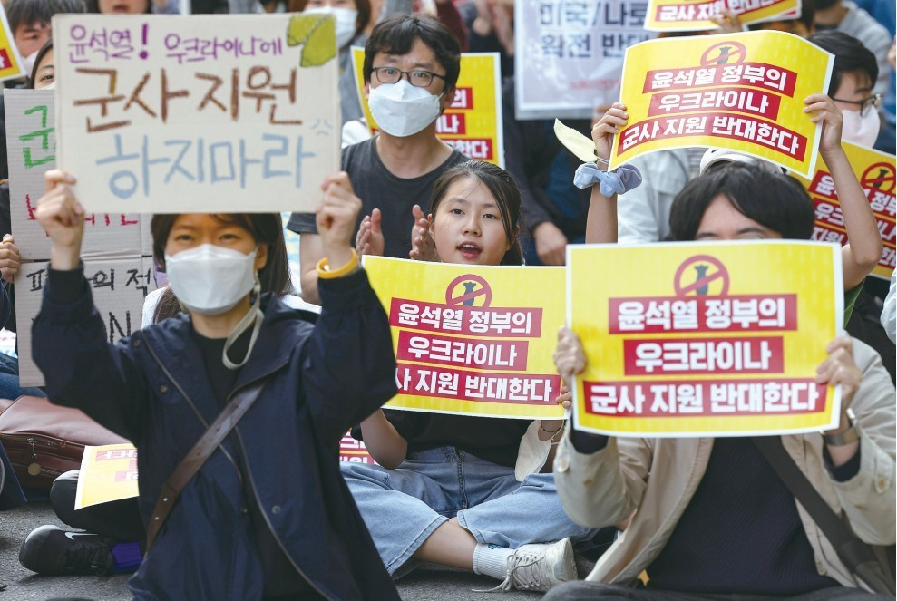

# 尹锡悦今日访美令韩国人不安：韩国有可能成“美攻击别国子弹”

【环球时报综合报道】韩国总统尹锡悦从4月24日起对美国进行为期七天的国事访问。这是韩国总统时隔12年后再次对美国进行国事访问。据韩媒报道，尹锡悦为了“打动美国的心”煞费苦心，准备在美国国会演讲时使用英文，为此尹锡悦每天背英文稿到深夜。在其访美之前，尹锡悦还频频发表刺激俄罗斯与中国的言论，引发俄罗斯和中国对韩方的强烈反应。韩国国内也担忧，尹锡悦这种对美国“一边倒”外交将让半岛局势危机四伏，韩国可能成为“美国攻击别国的子弹”。韩国《东亚日报》称，尹锡悦外交站上“新冷战的试验台”。

_韩国总统尹锡悦24日启程访美，他在访美前突然对中俄示强硬。图为22日，韩国民众在首尔举行抗议，要求尹锡悦撤回暗示向乌克兰援助武器的言论。
（视觉中国）_

**尹锡悦苦背英文演讲稿到深夜**

“尹锡悦访美在即，韩美保持紧密沟通。”据韩联社报道，韩国总统室相关人士23日接受该社采访时表示，在尹锡悦对美国进行国事访问前夕，韩美两国国家安全保障会议（NSC）之间保持紧密沟通，确保韩美元首会谈取得成功。报道称，韩国总统上一次对美国进行国事访问还是12年前时任总统李明博任内的2011年。

韩国国家安保室第一次长（国安副助理）金泰孝日前还公布尹锡悦访美的详细日程。尹锡悦将从24日至30日对美国进行为期七天的国事访问，他将同美国总统拜登举行会谈并出席国宾晚宴。尹锡悦这次访美的重头戏是他将于27日在美国国会参众两院联席会议上发表演讲，纪念韩美结盟70周年。韩媒报道称，届时，他将用英文演讲，时长30分钟。尹锡悦将在演讲中“回顾建立在自由民主、法治和人权等共同价值观基础之上的韩美70年同盟的历史，点明两国面临的挑战，并提出两国应共同追求的未来同盟蓝图”。此外，尹锡悦还将访问哈佛大学，在肯尼迪政治学院发表首场政策演讲。金泰孝介绍称，尹锡悦将回溯“美国近200多年推广经济、政治自由的历程”。

为了在美国国会演讲中“打动美国的心”，尹锡悦“操碎了心”。“在美国的心脏进行英文演说，尹锡悦正在猛练英语”，韩国“MT”网站称，在访美之前，尹锡悦全力进行最后准备。他自21日开始就没有外部公开活动，而是集中精力做各种准备。特别是针对27日在美国国会进行的演讲，尹锡悦更是“倾注了全部心血”。尹锡悦对演讲内容和措辞“一一检讨”，这是对“如何抓住世界最强国家的心”而“苦心积虑”。据相关人士称，尹锡悦“连日来对演讲稿练习及思考到深夜”。

尹锡悦访美还将率领由122名商界巨头组成的经济代表团一同前往，三星电子董事长李在镕、SK董事长崔泰源、现代汽车董事长郑义宣、LG董事长具光谟、乐天董事长辛东彬等主要财团负责人和韩国六大经济团体负责人将同行。韩国《中央日报》称，尹锡悦计划在访美期间完成7项经济日程。此次经济行程的目标是进一步拓宽此前以军事安保为中心的韩美同盟领域，强化尖端技术同盟。

韩国KBS电视台23日称，尹锡悦访美，最优先课题就是强化当韩国遇到核威胁时美国对韩提供核保护伞，即所谓的“扩展遏制”战略的有效性。虽然美国不可能在韩国部署核武器，但韩国希望美国能向韩国提供类似北约成员国之间的“核武共享”方案。在经济领域，韩美强化全球供应链和技术合作则是主要议题。这就是说，尹锡悦此访的核心就是在安保和经济领域均进一步提高与美合作水平。报道称，由于过度积极配合美国对中国和俄罗斯进行牵制而对自身形成负担，因此尹锡悦访美期间能否对此进行“强度调整”成为焦点。

**完全倒向美国只会带来屈辱**

“尹锡悦对美国进行国事访问，不能将美方款待和韩国国家利益位置颠倒”，《韩民族新闻》23日以此为题发表社论称，由于今年是韩美同盟70周年，因此可以想象将受到美方的盛大款待，但很多韩国人担心，尹锡悦这次访美，韩国到底能得到多少实实在在的利益。在安全方面，美国很可能要求韩国站在美国一边显示对中俄的强硬立场。如果这样，那么韩国将站在韩美日对朝中俄的“新冷战格局最前沿”，而这有可能让朝鲜半岛局势陷入恶性循环。

该报的另一篇报道称，在经济领域，美国的《通胀削减法》和《芯片与科学法》是诱导外国企业在美投资、封锁中国的法律制度，而韩美之间在半导体、电动汽车、电池等领域存在的经济纠纷的解决却没有任何进展。韩国一味接受美国的要求，除了得到加强韩美同盟的口头承诺外，韩国自身得到了什么，这值得深思。尹锡悦对美国的访问在即，韩国国民的忧虑却越来越大。

韩国完全倒向美国没有给韩国带来实际利益，反而带来屈辱。韩国KBS电视台称，尹锡悦访美，双方会就美国情报部门窃听韩国总统安保室等问题进行讨论，但很有可能采取不公开方式。“外交学者”网站刊登文章称，韩国担忧五角大楼文件泄密会给尹锡悦访美带来复杂影响。事件发生后，尹锡悦政府忙着灭火。尹锡悦政府的表态引发韩国国内的痛批。报道称，有韩国专家甚至满怀希望地企盼，如果美国真想帮助尹锡悦政府的话，出了五角大楼文件泄密这样的事情，那么美国应当让尹锡悦此访在美国得到一些收获，这样也好进一步巩固韩美同盟。

民调机构韩国盖洛普最新的民意调查结果显示，韩国民众对尹锡悦完全倒向美国的外交政策非常不满。据韩联社报道，盖洛普的民调结果显示，尹锡悦的施政好评率为31%，差评率为60%。受调查者给予差评的理由包括外交不力、未能有效处理经济、民生和物价问题、韩日关系和被日强征劳工问题处理不妥当等。

**韩国“站在十字路口”**

更让韩国民众担忧的是，尹锡悦政府为了配合美国，不惜成为美国的棋子和子弹，令韩国陷入安保和外交危机。4月23日凌晨，中国外交部网站刊登消息称，外交部副部长孙卫东20日奉命就韩国领导人涉台湾问题错误言论向韩国驻华大使郑在浩提出严正交涉。

韩国《世界日报》称，就在尹锡悦访美之前，韩国外交却接连与中国和俄罗斯发生冲突。考虑到韩国与中俄的密切经贸关系、中俄两国在朝核问题上的重要作用，韩国出现很多担忧未来韩国对华和对俄外交可能全面陷入困境的声音。报道称，韩国与周边四强（美中俄日）中的两个造成不必要的紧张，不仅短期内可能对韩国经济造成损害，从长期看甚至可能威胁韩国安保。

在韩国网站和社交媒体上，韩国网民纷纷质疑，“为什么国力比韩国强的日本不站在对抗中俄的最前线，韩国却要这么做？”“美国向来就是嘴上说说，比如俄乌冲突韩国配合美国对俄进行制裁而遭受经济损失，包括以前因为部署‘萨德’而受到中国经济报复，美国给韩国什么经济补偿了？”还有网友称，“现在韩美同盟让韩国成为美国攻击别国的子弹”。有韩国网友表示：“台湾问题还是美国自己去掺和吧，别把韩国拉下水！”

“美国盟友都在中美之间两条腿走路，只有韩国靠亲美一条腿支撑”，韩国《女性新闻》称，美国正强化对华遏制，韩国因为涉台言论导致中韩展开外交战，而法德等美国的盟国领导人接连访华获得实际国家利益。近期访问中国的法国总统马克龙，已经不止一次谈及在台湾问题上应该保持中立。去年11月访华的德国总理朔尔茨则强调不能与中国脱钩。连英国外交大臣日前也公开称，英国应该保持与中国“亲密的外交合作关系”，“与中国交恶绝对不符合英国的国家利益”。

“尹锡悦访美让韩国外交站在十字路口”，韩国《京乡新闻》23日称，随着尹锡悦总统踏上访美行程，韩国外交正站在决定命运的十字路口。尹锡悦访美期间，很有可能被美方要求在俄乌冲突和台湾等涉华问题上表态，这将导致俄中的强烈反对。在东北亚对立结构深化的情况下，韩国能否最大程度减少经济和安保不稳定因素、扩大外交空间，成为此次尹锡悦访美的关键。如果韩美元首会谈后的联合声明中有明显的遏制中俄的内容，那么韩国“在新冷战时代站在美国与中俄对抗最前线的坐标将更加明显”。

