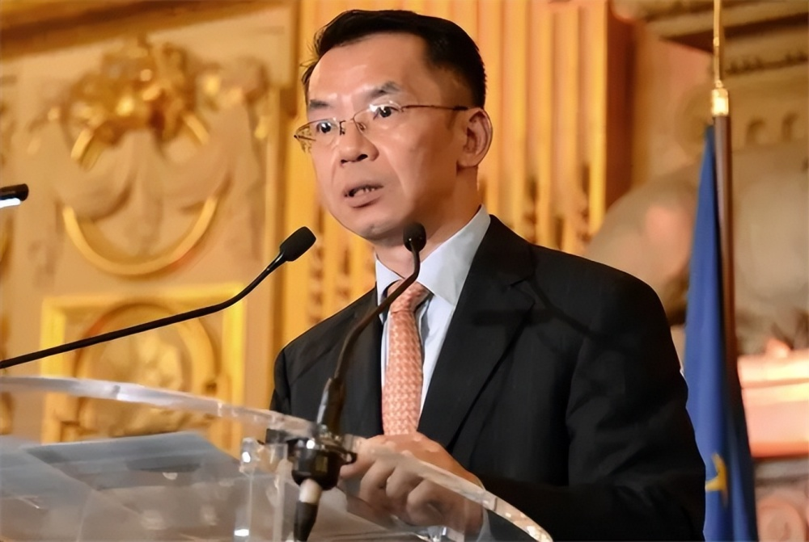
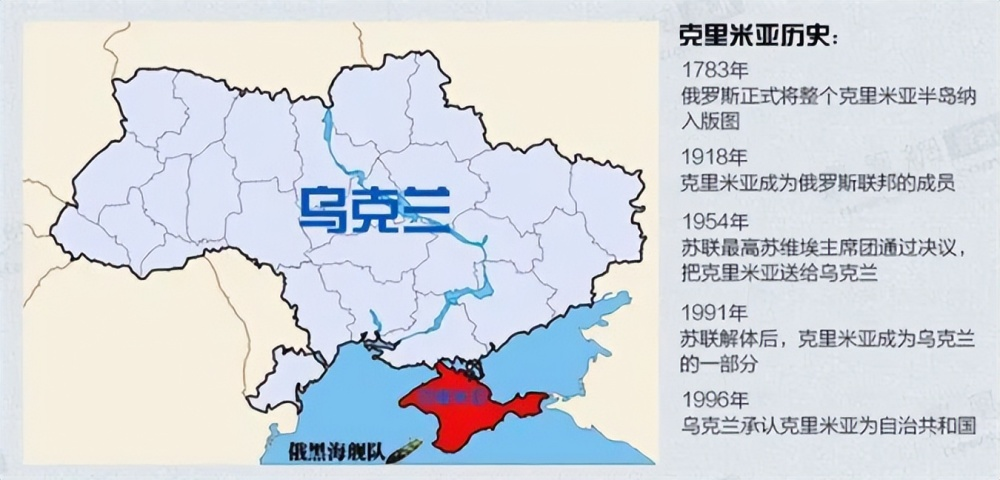
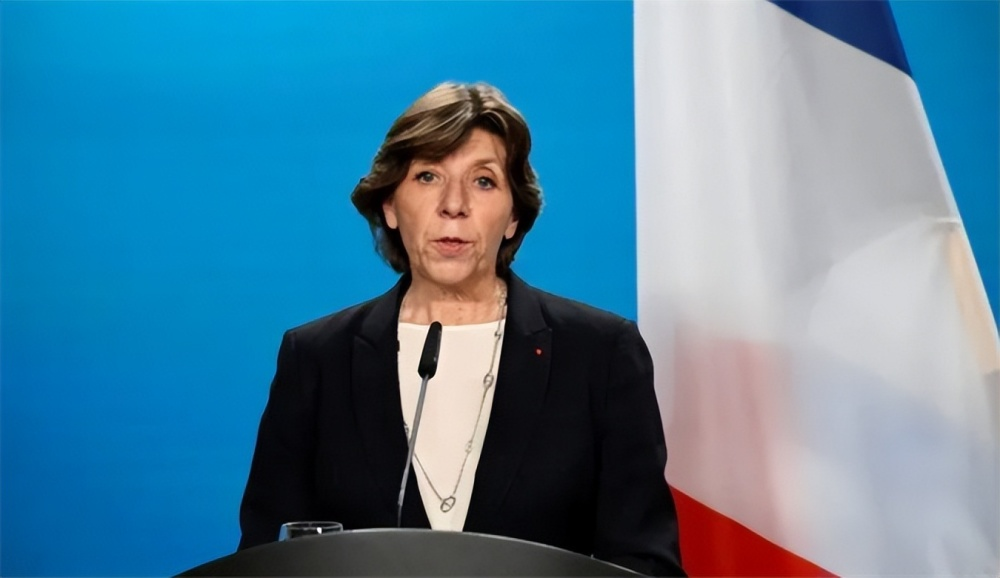
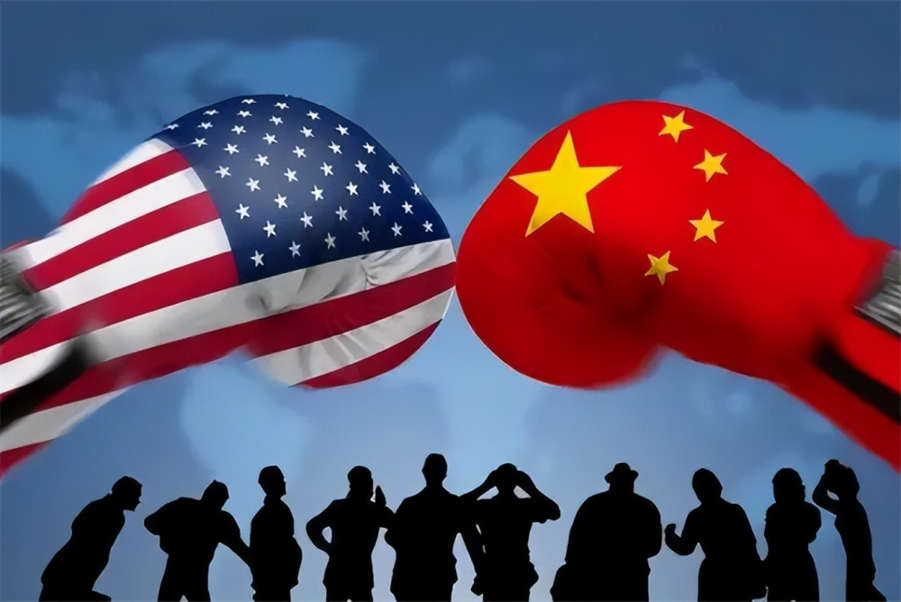

# 我大使涉克里米亚言论，遭东欧三国抨击

据俄罗斯卫星通讯社报道，在俄乌冲突持续僵持的背景下，近日，在回应克里米亚地区的归属问题时，我驻法大使卢沙野的一番言论，在欧洲引起了轩然大波，尤其是东欧的波罗的海国家，更是就此对我大使发起“围攻”，
**质疑中方的立场，并要求中国承认其地位** 。

卢沙野大使言论受到争议

当时，面对法媒在采访中提出的相关问题，卢沙野大使本不愿过多回应，称“该问题并没有那么简单，取决于看待该问题的角度”。然而，法媒主持人却不依不饶，声称按照国际法，克里米亚属于乌克兰。随后，我大使纠正其言论，表示乌克兰一开始属于俄罗斯，而
**按照国际法，前苏联加盟共和国并没有“有效地位”** 。

事实上，尽管卢沙野大使的这番言论比较敏感，但却是事实。从历史的角度来看，克里米亚地区在苏联时期属于俄罗斯，后来被划分给了乌克兰，但
**前苏联加盟国脱离苏联时，其实并没有签署相关的国际协议** ，制定国际法来确认自身的主权权利。因此，若真按照国际法来解释，这些国家的相关主张都是存疑的。

克里米亚归属问题没有国际法支撑

而卢沙野大使此言恐怕有两个意思，首先，克里米亚问题属于历史遗留问题，其被划给乌克兰的时候，俄乌尚未分离，但现在乌克兰甚至退出了独联体。如今，
**两国就此地区的归属出现争议，是无法通过国际法去明确定义的** ，想要解决问题，需要尽快坐上谈判桌共同协商。

其次，卢沙野大使之所以指出。前苏联加盟国在退出时，没有签署相关国际法，可能是在向外界强调，正是由于这方面的疏漏，导致相关国家的边界并不清晰，一旦出现问题便很容易形成一笔“糊涂账”，各方的主张难以达成一致。所以，我大使恐怕是希望相关国家积极沟通，
**与俄方共同解决问题，而不是制造矛盾** 。

波罗的海三国对华发难

然而，不少欧洲国家却曲解了我大使的意思，尤其是位于东欧的波罗的海三国，纷纷召见中国外交官员，指责卢沙野大使的相关言论。其中，拉脱维亚和爱沙尼亚声称该观点“不可接受”，希望中方收回此声明；立陶宛则借机炒作，质疑中国在乌克兰问题上的立场。

此外，约80名欧洲议员联名致信法国外长科隆纳，以所谓的“不承认主权国家地位”为由， **要求其将我大使列为“不受欢迎人员”**
。对此，法国外交部也公开表示，对相关言论感到“震惊”， **要求中方作出解释，并声称希望相关言论并非中国立场** 。

法国外长科隆纳

事实上，波罗的海三国的反应之所以如此激烈，是由于 **其就是前苏联加盟国，甚至这三国连《阿拉木图宣言》都没有签署**
。所以，其脱离苏联的举动没有相关国际法支撑，中方此时拿出的这一论述，对三国而言极为不利。至于作为欧洲领头羊的法国，为了维护欧洲团结，自然会毫不犹豫地站在三国这边。

不过，中方的言论有着清晰的事实依据，只不过这些国家不愿听到实话罢了。相反，
**立陶宛等国要求中方认同其主权国家的地位，但自身在台湾问题上，却无视中国主权**
，与“台独”分裂势力勾连，妄图阻止两岸统一。在这种情况下，其更加没有资格以双标态度，指责中方有理有据的论调。

反抗霸权侵害需要强硬态度

而 **在乌克兰问题上，中方始终秉持客观中立的立场**
，主张以和平方式解决问题，并积极为各方劝和促谈，所发挥出的建设性作用，国际社会都有目共睹。相反，以美国为首的部分国家，一直妄图将中俄绑定在一起，以此损害中国的国际形象。

面对来自外部的恶意、以及颠倒黑白的言论，卢沙野大使敢于反击，实话实说的言行， **正是应对霸权侵害地区和平，所需要展现的强硬姿态** 。

