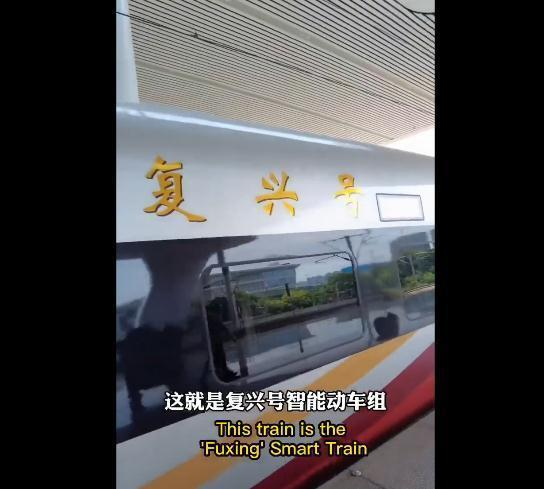
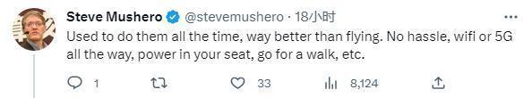

# 推特网友赞中国高铁“舒适宽敞快速准时” 马斯克：是真的

中新网4月24日电 日前，推特用户、风险投资人符传志(Alvin
Foo)发布了一段自己乘坐中国高铁的视频，大赞“舒适、宽敞、快速、准时”，引发网友关注，就连推特老板马斯克也评论留言称：是真的！

_图片来源：符传志(Alvin
Foo)社交媒体截图_

符传志23日在社交媒体推特发文称，“中国的豪华高铁，我坐过，必须说它比坐飞机好多了。它舒适、宽敞、快速，最重要的是准时！如果你去中国旅游，一定要试试。”

中国高铁“复兴号”到底有多豪华、多快速、多智能？符传志特地配上了一段自己乘坐中国高铁的视频，进行了详细介绍。

_图片来源：符传志(Alvin
Foo)社交媒体截图_

“拖鞋、毛巾和毛毯，单独的空调，好吃的甜点，挂衣服的，放水杯的地方，它都给你安排好了！”

当谈到“复兴号”的速度时，符传志感叹说，从杭州到北京的高铁只花了大约4个半小时，“跑这么快，稳稳当当，中国速度YYDS(永远的神)！”

此外，高铁上的充电设备、无线投屏等，也都让符传志大为赞叹。

符传志的推文发布后，引发不少网友共鸣。推特老板马斯克留言对其评价表示赞同，称“是真的”。

_图片来源：社交媒体截图_

曾在中国工作多年的企业家Steve
Mushero也留言说，“我以前一直坐高铁，比坐飞机好多了。不麻烦，一直有wifi或5G，你的座位上有电源，还可以散散步等。”

_图片来源：社交媒体截图_

有网友介绍说，“最好的体验，比坐飞机要快得多，我在上海呆了4年，坐过很多次。”

_图片来源：社交媒体截图_

还有网友说，“2019年坐高铁从北京到上海。一些事我永远不会忘记。速度很快。太棒了。很多国家可以向他们学习。”

_图片来源：社交媒体截图_

美国哈佛大学东亚系中国历史教授、费正清研究中心前主任宋怡明(Michael A. Szonyi)此前接受中新社采访时也曾对中国高铁表示羡慕。

他表示，自己每周需要花六小时去上班，自己非常希望在美国也能坐上高铁。“中国基础设施的非凡成就并没有让美国利益受损。”

看了大家的“安利”后，还有网友留言说，“我的梦想是到中国旅游。”

_图片来源：社交媒体截图_

