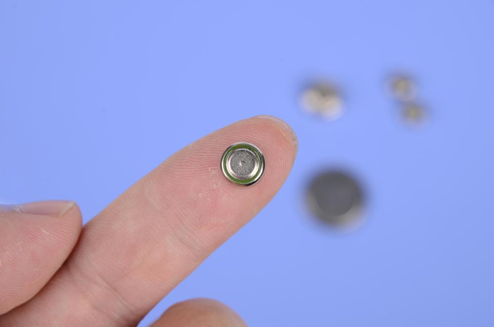

# 断崖式下降，“白色石油”为何跌起来不讲理？

谁能卡住新能源车的脖子？

就像石油对传统油车的重要性一样，号称“白色石油”的锂正是可以在新能源车领域卡脖子的那位。

所谓有“锂”走遍天下，去年以来，锂价一路狂飚，锂企的业绩扶摇直上，而新能源车企却是苦“锂”久矣。

但进入2023年，锂价却突然掉头直下，短短几个月已从60万元/吨降至20万元/吨，甚至有业内人士称其价格会降到10万元/吨。

锂价为何出现如此大的反转？何时见底？

**大涨大跌**

早在今年2月份，有消息称，宁德时代计划开展“锂矿返利”活动，即车企采购宁德时代的动力电池占比达到80%，年底与宁德时代结算时，半数电池按照20万元/吨的碳酸锂价格计算，另外一半电池仍以市场价为依据。

按照这一计划，宁德时代当时设定碳酸锂的底价为20万元/吨，此举有一定的让利意味。

但很快，这一计划就破产了，因为碳酸锂的价格跌下去就像涨上来一样，没多久就跌破了20万元/吨，“太不讲理”。

4月17日，上海钢联公布的数据显示，当日电池级碳酸锂价格再次下降，均价由19.25万元/吨降至18.75万元/吨，创一年来新低。4月21日，其均价又降为18万元/吨。

降价成为了当前碳酸锂价格变动的主线。监测数据显示，2022年11月，电池级碳酸锂价格触达高峰值，为近60万元/吨，仅仅5个月之后，降幅已接近70%。

这与此前锂的价格走势迥然不同。

作为新能源车的主要动力电池原料，电池级碳酸锂的价格在2020年只有4—5万元/吨。

随着新能源车开始陆续上市，碳酸锂价格开始狂飙，尤其是2021、2022这两年，其价格先后突破20万元、40万元、50万元/吨的关口，一度在2022年11月接近60万元/吨，在两年多的时间上涨了15倍。

不过，涨得快跌得更快。今年开年之后，电池级碳酸锂的价格先后跌破40万元、20万元/吨的关口。

锂价暴涨暴跌，产生了一系列连锁反应。

一方面，在锂价快速上涨的过程中，锂产业链上中游的企业固然赚得盆满钵满，但下游的新能源车则饱受其苦。

2022年报显示，锂矿龙头赣锋锂业归母实现净利润205.04亿元，同比增长292.16%；天齐锂业归母净利润241.25亿元，同比增长1060.47%；盛新锂能归母净利润为55.52亿元，同比增长541.32%。

作为电池厂商，宁德时代2022年实现归母净利润307亿元，同比上涨93%。

相比之下，多家新能源车企则遭遇亏损。2022年，理想汽车亏损20.3亿元。蔚来汽车2022年净亏损达到144.37亿元，较去年同期亏损扩大259.4%。

另一方面，随着价格的快速下跌，锂企业绩同样呈现下滑势头。

事实上，上海钢联数据显示，在均价下滑的同时，碳酸锂最低价为17万元/吨，已经逼近成本价。

中科院院士欧阳明高日前表示，就碳酸锂成本而言，从成本较低的盐湖提锂到成本较高的云母提锂，目前生产成本在每吨5万-16万元的区间。

这意味着，当前电池级碳酸锂的价格已经离成本价不远。

隆众资讯锂电池行业分析师曲音飞告诉中国新闻周刊，在这一局面下，部分锂企的生产线出现停产的趋势。

江特电机负责人日前表示，确有部分产线停产，对于产能安排，公司在实行动态调整。

**供需错配**

锂价下跌，是一系列因素作用的结果。

在锂价大幅上涨的过程中，存在着巨大的利润剪刀差效应，产业链不同环节存在分化，锂企、电池厂商利润高涨，而新能源车企则亏得一塌糊涂，正所谓天下苦宁王久矣，由此造成了一个严重的后果。

在持续亏损的背景下，来自资金面的压力必然增大。

有分析人士指出，过去新能源车企是宁可赔钱也要完成业绩，但今年新能源车企就很难再投钱追高了。

曲音飞向中国新闻周刊表示，从今年最新现状来看，由于需求因素受到抑制，终端及下游市场需求回暖周期尚不明朗，而供给端充足，行业供强需弱局面导致锂的价格大幅下跌。

乘联会4月10日发布的数据显示，今年1月，新能源市场销量约为29.4万辆，同比下降6.8%；今年2月，新能源市场销量约为39.6万辆，同比上涨60.5%；前两月新能源市场销量68.9万辆，同比上涨22.8%。

而在去年同期，新能源市场销量增幅连续多月超过100%，这一趋势在2022年上半年尤其明显。其中，2022年2月，新能源市场销量同比上涨158.2%。

这意味着，当前新能源车销售增幅已经远低于去年同期。

富宝新能源锂原料分析师刘晓敏告诉中国新闻周刊，受补贴政策退出和经济环境等因素影响，今年新能源车的销量增长速度相对放缓，这影响了对锂的整体需求。

而与此同时，随着锂产能的释放以及替代资源、技术的出现，锂的供应呈现相对增长较快的局面。

从上游来看，碳酸锂的主要开采地澳大利亚、阿根廷、智利以及非洲部分区域，均在加速扩采和投产锂矿；而国内包括江西宜春矿的规模在快速扩大，盐水提锂技术的加大应用乃至于海水提锂技术的推进，其供应量也在不断增长，供不应求的局面得到大幅缓解。

从中游来看，宁德时代在电池领域一家独大的局面正在被打破，比亚迪、国轩高科、欣旺达等企业正快速增长，电池领域的实力玩家日渐增多，甚至是一些新锐新能源车企，也在试图杀入电池自研自产领域，以摆脱被锂电池厂商牵着鼻子的束缚。

比如长城汽车投资孵化了蜂巢能源，广汽集团、蔚来、小鹏等旗下的动力电池项目都在推进中。

此外，随着钠离子电池技术的成熟和低成本优势的放大，以及锂电池回收规模的扩大，新能源电池行业的供应局面在不断发生改变。

一位业内人士表示，在这样的背景下，去年底为赶上享受补贴优惠政策，产业链上下游都在抢订单，导致库存积压都很大，但需求并未达预期，这进一步加剧了供需错配的局面，锂的价格支撑更加不足。

**何去何从**

对于碳酸锂的未来价格走势，业界众说纷纭。

日前，孚能科技股份有限公司董事长王瑀表示，预计碳酸锂价格会飞速地下降，估计未来探到10万元以下也不是没有可能。

中国科学院院士欧阳明高表示，合理的锂价不能太低，太低了回收利用和钠离子电池就没有发展空间，碳酸锂的价格在10万到20万元/吨之间是相对合理的价格，锂价宜在合理区间范围，不要过大波动，才能保持行业可持续发展。

远景动力执行董事、中国区总裁赵卫军则认为，未来碳酸锂价格应该是在成本加合理利润附近波动，将不会发生从5万到60万元/吨这样十几倍的急剧波动情况。

总而言之，对于锂价的疯狂，业界可谓是涨怕了，也跌怕了。

曲音飞告诉中国新闻周刊，碳酸锂价格是否跌到每吨10万以下，主要还是看需求因素，毕竟成本面支撑力度相对较弱，自有矿产资源的企业成本较低，供应面表现充足，需求因素更重。

据华福证券预计，2022年到2024年，海外盐湖锂将贡献23.5万吨、32.7万吨、40.7万吨碳酸锂当量，2022年到2024年海外锂精矿将分别贡献30.2万吨、43.2万吨、57.8万吨碳酸锂当量。而从国内来看，2022年到2024年，中国盐湖锂将分别贡献8.1万吨、11.4万吨、16.8万吨碳酸锂当量，中国锂辉石将贡献1.8万吨、3.3万吨和4.5万吨碳酸锂当量，中国锂云母将贡献6.5万吨、9.5万吨和17.2万吨碳酸锂当量。

根据华福证券测算结果，锂盐湖以及国内锂云母在行业未来的格局中将占据更加重要的地位。

赣锋锂业在日前业绩说明会上表示，近期锂云母、锂盐湖等资源产能释放速度并没有很快，因此锂盐价格向下空间可能不大。

刘晓敏也表示，锂价的未来，主要取决于当前去库存的进度。

从近期的终端需求市场来看，随着电池原材料成本大幅下探，有不少新能源车企也加入了燃油车所掀起的价格战。

奇瑞新能源日前宣布，受惠于新能源原材料价格回调，将下调官方指导价，至高回调幅度9000元。吉利汽车、沃尔沃等新能源车也发布了降价补贴政策。

从3月来看，新能源汽车销售有所回暖。据乘联会统计，3月新能源乘用车批发销量达到61.7万辆，同比增长35.2%，环比增长24.5%；零售销量54.3万辆，同比增长21.9%，环比增长23.6%。

曲音飞表示，目前市场情绪起来了，锂冶炼厂低价售货意愿已经降低了。

“当前，从4月份电池厂排产等指标来看，锂的价格并没有出现企稳的信号点”，刘晓敏表示，对于其价格走势，5月份是是一个重要的窗口期，当然，乐观的情绪在看涨。

富宝锂电网本周电池级碳酸锂和工业级碳酸锂报价均有小幅反弹，材料厂已经开始在提前补充5月库存，同时贸易商也有囤货待涨的心态。

作者：刘德炳

