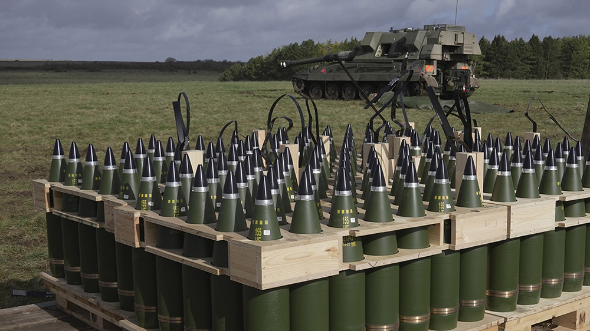

# 智库报告：去年全球国防开支创纪录，中欧西欧支出超冷战时期

瑞典斯德哥尔摩国际和平研究所（SIPRI）的年度报告发现，2022年全球国防开支达 2.24 万亿美元，创历史新高。2022年爆发的俄乌冲突引发了欧洲 30
多年来国防开支的最大增长，去年西欧和中欧的国防开支已超过冷战结束前的1989年。

《卫报》24日报道，斯德哥尔摩国际和平研究所的数据显示，俄乌冲突引发了欧洲 30 年来国防开支的最大增长，同比增长约13%。该报告称，中欧和西欧国家的支出在
2022 年达到 3450 亿美元，按实际价值计算，这一数值超过了1989 年冷战时期的水平。

斯德哥尔摩国际和平研究所国防开支和武器生产项目的高级研究员迭戈·洛佩斯·达席尔瓦（Diego Lopes da Silva）博士说，2022
年未来很可能被证明只是大规模军备重组的开始。

“俄乌冲突对中欧和西欧的国防开支决策产生了直接影响。”他说，“这包括多个国家的政府增加军费支出的多年计划。”达席尔瓦表示，可以合理预期未来几年中欧和西欧的国防开支将继续增长。

2022年，俄罗斯的国防开支估计增长了 9.2%，达到约 864 亿美元，相当于 2022 年该国 GDP 的 4.1%。2022年乌克兰的国防开支增长了
640%，由此成为世界第 11 大国防开支国，值得注意的是，眼下乌克兰的军事负担是迄今为止所有国家中最大的，占本国 GDP 的 34%。

当地时间2023年3月24日，英国，一个军事训练营里，乌克兰士兵参加军事演习时放置的弹药。第二批乌克兰炮兵新兵即将结束AS-90自行榴弹炮的训练。人民视觉
资料图

英国在中欧和西欧的国防开支最高，为 685 亿美元，其中估计有 25 亿美元，即 3.6% 是对乌克兰的援助。

2022年，德国也迎来了自第二次世界大战以来最大规模的军备重整，这被外媒称为“时代转折”
（Zeitenwende），当年德国军事预算位居世界第七，并且计划进一步大幅增加国防开支。德国2022年还设立了 1050 亿美元的预算外基金，这笔资金将从
2023 年起被用于提高其武装部队的军事能力。

此外，法国、韩国和日本也位列世界前 10 大国防支出国中。

报道称，虽然俄乌冲突是全球国防开支增长的“主要推动力”，但在过去二十年中，全球国防开支也普遍增加。

北约成员国在2014年承诺，到2024年将GDP的 2% 用于国防，斯德哥尔摩国际和平研究所的报告表明，全球国防开支在2022年连续第八年增长。

迄今为止，美国仍然是世界上最大的国防开支国，达到 8770 亿美元，占全球总额的 39%。

斯德哥尔摩国际和平研究所军事开支和武器生产项目的另一位高级研究员田南博士（音译Dr Nan
Tian）说：“近年来全球军事开支的持续增长表明，我们生活在一个越来越不安全的世界中。各国正在加强军事实力，以应对日益恶化的安全环境，他们预计这种情况短时间内不会有所改善。”

