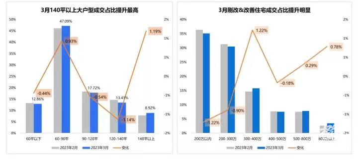
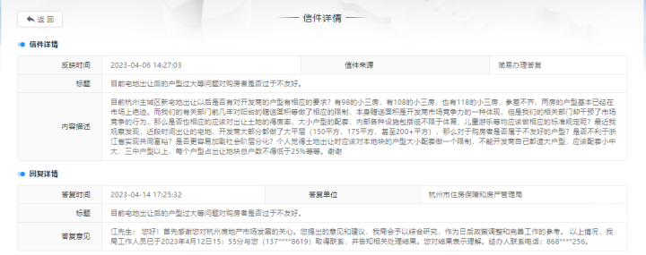

# 杭州楼市：90平米以下户型正在消失

**杭州刚需购房者的门槛，越来越高了？**

据克而瑞浙江区域数据，3月杭州新增供应商品房8217套，其中90方以下小户型只有844套，占总供应量的10%。
**而180平方米以上大平层，新推出了1182套，占比14%，比小户型还要多。**

“现在开发商都喜欢推大平层，其实大部分购房者财力有限，更需要小户型。相关部门能不能在士地出让时，对户型大小做出限制，比如配套小、中、大，三种户型之类的。”橙友江先生呼吁。

更让刚需购房者懊恼的是，本来就不多的小户型供应，目前主要集中在临安区、富阳区、钱塘区的大江东、萧山区的衙前镇。

也就是说，除了一些远郊板块， **杭州核心区和近郊已经鲜少见到90方以下的新房了** 。

杭州新房市场还有多少小户型？

杭州90方以内的新房有多稀缺？

据我们统计，目前，整个杭州拥有90方以下户型的楼盘不到 **20个** 。

“现在主城区基本没有刚需板块了，户型面积都是越做越大，总价越来越高。”江先生说，原本一直以低总价吸引刚需的临平区，现在新房总价也要300万元以上了。上月公示的临平星桥天都城沁源公寓附近宅地，总户数约608套，户均面积120方，总价门槛超过了300万元。

的确，今年的杭州楼市，在优质地段，大户型的改善楼盘明显增加，不少楼盘起步户型就超过了160方。89方三房两厅两卫的户型，已经成了不少刚需眼中的“白月光”。

在上月杭州商品住宅摇号中签率最低TOP10项目中，闻堰、闲林、乔司等板块的刚需楼盘，均价2.3-3万/方，中签率20%上下，都较为热门。

但这些刚需盘也没有90方以下户型——面积最小的有97方，在乔司板块的滨江蝶翠迎宾府；其他刚需盘里，110方、130方的户型更为常见；改善楼盘的户型则几乎都是170方起，最大的400多方/套。

近日，有未来科技城宅地发布规划公示，5幢高层一共192户，起步户型176方，配上3.6万/方的均价，购买门槛就要630万元。

在云城板块内，即将开盘的枫秀云庭，最小户型也规划到121方。

临平新城这样传统刚需板块的全面大户型化，更是让购房者叫苦不迭。今年2月21日，杭州出让临平新城两宗宅地，一宗140方起步，一宗170方起步。而在良渚、星桥、金沙湖这样的板块，90方左右小户型几乎绝迹，起步户型至少105方、110方。

艮北等4万多元/方的板块，户型门槛也在不断提升。比如今年出让的中天艮北项目，起步户型预计139方。

申花、钱江新城二期等改善板块，馥香园户型175方起步，潮映彼岸轩规划了208、258方两种大户型，江澜映象府最小户型147方。

萧山、余杭、钱塘区，以及主城区的丁桥、双浦、三墩北等板块，情况也都差不多。例如三墩北如澜邸，主力户型是170方。

为什么开发商喜欢推大户型？

如今杭州的新房大部分是限价房源，均价固定，总建筑面积固定，因此不管设计成大户型，还是不同面积段的户型混搭，卖房子的总收入是固定的。在这种情况下，面积小一点、总价低一点的楼盘，相对更抢手。

但开发商为什么喜欢设计大户型呢？

**为了节省成本。**

从开发商角度看：

1、小户型需要建更多地下室、卫生间和厨房；大户型可减少建安成本和精装修成本，少则千万，多则数亿。

2、建大户型工期更短，对开发商来说，效率就是金钱。

3、减少车位销售压力。

“现在开发商的利润都在车位里，不少楼盘都在为卖车位发愁。如果是小户型为主的楼盘，通常车位会剩下很多。相较之下，大户型本身的购入门槛就高，居住的人群对车位需求也更高，开发商利润就有保障。”一位杭州头部房企的营销负责人坦言。

能否出政策增加小户型？

“杭州曾经出过70、90政策（即套型建筑面积90方以下的商品房住房，包括经济适用住房面积，所占总面积比重，必须达到开发建设总面积的70%以上）。现在没有了相应政策，有
**关部门是否可以在土地出让阶段，就楼盘户型做相应规定?**
不能由着开发商都选择大户型，应该小、中、大配套，比如每种户型占出让地块总户数不得低于25%之类，做出限制。不然，想买小户型的年轻人只能去买二手房。”江先生认为。

当年70、90政策的出台，是为了抑制房地产投资增长和房价上涨过快势头，于2006年6月1日开始施行，2014年7月终止，初步缓解了住房供应结构不合理的矛盾。

“如今大户型占领杭州新房市场，其实也是 **市场选择的体现**
，因为大户型虽然多，总体卖得并不差，说明符合市场需求。”一位资深研究杭州房产市场的专家表示，“现在不少家庭都有两孩、三孩，大户型未来还会更受欢迎。尤其是在摇号难度高的热门板块，大户型更保值。”

以上个月克而瑞浙江区域数据为例，杭州新建商品住宅3月份共成交10583套。其中最热销的是90-120方户型，成交了4785套，在市场上占据45%，近半壁江山。90方以下小户型则成交了869套，仅占全部房源的8%。

杭州市住房保障和房产管理局相关人员表示，对于江先生提出的意见和建议， **会予以综合研究，作为日后政策调整和完善工作的参考。**

橙柿互动记者 岳雁 许晖

