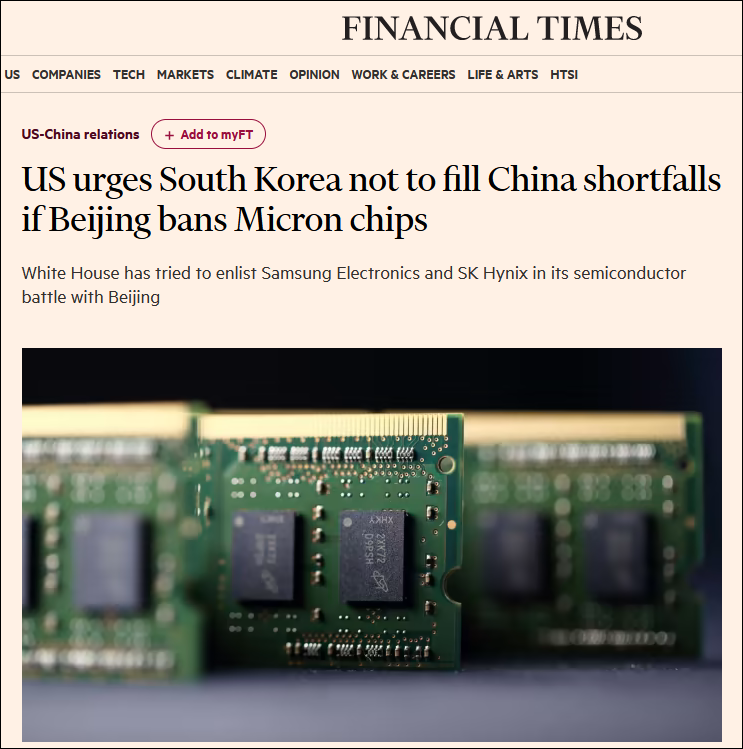
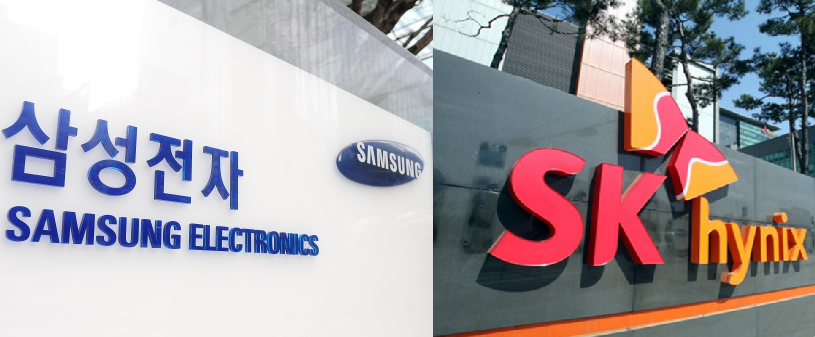
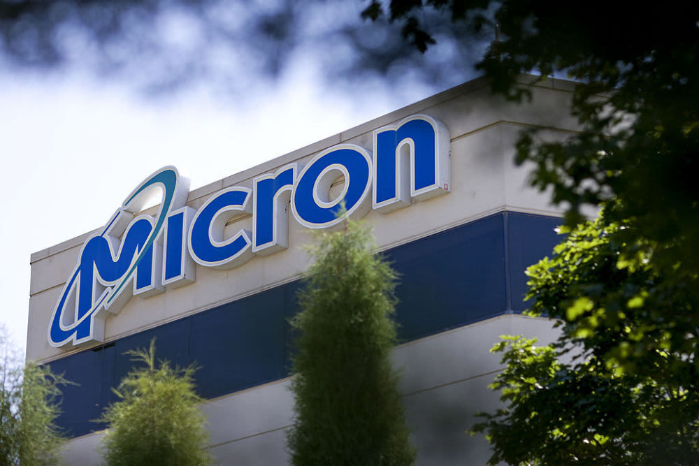

# 白宫被曝施压韩国：若美光在华被禁，三星和SK海力士勿去填补市场缺口

【文/观察者网
熊超然】4月24日至30日，韩国总统尹锡悦将对美国进行为期七天的国事访问，这也是韩国总统时隔12年后再次对美国进行国事访问。就在尹锡悦启程前往华盛顿前夕，英国《金融时报》援引四名了解美韩会谈情况的消息人士报道称，美国就半导体议题向韩国施压。

报道称，白宫方面已要求韩国政府敦促其芯片制造商，一旦中国禁止美国芯片企业美光公司（Micron）的销售活动，韩国芯片企业不要去填补中国的任何市场缺口。目前，美国正不断试图拉拢其盟友国家，在经济上同中国对抗。

3月31日，中方宣布对美光实施网络安全审查。而在全球DRAM存储芯片市场之中，韩国的三星电子（Samsung Electronics）、SK海力士（SK
Hynix）和美光同为该领域三大主导企业。

_《金融时报》报道截图_

据《金融时报》报道，这四名了解白宫与韩国总统府会谈情况的人士透露称，美方提出这一要求之际，正值尹锡悦准备于4月24日前往华盛顿对美进行国事访问，时机点很敏感。

尽管美国此前曾拉拢盟友在“印太地区”的安全领域一同对抗中国，但如今，这是美方首次要求其盟友国家去争取其国内公司发挥作用。

知情人士称，如果美光因此次审查而被禁止在中国销售芯片产品，美国对韩国提出的这一要求，事实上就是敦促三星和SK海力士这两家韩企不要增加对中国的销售。

据报道，对此消息，韩国驻美国大使馆和三星方面没有回应置评请求。SK海力士方面表示，尚未收到韩国政府的要求。美光方面则拒绝置评。

_资料图：2022年11月13日，柬埔寨金边，东盟峰会期间，美国总统拜登同韩国总统尹锡悦举行会谈。图自澎湃影像_

白宫方面没有就具体细节发表评论，但表示，拜登政府和尹锡悦政府在深化国家及经济安全问题上的合作取得了“历史性进展”，包括在保护“前沿科技”的努力上。美国国家安全委员会（NSC）声称，美方期待尹锡悦的来访将进一步加强所有这方面的合作，包括协调半导体行业投资、确保关键技术安全，以及应对经济胁迫。

《金融时报》指出，目前尚不清楚首尔方面对此的反应，此次尹锡悦访美，韩美双方要讨论许多议题，包括朝鲜半岛紧张局势以及美国如何在“核保护伞”方面给予韩国更多保证。

而这一项与美光有关的要求，也让尹锡悦处在一个“复杂境地”。自他去年上台执政以来，政策上几乎一面倒向美国，在对华问题上被普遍认为比其前任文在寅更为强硬。就在上周，尹锡悦发表了一番错误的涉台言论，中国外交部副部长孙卫东奉命就此事向韩国驻华大使郑在浩提出严正交涉。

报道指出，尽管如此，对于尹锡悦政府而言，也会对美国为了其自身经济安全议程而拉拢盟友的做法“感到愤怒”，因为人们担心美国的出口管制可能会削弱三星和SK海力士的长期竞争力。

_韩国芯片大厂三星和SK海力士_

事实上，三星和SK海力士并不会欢迎“缩减其在华业务”的做法，但美国手上或许具有“威胁筹码”。去年10月，美国商务部宣布对芯片实施新的出口管制，但豁免了韩国在华芯片厂，而这些豁免今年晚些时候将到期，美国商务部表示目前尚无最新进展。

与此同时，由于行业供应过剩，存储芯片制造商已经面临到压力。今年第一季度，这种供应过剩的情况导致DRAM存储芯片的价格下跌了25%。

据报道，对于审查一事，美光此前曾回应称，正积极沟通和全力配合。目前尚不清楚中方在审查后是否会对美光采取惩罚性措施，但这对美光而言“事关重大”，因为去年该公司308亿美元的营收额中，有25%来自中国内地和香港地区。

有美国官员和企业高管声称，中方启动的审查，是针对美国发动对华半导体出口管制的“强硬报复”，而《金融时报》援引的一名知情人士则认为，此番美方向韩方提出要求，反映出这样一个事实，即“拜登政府想要确保中国无法利用美光作为影响美国政策的杠杆”。

_美国芯片企业美光公司_

3月31日，国家网信办网站发布关于对美光公司在华销售产品启动网络安全审查的公告称，为保障关键信息基础设施供应链安全，防范产品问题隐患造成网络安全风险，维护国家安全，依据《中华人民共和国国家安全法》《中华人民共和国网络安全法》，网络安全审查办公室按照《网络安全审查办法》，对美光公司在华销售的产品实施网络安全审查。

4月3日，中国外交部发言人毛宁表示，中国有关部门依法依规对影响或者可能影响国家安全的网络产品进行网络安全审查，是一种正常的监管措施。对于所有的企业来说，不管是中国企业还是美国企业，还是其他国家的企业，在中国经营首先要做到的是遵守中国的法律法规，只要能够守法合法经营，就没有什么可担心的。

**本文系观察者网独家稿件，未经授权，不得转载。**

