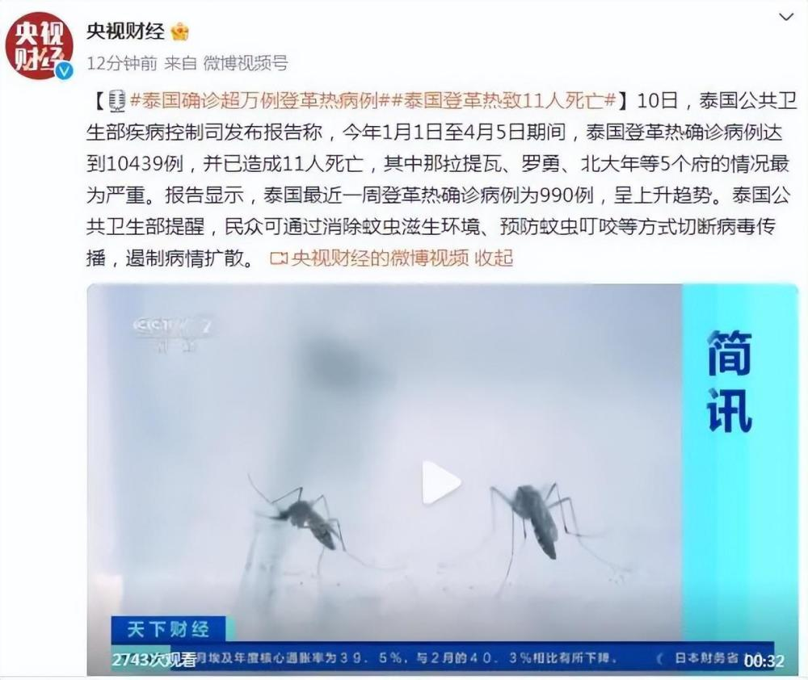

# 突发！多国爆发大规模传染病，致死人数创纪录！国内尚无疫苗，也无特效疗法…

今年以来，阿根廷正在经历创纪录的登革热疫情。该国首都和14个省份共发现登革热确诊病例达6万多人，其中包括超过40例死亡病例。

**多国爆发登革热疫情**

据路透社（reuters）报道，阿根廷卫生部近日发布公告称，今年是自2009年以来阿根廷登革热疫情致死人数最多的一年。主要原因是去年以来，阿根廷全境出现近60年罕见的持续高温干旱天气，给蚊虫大量滋生创造了条件。

阿根廷卫生部强调，登革热是通过蚊虫传播病毒的传染性疾病，灭蚊是最有效的阻断传播的方法。为此，阿根廷卫生部门已在该国范围内进行大规模灭蚊工作，并要求各地居民做好家中清洁和消毒，加强防蚊措施，包括在门口和窗户上安装蚊帐，使用驱虫剂，并清除任何可能成为滋生地的盛水器。

卫生部门还提醒民众，被蚊虫叮咬后一旦出现不适须立即就医，避免因延误救治危及生命。登革热症状包括发烧、头痛、恶心和关节疼痛。

据英国广播公司报道，靠近阿根廷、智利与玻利维亚边境的西北部省份萨尔塔省、图库曼省和胡胡伊省的死亡人数最高。

据悉，阿根廷曾在2009年、2016年和2020年发生过大规模的登革热疫情，分别造成5人、11人和19人死亡。

据巴西媒体当地时间4月7日报道，巴西卫生部日前发布的流行病学报告显示，2023年，该国有4231个城市报告了登革热病例，占巴西城市总数的75%，其中死亡病例173例。该报告显示，今年3月，巴西登革热病例急剧增加，从当月17日到20日，病例数量从32.8万增加到37.3万。

据巴西卫生部公布的统计信息，2022年，该国共有1016人死于登革热，这是自2008年以来的最高纪录。登革热是一种发生在热带和亚热带地区的蚊媒传染病，传播速度快，主要表现为突发高热、头痛、肌肉和关节痛以及皮疹，严重可导致死亡。

10日，泰国公共卫生部疾病控制司发布报告称，今年1月1日至4月5日期间，泰国登革热确诊病例达到10439例，并已造成11人死亡，其中那拉提瓦、罗勇、北大年等5个府的情况最为严重。报告显示，泰国最近一周登革热确诊病例为990例，呈上升趋势。泰国公共卫生部提醒，民众可通过消除蚊虫滋生环境、预防蚊虫叮咬等方式切断病毒传播，遏制病情扩散。

**阿根廷用辐射给蚊子绝育**

**巴西拟制造转基因蚊子**

据报道，为了反击，阿根廷国家原子能委员会CNEA的生物学家自2016年以来一直在进行辐射绝育试验。他们每周对1万只雄蚊进行绝育，并计划将数量增加到50万只。他们预计将在11月释放第一批经过绝育的雄蚊。

加西娅·阿尔瓦说：“它们是通过电离能量进行绝育的。这些不育的雄蚊被释放到野外，在遇到野生雌蚊时，它们将无法繁育后代。”她说：“这样一来，通过连续释放这样的雄蚊，我们就能够减少病媒蚊子的种群数量。”

报道称，利用辐射对害虫进行绝育的类似技术已经应用了几十年，为全球控制基孔肯雅热、登革热和寨卡等疾病的努力提供了帮助。

据报道，巴西正在建造一座蚊子工厂，以抗击全国范围内持续爆发的登革热。该设施的位置尚未确定，其目标是生产多达50亿只被细菌感染的蚊子，这将作为对抗这一蚊子传播疾病的方式。

有关巴西蚊子工厂的细节于4月14日（上周五）发表在了《自然》杂志上，其中非营利组织世界蚊子计划（WMP）宣布，未来10年将在巴西的许多城市释放转基因蚊子，以保护7000多万人免受登革热等疾病的侵害。

巴西是世界上登革热感染率最高的国家之一，2022年报告病例超过200万例。报道称，该工厂将与巴西公共卫生机构奥斯瓦尔多·克鲁斯基金会（Fiocruz）合作。相关设施于2024年开始运行，每年将生产50亿只蚊子。

“这将是世界上最大的生产感染沃尔巴克氏菌蚊子的设施。”WMP负责人、澳大利亚莫纳什大学微生物学家Scott O 'Neill说。

**国内尚无可预防登革热的疫苗**

据悉，登革热是一种由登革病毒经蚊媒传播引起的急性虫媒传染病，主要在热带和亚热带地区流行。

如果前往东南亚、非洲、加勒比海等地区，都会有感染登革热的风险。

得了登革热之后，体温会达到39℃~40℃，皮肤会发红，颜面颈胸四肢的皮肤会红肿充血，身上会疼痛并出现皮疹。典型症状包括持续发热、头痛、肌肉痛、关节痛等，严重时可致死亡。

目前国内尚无可预防登革热的疫苗，也没有特效疗法，登革热的主要预防措施是防蚊灭蚊。医生建议，在登革热风险地区旅游时，外出要穿长衣长裤，身上涂擦驱蚊药水，并且房间里可以安装蚊帐、纱窗，及时清理生活环境的积水，保持干燥，从根源上灭绝蚊虫的滋生。

来源：每日经济新闻综合自锦观新闻、央视新闻、央视财经、财联社、澎湃新闻、光明网

