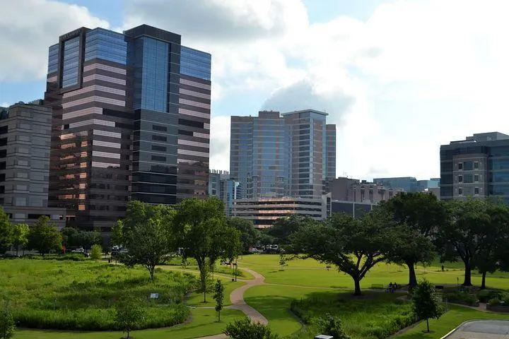

# 花粉柳絮惹人嫌但并不存在完美绿植，北京城市绿化率曾靠它们翻了38倍

_图源：pixabay_

**撰文 | 史军**

**责编 | 李珊珊**

在我们上周一的推送《过敏季越来越长，过敏者越来越多，这已经是“新世纪流行病”了吗？》的后台留言中，大量苦于这个超长花粉季的读者提到了自己遭遇的过敏：

“一到4月就过敏咳嗽，咳得整宿无法休息”；

“年年这个季节开始长疹子，今年特别严重”；

“吃药吃得迷迷糊糊，无法欣赏花城之美”；

乃至，“南京街道上只要出现梧桐，就打喷嚏流鼻涕”……

无论是路边的行道树，还是小区庭院里的绿植，在我们的城市绿化中，本该是经过精心选育的树种中，梧桐、圆柏等常见树种，几乎都是容易引起过敏的罪魁祸首。

根据王辰院士团队2022年发表在《柳叶刀》上的一份中国成人哮喘流行情况报告，哮喘的两大危险因素是吸烟和过敏性鼻炎。而根据中华预防医学会过敏病预防与控制专业委员会等机构在2022年发布的《过敏性疾病流行病学调查报告》，仅北京地区，每年因成人过敏性哮喘造成的社会经济损失高达近35亿人民币。难怪，一部分读者会提议：花医保基金，把致敏的绿化植物们置换掉。

为什么这些“致敏达人”们会作为今天的城市绿化主力军，当年的他们是如何脱颖而出的？这些植物里的“致敏达人”是城市绿化植物选项中避无可避的吗？除了避免引发过敏的可能，城市绿化植物的挑选，还需要考虑什么？世界上有没有一种完美的绿化植物？

**靠着这些速生树木，北京的城市绿化率翻了38倍**

‍‍‍‍‍‍‍为什么我们之前要在城市里种植那么多杨树、泡桐和悬铃木？这是有历史原因的，正是这些性能强悍的速生树种为我们的城市带来了立竿见影的绿化。

要知道，在建国初期，北京的林木覆盖率仅为1.3%，而城市，需要绿化来来提高城市的景观质量和生态价值，增加城市居民的户外活动和社交空间。

在最初，中国的城市最迫切的需求是速生的绿色植被能够遮阴和造景，满足人们对城市景观的期待，速生树木此时便是首选。

就拿毛白杨来说，它耐寒，耐干旱，生长迅速，10年即可长成20-30米高的大树，所以在城市绿化和人工造林中都有广泛应用。

而比起毛白杨，泡桐的生长速度也一点不逊色。一人高的泡桐树苗只要两三年的时间就可以蹿到五六米，堪称速生树种里的佼佼者。与此同时，泡桐还可以适应多种土壤条件，在盐碱环境下也有良好表现。于是，在20世纪八九十年代，泡桐几乎是我国北方绿化的主力树种。

除了速生，遮阴效果也是绿化树种必须考虑的关键点，此时，悬铃木就出场了。

法国梧桐，英桐和美桐都是悬铃木家族（悬铃木科悬铃木属）的成员，因为枝头的果实酷似悬挂的小铃铛因而得名——注意，他们名字里虽然也有“梧桐”两字，却与梧桐（锦葵科梧桐属）和泡桐（泡桐科泡桐属）完全不同。

按照每个果枝上悬挂果子的数量，这些悬铃木又分别被称为三球悬铃木（法桐），二球悬铃木（英桐）和一球悬铃木（美桐）。法桐来自法国，美桐来北美，而英桐则是法桐和美桐的杂交后代。

悬铃木被选作城市绿化植被，还因为他们有优秀的吸尘能力。比如：法国梧桐生长的最初阶段，它们的叶片全身都密密地布满了绒毛，这些毛在显微镜下面就像星星一样，于是有了星状毛的名字。宽大的叶片加上丰富的星状毛，让法国梧桐的叶子成了良好的灰尘颗粒收集器。它们收集灰尘的能力，甚至要强过毛白杨，构树和枫杨。

**事实上，正是因为这种优势，虽然法国梧桐在花期会产生大量的花粉，也能引发一系列的过敏，至今，在欧洲，它仍被广泛地应用做城市绿化，政府则主要通过提供警报和建议个人采取措施来应对开花季的过敏问题。**

也正是因为上述独特的优势，使得大量今天被抱怨的速生树种在建国初期被选作了城市绿化的主力。这些速生树木大大提升了中国的城市绿化水平，到2020年，根据国家统计局发布的数据，全国的城市建成区绿化覆盖率达到了42.1%，而北京市的建成区绿化覆盖率更是达到了49.0%，比解放初期翻了接近38倍。

这些绿化，除了造景，也有效地帮助城市清洁空气，吸收噪声，对降低城市空气污染和噪音污染都发挥了非常正面的作用。它们还对降低城市热岛效应，改善城市热环境也起到了相当的作用。

然而，随着时间的推移，这些速生树种的弊端也逐渐暴露出来。比如，泡桐不够结实的树干带来的问题就是容易折断，并且在生长到一定年限的时候，泡桐的树心就开始出现空洞腐朽，以至于完全没有经济价值。

缺乏经济价值的同时，随着过敏人数的增加，这些常用园林绿化植物的更大的麻烦出现了，那就是：花粉和果实带来过敏症状。

**恼人的花粉和种子**

春天的空气中很多花粉颗粒，在北京，油松，圆柏是主要的花粉来源，而到了南京，营造着浪漫街景的法国梧桐则成了花粉的主要源头。

植物的花粉要依靠风力奔赴与胚珠的约会，这是一个延续了千万年的传统。然而，因为风力传粉的定向性能很差，只有释放足够多的花粉，才能保证繁殖成功率，所以风媒花植物的花粉要比虫媒花的花粉量大得多，以至于把空气变成了一锅花粉粥。

花粉的粒径在几微米到几百微米之间，大部分常见花粉的粒径略大于PM10污染物的粒径，无法进入血液，会被拦在鼻腔、咽喉、上呼吸道，然而，麻烦也恰恰在这。

在充满了花粉的空气中吸一口，花粉粒进入我们的鼻腔，便会跟黏膜上的免疫细胞发生反应，引起过敏。这是因为花粉上带有特殊的蛋白质，那本该是帮助花粉中的精子与胚珠约会的密码钥匙，被人体的免疫系统识别为入侵信号，接下来就是流鼻涕，流眼泪，还有停不下来的响亮喷嚏，再进一步，还会有皮疹，以及各种不适……

要知道，人体有个奇异的免疫系统，它时刻监视着外来入侵者，一旦有异物就会发动免疫细胞进行攻击，并且免疫系统会记住入侵物的“长相”，一旦入侵物再次来犯，就是发动猛烈攻击，这就是我们接种疫苗，抵御疾病的原理。然而，有些时候，在接受无害刺激时，这个警报系统也会发神经，反应过激，发出错误警报，这就是过敏。发生过敏的时候，免疫细胞释放的组织胺等化学物质会刺激平滑肌收缩（产生小疙瘩），扩张血管（皮肤发红），同时诱发刺痒的感觉。免疫系统打得不亦乐乎，我们人体便开始不舒服了。

除了花粉，杨絮和柳絮也是导致过敏的因素。杨絮和柳絮并没有如花粉般携带致敏的蛋白，但它们却有协助一些过敏物质的本领。通常来说，可以织布的棉纤维的长度通常在2-4厘米，而杨絮纤维的长度只有0.5厘米左右，完全没有纺织性能。而杨絮纤维的直径只有10.5微米，如此细碎的植物组织，无法纺纱成线，却足以织成小网把花粉颗粒等等过敏原打包一起送到鼻孔中，皮肤上，进而导致人体过敏。

**是否有完美的绿化植物？**

在过去的十多年时间，这些建国初期就开始各地推广的绿化植物带来的麻烦逐渐被人们认识到。时至今日，很多城市的绿化带植物已经在发生着明显变化了，在北方，绝大多数绿化带上的毛白杨已经被替换成了栾树、银杏和白蜡树。

事实上，除了过敏，今天的人们在选择城市绿化植物时还会考虑更多。

比如，城市中鸟类的需求。

中科院西双版纳热带植物园的研究人员发现，鸟类会将防风林当做移动的路线、觅食与筑巢的场所，也就是说，自然防风林可能对保护生产用地中的鸟类具有重要的作用。于是在我们植树的选择上又多出了一条标准，那就是要为生物提供合适的家园和食物。因为并不是所有的树木对动物都是友好的，比如桉树和橡胶树就是这样的恶霸，它们不仅枝叶有毒，果实有毒，连根系都会分泌抑制其他植物生长的毒素，非常不利于城市野生动物的生长。

另外，物种的多样性也是城市绿化植被选择时需要考虑的问题。因为，过于密集的单一树种，会有利于病虫害传播，也不利于栖息其中的动物。

这是因为不同动物所需要的食物不同，小鸟喜欢禾草的种子，松鼠喜欢核桃楸的果仁，美丽的凤蝶需要西番莲柔嫩的叶子，我们种植的植物的多样性越高，能够吸引的动物就越多，这样的林地和草地的生物多样性就越丰富，也就更有能力对抗疾病气候变化等灾难的侵袭，让我们的城市更有可能与大自然融为一体。

还需要注意的是，树种的选择对防火工作也有影响。一般来说，阔叶树种（如：杨树，山杏）的含水量比较高，不易燃烧；而像松柏类植物，含水量比较低，同时这些植物体中含有丰富且易燃的松脂，一旦着火就会迅速燃烧。树木的枯枝落叶也会影响到防火。北京林业大学的研究人员发现，不同植物枯枝落叶对雨水有不同的的储存能力，比如栓皮栎可以储存2．33毫米，油松是2．12毫米，黄栌是0．89毫米，侧柏是0．23毫米。所以，在选择绿化带植物的，也需要考虑相应的防火能力。当然，话说到这里，毛白杨并没有完全下岗。组织培养技术的发展让我们可以专门挑选雄性杨柳树的茎叶芽来培养，直到产生成千上万的雄性树苗。

毕竟，一种树，要成为城市绿化树种，需要适应性强，能够承受城市环境的压力，耐旱、耐污染，又有广阔的树冠和浓密的叶子，不仅能起到对噪音和空气的净化作用，也擅长营造优美的城市景观。

而作为城市独特的自然人文风貌的一部分，一个城市的绿化树种的选择，既需要考虑气候、土壤、环境等自然条件，又要考虑当地居民的偏好等等人文条件，还需要考虑城市绿化中物种多样性的需求。

从这个意义上，几乎并不存在一个跨时空通吃的、完美的城市绿化树种。

曾经的毛白杨和泡桐等速生树种因为其速生和适应性强的品性，成为了当年的北京相对理想的主力绿化树，然而时至今日，随着人们需求的变化，它们显然已经不再适合这个城市了。我们可以看到，这些速生树种越来越少，取而代之的是生长略缓慢的多样化树种。不过，恰恰因为新树种的慢生，如那句“十年树木”的古谚，这场植被的变迁会是一个以十年为单位的漫长的过程。

