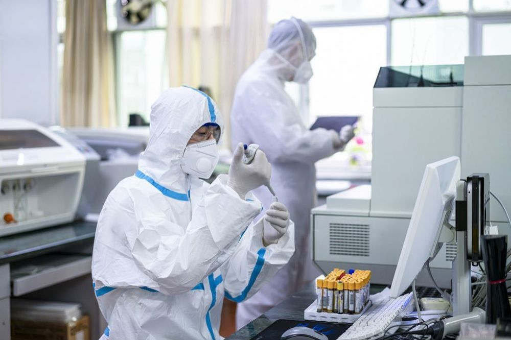

# 专家：没有证据表明二次感染对身体伤害更严重，应以平常心看待新冠

每经记者：陈浩 每经编辑：董兴生

新冠疫情似乎已经离我们远去，但实际上，病毒并未消失。近日，多名网友在社交媒体上晒出抗原阳性的照片，表示已经二次感染。距离去年12月底的疫情高峰已经过去了4个多月，新一波疫情要来了吗？二次感染的症状和伤害程度如何？

4月24日上午，香港大学李嘉诚医学院生物医学学院教授金冬雁在接受《每日经济新闻》记者采访时表示，国内第二波疫情随时都可能到来，但由于现在检测不足，很难判断第二波疫情的具体时间。对于即将到来的“五一”小长假，他表示，人员流动会加速病毒传播，但大概率只会引起感染人数小幅度增加，不会造成感染人数的大幅上升。

金冬雁还表示，没有任何证据表明，二次感染对身体的伤害会更加严重，对非高危人群来说，二次感染通常症状会相对轻微。不过，对老年人和有基础疾病的高危人群来说，二次感染同样有可能造成重症和死亡，对这部分群体仍然要加强疫苗接种。“老百姓应该以平常心看待新冠病毒，未阳群体和高危人群应该特别注意防护，重点是保护老人。”

香港正经历新冠和流感夹击，不会造成严重冲击

金冬雁近日撰文提到，从数据上看，目前香港每天累计有7万多到14万多人感染。由于该时点的阳性者平均五天内维持阳性，需要分摊到5天内计算，由此推算每日新增确诊人数或达1.5万人。

那么，香港是否会迎来新一轮疫情冲击？金冬雁告诉记者，香港现在全面把新冠当成流感来防控，已经完全常态化对待；在疫苗接种上，老人、小孩、长期患病人士等仍可以免费接种第四针疫苗，其他人群接种疫苗需付费。“香港正处于流感高峰期，现在政府部门是流感疫苗和新冠疫苗一块推，香港卫生防护中心一直有流感周报，现在新冠数据和流感数据都呈现在流感周报上。”

金冬雁表示，香港自2022年4月结束了一轮疫情“海啸”后，又分别在去年9月、去年12月到今年1月经历了两波疫情，目前处于第三波疫情。“现在香港整个社会对新冠疫情已经完全习以为常了，不会再把它当回事儿，就是平常心对待。”他也表示，虽然香港自3月1日起已经全面取消“口罩令”，但仍有近半数市民出行时自觉佩戴口罩。

除了新冠疫情，香港还正面临着流感冲击。金冬雁称，统计显示，在4月13日至4月19日一周内，香港有47例成人流感重症或死亡，其中20人死亡。同一时期，新冠重症与死亡人数为39人，其中大概七八人死亡。这表明，目前因流感死亡的人数比因新冠死亡的人数多。“这次季节性流感杀伤力比较低，重症人数也比较少，不会对香港造成很大的冲击。”

新一波疫情快到了吗？

4月22日，中国疾控中心公布全国新冠病毒感染疫情最新情况：2022年12月9日以来，各省份报告人群新冠病毒核酸检测阳性数及阳性率呈现先增加后降低趋势，2023年4月20日降至2661例，2023年4月20日检测阳性率为1.7%；抗原检测方面，2023年4月20日阳性数降至79例（阳性率为0.5%）。

近日，多名网友在社交媒体上晒出抗原阳性的照片，表示已经二次感染。新一波疫情要来了吗？金冬雁表示，国内第二波疫情随时都可能到来，但由于现在检测不足，很难判断第二波疫情的具体时间。“而且中国这么大，各个地方的流行情况不一样，第二波就算是来了，可能大家都不知道。有过一次海啸疫情后，新一波疫情波幅不会太大。”

金冬雁提到，目前，仍然有不少未感染过新冠病毒的“未阳人”，这部分人群比较少，可能只占总人口的10%或者更低，最多也不超过30%，但这类人群是高度易感的。如果他们不打疫苗，很可能就会中招，所以这部分群体要加强疫苗接种。“对于那些健康的非高危人群，第四针可以视情况自愿接种，他们经历一次自然感染获得的免疫力会更强，而且也不会出现严重的症状。”

金冬雁认为，老年人是疫情防控的重点群体，在医疗资源还足够的情况下，应该重点关注“一老一少”。“小孩有集体活动，容易有聚集性感染，免疫力也没有完全成熟，属于易感群体；如果小孩感染了，回家就容易传染给家里的老年人，这样老年人重症和死亡的比例就高了。”

临近“五一”小长假，人员流动加大，这是否会加速新一波疫情的到来？金冬雁认为，人员流动会加速病毒传播，但大概率只会引起感染人数的小幅度增加，不会造成感染人数的大幅上升，也不会造成疫情大暴发。“如果特别担心自己会受感染，可以采取一些防护措施，比如打疫苗，出行戴口罩、勤洗手，避免去人多的地方。”

二次感染会更严重吗？

距离去年12月底的疫情高峰已经过去了4个多月，我们体内的抗体还充足吗？金冬雁表示，一般来讲，正常人在感染6个月后体内抗体水平会下降，特别是有症状感染者，他们感染后产生的抗体基本都能维持6个月，甚至更长，保护效力也会在一年以上。“这些身体健康的群体在半年内再次感染或者再次出现重症的几率是非常小的，如果很不想得新冠，现在也可以再接种一剂疫苗来提高体内的抗体水平。”

“新冠疫情进入地方性流行以后，提高群体免疫力主要有两招，第一个是打加强针，第二个就是自然感染。保持一定程度的低度流行，对整个社会是有好处的。”金冬雁称。

金冬雁表示，没有任何证据表明，二次感染对身体的伤害会更严重，就像得流感一样，不可能每次得流感都很严重或者越来越严重。“新冠病毒致病性肯定是在弱化，这是毋庸置疑的。”

金冬雁还提到，由于去年国内疫情高峰时检测太少，现在很多感染的人并不清楚是首次感染还是二次感染；而从检测数量很稳定的地区来看，例如新加坡，已经经历了好几波疫情，但是重复感染率也只有30%。“在疫情余波里，首先受到冲击的是未阳者，而不是二次感染人群，二次感染总体来说是比较少的。”

“对健康人群和非高危人群来说，二次感染通常症状会相对轻微，以无症或者轻症居多。但是也有一些例外，比如有些人可能由于遗传上的原因，二次感染会严重一些。”金冬雁称，对于老年群体或有基础疾病的群体，无论是一次感染还是二次感染，都容易出问题，二次感染可能会导致基础疾病的恶化。他建议，这部分群体在首次感染3个月后就可以接种一次疫苗，同时在再次感染后提供口服抗病毒药物。

金冬雁多次强调，总体来说，一般人二次感染都是轻症或者无症，老百姓不需要太担心，应以平常心来看待新冠病毒。对于近期引发讨论的奥密克戎变异株XBB.1.16，金冬雁表示，该毒株致病性没有增加，国内报告病例也很少，症状谱也没有明显的改变。

每日经济新闻

