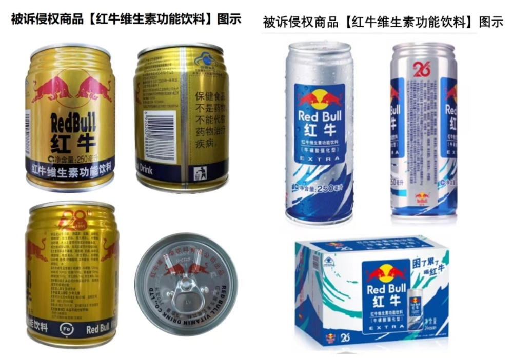

# 中国红牛销售被禁？红牛商标之争再掀波澜：客服称正常生产销售

近八年“红牛”商标之争仍未结束。

4月23日，饮料品牌红牛（Red
Bull）创始公司天丝医药保健有限公司（以下简称“天丝公司”）向澎湃新闻记者表示，收到来自黑龙江高级人民法院（以下简称“黑龙江高院”）的判决书，一审判决华彬旗下的合资公司红牛维他命饮料有限公司立即停止生产、销售“红牛维生素功能饮料”并赔偿天丝公司1亿元。

针对天丝公司公开判决书一事，4月24日，澎湃新闻记者致电“红牛维生素功能饮料”客户服务热线，官方客服表示：“公司仍处于司法过程中，还没有最终的司法结果。”对于华彬集团是否会提起上诉，该客服并未正面回应，仍强调目前处于司法过程中，并表示目前公司“正常生产销售”。

_来源：天丝公司供图_

**华彬四工厂被判侵权，回应称依法上诉**

据天丝公司提供的黑龙江高院判决书，4月12日，黑龙江高院就天丝公司针对红牛维他命饮料有限公司、北京红牛饮料销售有限公司、北京红牛饮料销售有限公司黑龙江分公司侵害红牛商标专用权纠纷一案，做出一审判决（【2017】黑民初12号)。

黑龙江高院判决，合资公司立即停止生产侵犯“红牛”系列商标专用权的商品
“红牛维生素功能饮料”；北京红牛销售公司立即停止销售侵犯“红牛”系列商标专用权的商品；同时判决二被告连带赔偿原告天丝公司经济损失1亿元人民币。

据天丝公司提供的判决材料，至此，华彬集团旗下四家红牛工厂，即红牛维他命饮料（江苏）有限公司、广东红牛维他命饮料有限公司、红牛维他命饮料（湖北）有限公司与红牛维他命饮料有限公司在2021年至2023年陆续被判侵权，法院判决华彬集团旗下红牛工厂立即停止销售侵犯“红牛”系列商标专用权的商品，累计被判罚约4.49亿元。

值得一提的是，天丝公司在4月18日公布了一项2022年10月31日的判决，也就是华彬旗下的湖北红牛工厂一案。

据天丝公司方面提供的材料，早在2022年10月31日，吉林省高级人民法院（以下简称
“吉林高院”）就天丝公司针对红牛维他命饮料（湖北）有限公司、北京红牛饮料销售有限公司、北京红牛饮料销售有限公司吉林分公司侵害红牛商标专用权及不正当竞争纠纷一案，做出一审判决（【2016】吉民初34号)。吉林高院同样判决华彬方面三被告立即停止生产、销售“红牛维生素功能饮料”；立即停止使用含有“红牛”字样的企业名称，并连带赔偿原告天丝公司经济损失3000万元人民币。

据天丝公司方面提供的说法，目前，包括京东、天猫、中石油、中石化、沃尔玛等在内的主流线上线下渠道都已经全面下架了华彬集团生产的“华彬红牛”。

4月24日，澎湃新闻记者在京东、天猫等电商渠道搜索“红牛”已无法找到华彬公司生产的红牛饮料产品。

当日，澎湃新闻记者致电认证为北京红牛饮料销售有限公司官方微博提供的客服热线，客服回应称公司仍处于司法过程中，目前公司也是在正常生产销售。

据中华工商时报24日报道，中国红牛发送声明称，此判决（指吉林案）非生效判决，并不会产生禁止生产和销售的法律效果，将依法上诉。此前还有媒体报道称，华彬集团表示，吉林案是一审，是未生效判决，不具有既判力和执行力。同前案性质一样，这是泰国天丝滥诉的结果。

对于华彬方面上述说法，多位律师表示或有一定合理性。

“在‘红牛’商标的案件中，如果有任何一方不服一审判决，并在上诉期内提起上诉的，一审判决确实暂不生效。在上诉程序中，判决目前无法执行。”上海市德尚律师事务所主任王凡律师向澎湃新闻记者解释道。

王凡介绍，我国民事诉讼采取的是两审终审制度，一般来说当事人不服地方人民法院第一审判决的，有权在判决书送达之日起十五日内向上一级人民法院提起上诉。在中华人民共和国领域内没有住所的当事人，不服第一审人民法院判决、裁定的，有权在判决书、裁定书送达之日起三十日内提起上诉。如果在上诉期内双方当事人都未上诉，此时一审判决才会生效。

邦聖法商律师高鹏翔介绍，在我国，未生效判决不具有执行力。华彬集团所说的“既判力”指的是已经发生法律效力的判决、裁定对后诉的羁束力。“如果华彬方面在法定期限内提起上诉，那么他们关于‘吉林案是一审，是未生效判决，不具有既判力和执行力’的说法有一定合理性。”高鹏翔说道。

值得一提的是，4月18日，吉林高院就红牛维他命饮料（湖北）有限公司起诉天丝公司确认不侵害知识产权纠纷一案也作出了民事裁定书，驳回红牛维他命饮料（湖北）有限公司的起诉请求（或应为“诉讼请求”）。

对此，高鹏翔解释称，这并非是华彬方面对“吉林案”的上诉，他指出，如果华彬方面上诉，应由最高院审理。

**合作期限20年还是50年？持续近8年商标官司“罗生门”**

自2016年起，华彬集团旗下的“华彬红牛”（华彬集团官网也称之为“中国红牛”）与来自泰国的天丝公司就“红牛”商标授权合作期限陷入诉讼“拉锯战”。

据公开报道，上个世纪70年代，泰国知名食品饮料公司天丝集团(TCP
Group)创始人、泰籍华人许书标研发出红牛饮料，于1993年在其父的出生地海南成立国内第一家红牛工厂，也就是海南红牛饮料有限公司，并首次在国内使用中文“红牛”命名，红牛由此进入中国市场。

而据华彬集团官网所述，红牛是由华彬集团于上世纪90年代引入中国，在20年来稳居中国功能饮料市场第一。

据媒体报道，1995年，许书标将天丝红牛的中国区经营权授予华彬集团创始人严斌。2012年，许书标去世后，其子许馨雄接管天丝公司，在2016年以“侵害注册商标专用权”及“不正当竞争”为由将华彬集团旗下多家工厂、销售公司乃至经销商告上法庭。

天丝公司认为，双方合作期限为20年，“经过商标局备案的多份《商标许可合同》表明天丝公司对合资公司的商标许可期限至2016年10月6日止。”据此，天丝公司要求华彬集团旗下工厂停用“红牛”商标，并赔偿经济损失，而华彬方面则坚持许书标在世时曾与严彬签署协议，协议约定双方授权期为50年。

按黑龙江高院的判决书所述，1995年，天丝公司与华彬旗下公司签署了所谓的“五十年协议”，但黑龙江高院认为，上述协议的"真实性存疑”。

天丝公司认为，即便是存在“五十年协议”，也被后续商标使用许可合同所废止，天丝公司与华彬方面分别于1998年、2006年、2009年签订了商标许可合同，均明确约定合同签署后双方之前所订立的商标许可合同均立即终止。

官网介绍，华彬集团旗下的快消品业务板块主要包括五大品牌，即红牛、果倍爽、唯他可可（Vita
Coco）、自由能量饮料品牌战马与高端进口水芙丝（VOSS），但其他四个品牌的知名度均不及红牛。

据华彬集团官方微信公众号，2022年上半年，红牛的销售额达121.97亿元，超预期达成年进度58.6%。据公开报道，2021年，红牛的订单额锁定为218亿元，交货额为221亿元，同比增长4%。2022年，华彬集团全年的总销售额为215.38亿元，但并未单独披露红牛产品销售状况。

公开报道显示，在2023年3月公布的《胡润全球富豪榜》中，严彬以1050亿元的身家跻身第108位。相比去年同期下跌了100亿元。

