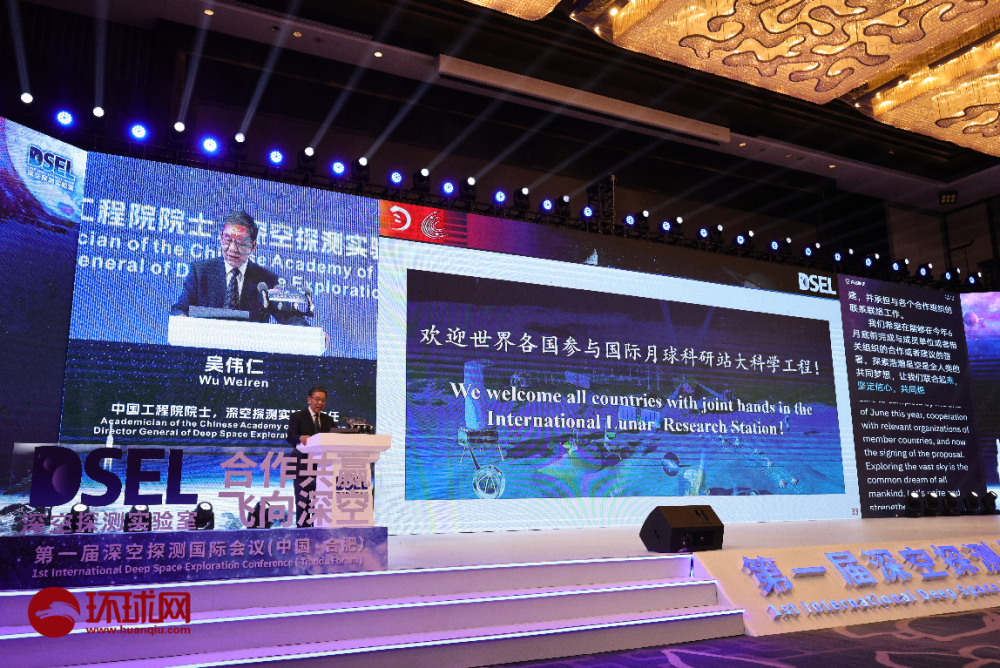
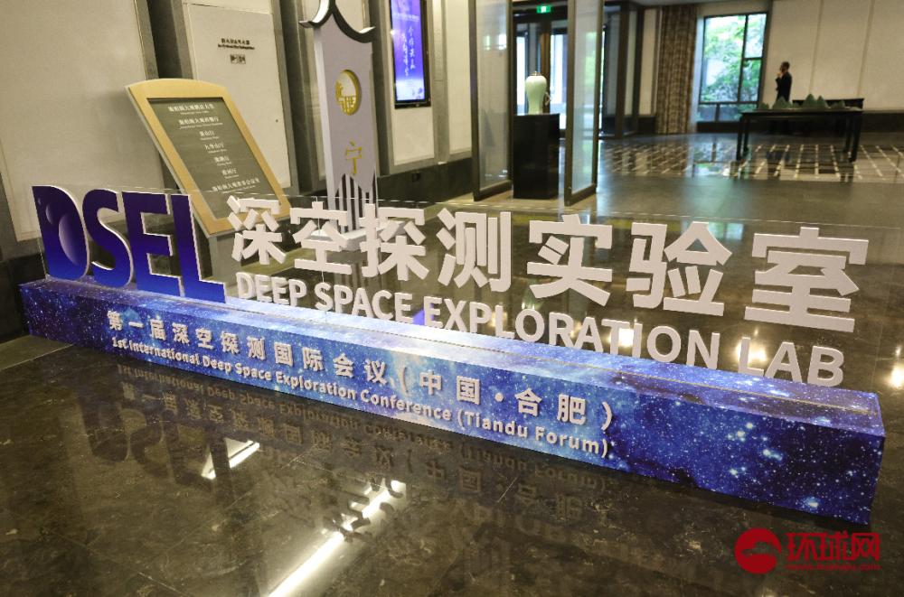

# 中国航天公布国际月球科研站详细计划

【环球时报-环球网报道 记者
樊巍】4月25日，在2023年“中国航天日”第一届深空探测（天都）国际会议上，我国深空探测重大专项总设计师吴艳华以及中国工程院院士、深空探测实验室主任吴伟仁，分别就未来中国航天的深空探测，以及国际月球科研站建设作了专题报告。报告指出，我国初步规划于2030年前后建成月球科研站基本型，2040年前后建成完善型。未来，我国将持续推进国际月球科研站、中海联合月球和深空探测中心、国际深空探测联合会等重点方向建设，深化深空探测领域国际合作。

_摄影：邓孝慈_

深空探测事业是拓展人类认知、服务人类文明、增进人类福祉的伟大事业，值得人类永续求索。吴艳华介绍称，当前月球是深空探测热点，火星是深空探测重点，发现未知是永恒主题，国际合作成为共识。中国将持续开展月球、行星探测，为这一人类共同的事业奉献中国智慧、中国力量。

“在月球探测方面，我国将在2024年前后发射鹊桥二号中继星和嫦娥六号探测器，实现月背采样返回，2026年前后发射嫦娥七号，实现月球南极资源勘查，其中一个重点目标是要寻找水冰等物质；2028年前后发射嫦娥八号，此次任务将重点开展月球科研站的月面指挥通讯中枢技术验证、远程机器人探测和资源原位利用，而在此任务之后，嫦娥八号将和嫦娥七号一起构成国际月球科研站基本型。在行星探测方面，我国计划在2025年前后发射天问二号探测器，实现近地小行星伴飞、取样和返回、主带彗星伴飞，随后还将发射天问三号进行火星采样返回，发射天问四号开展木星系探测和行星穿越探测，在2046年前后到达天王星。”吴艳华称。

中国工程院院士、深空探测实验室主任吴伟仁在会上介绍称，国际月球科研站由中国提出，并联合多国共同建设，目标是建成在月球表面和月球轨道长期自主运行、短期有人参与，可扩展、可维护的综合性科学实验设施。

_摄影：邓孝慈_

依据“总体规划、分步实施、边建边用”的原则，国际月球科研站将按照三个阶段分步实施，计划2030年前后建成基本型，开展月球环境探测和资源利用试验验证；2040年前建成完善型，开展日地月空间环境探测及科学试验，并建成鹊桥通导遥综合星座，服务载人登月和火星、金星等深空探测；之后建设应用型月球科研站，由科研型试验站逐步升级到实用型、多功能的月球基地。

吴伟仁表示，作为国际月球科研站基本型建设阶段的重要任务，嫦娥六号将于2024年前后发射，实施月背采样返回任务，此次任务中将搭载法、意、瑞、巴等多国的探月载荷；嫦娥七号将于2026年前后发射，开展月球南极的环境与资源详查，目前已收到11个国家18类国际载荷搭载意向；嫦娥八号将于2028年前后发射，开展月球资源利用试验验证，构建月球科研站基本型。“近年来，我国空间技术能力实现重大跨越，建成深空探测重大基础设施，并与世界多个国家建立起合作，这些都为国际月球科研站建设奠定了坚实基础。”吴伟仁称。

据悉，国际月球科研站由地月运输系统、月面长期运行保障系统、月面运输与操作系统、月球科研设施系统、地面支持及应用系统五大基础设施构成，具备能源供应、中枢控制、通信导航、天地往返、月球科考和地面支持等保障能力，持续开展科学探测研究、资源开发利用、前沿技术验证等多学科、多目标、大规模科学和技术活动。

吴艳华透露，我国正在论证鹊桥通导遥综合系统方案，拟按照“三步走”方案，支撑我国以及合作国家的深空探测任务目标。其中，鹊桥二号中继星将于2024年年初发射，其作为探月四期公共中继星平台，将为嫦娥四号、六号、七号、八号任务提供中继通信服务。该任务还将搭载天都一号和天都二号两颗鹊桥通导技术试验卫星，开展关键技术验证。

吴艳华表示，中国坚持“平等互利、和平利用、共同发展”的原则，倡导世界各国一起推动构建人类命运共同体。中国探月工程自2004年实施以来，积极推进科学载荷搭载、数据开放共享、测控相互支持、共同科学研究等多种形式的合作交流，与超过19个国家和地区开展合作，先后签署23份国际合作协议或谅解备忘录。未来，我国将持续推进国际月球科研站、中海联合月球和深空探测中心、国际深空探测联合会等重点方向建设，深化深空探测领域国际合作。

