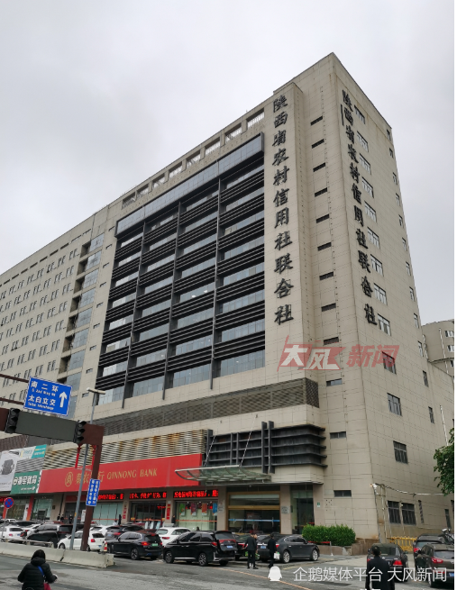

# 信合“被贷款”事件为何频发？快评：坑苦无辜者，后遗症何以久久难愈

近半年读者投诉中，涉及信合被贷款的案例高达数十起。 **信合“被贷款”事件为何频发？是系统错误？还是人为原因？**
针对读者关心的一些问题，近日，华商报大风新闻记者采访了陕西省农村信用合作社联合社。

_陕西信合办公地点_

陕西信合回应：2008年前“手工”操作，难免存在差错

4月24日，针对读者关心的一些问题，华商报大风新闻记者来到陕西省农村信用合作社联合社采访。

**问题一：针对之前投诉人反映，陕西信合对外电话“96262”客服，而这个电话，打过无数次后，为何一直没有回复？**

**回应：** 陕西信合办公室工作人员称，目前陕西信合和秦农银行共同用一个客服电话“96262”，工作人员属于秦农银行，业务只负责转交，没有答复业务。

**问题二：对于信合总部在接到投诉进行转交之后，有无跟进督办机制？对于典型案件是否进行直接督办？近年来直接督办的有哪些案件？**

**回应：** 信合工作人员说，陕西信合属于两级法人制，省级和县级，接到投诉后，会直接转交到县级信合，主要问题解决在县级信合，省级会督办。

**问题三： 信合“被贷款”事件为何频发？是系统错误？还是人为原因？还是恶意诈骗？**

**回应：**
工作人员说，2008年前，信合的贷款业务属于手写，这种“手工”操作，难免就会有些失误。基层单位，难免存在一些恶意造假身份证，冒领套取等行为。随着银行的新系统和二代身份证的更换，这种现象就非常少了。

**问题四： 2015年每日经济新闻曾报道《陕西信合“被贷款”事件频现
办公室人士坦承管理存漏洞》，接受媒体采访时，信合表示在筛选清理被贷款情况，截至目前，清理情况如何？是否公布结果？**

**回应：** 该工作人员介绍，陕西信合曾连续对“冒名贷款”整治几年，也有相关的数据，从自身业务及安全角度就没有公开这部分数据。

**问题五：作为省属大型金融机构，储户信任是企业生存之本，信合如何杜绝“被贷款”现象？如何自我监管？**

**回应：** 陕西信合工作人员介绍，他们信合有严格的贷款流程、审计、监督流程。

半年数十起案例，均为投诉在信合“被贷款”

**在这个信息互联互通，个人征信成为一项重要衡量标准，被贷款，成为失信人员后，给这些受害者带来无尽的困扰。在近半年读者投诉中，华商报大风新闻记者梳理发现，涉及信合被贷款的案例多达数十起。**

陕北的赵女士给华商报反映说，她去年底查征信的时候发现，她们当地信合无故给她名下一笔五万元的贷款，留的身份证号是她的。

4月21日，赵女士告诉华商报大风新闻记者，事发后，她们一直到省、市、县信合反映。事后，当地信合称，5万元还上了，征信给处理了。虽然钱还上了，但她名下永远有这笔莫名贷款的记录，到底谁贷了这部分款？又是谁还的这部分钱？信合为何不给她提供信息？这种操作方式肯定“野蛮”。

李先生来电说，他一直在西安，前几天收到电话，咸阳一个县上信合说他在23年前有贷款，还有五六笔，总共有8万多元，他查了一下，而他自称根本没有在那里贷款，而且当时还不到20岁，他本人也没签字，最后信合说让他起诉。

咸阳30多岁刘女士说，去年买房时，发现才发现名下陕西信合有三个贷款，一共30万，第一个贷款是妹妹17岁，未成年时期。连续多笔贷款。因为根本没有贷款，她们反复向省、市、县信合、银监部门反映。这些贷款又突然还了。今年1月份，他提交的异议后，才恢复征信。这笔钱谁贷的？又是谁还的？至今是个谜。

曹先生是乾县人，自称当地信合在其不知情的情况下，2015年以他的名义贷款10万元，而且上面的担保人也不知情……

大风快评：“被贷款”坑苦无辜者，后遗症何以久久难愈？

人在家中坐，债从天上来。

贷款不是自己借的，钱不是自己用的。

从投诉案例看，你确实无法苛求这些“被贷款者”没能保护好个人信息，因为连陕西信合都明确承认这是“难免的”——2008年前的贷款业务属于手写，“手工”操作难免会有失误；基层单位也难免存在一些恶意造假身份证，冒领套取等行为。

很显然，2008年前发生的“被贷款”，与陕西信合有着莫大关系。陕西信合同时也表示，随着银行的新系统和二代身份证的更换，“被贷款”现象已经非常少了。亡羊补牢，未为迟也，把漏洞堵上了，这是个好事情，但问题是，那些因为“难免”造成的受害者们不应该被忘记，更不能当他们不存在。在这个信息互联互通，个人征信成为一项重要衡量标准，“被贷款”意味着什么，不言而喻。

更值得注意的是，几年前，媒体就爆出过陕西信合旗下信用社“被贷款”事件，陕西信合曾回应称“出现冒名贷款、‘被贷款’现象，有农村业务条件的客观原因，也有内部管理漏洞的原因”，并表示将加强对冒名贷款整治和贷后抽查。然而，时至今日，“被贷款者”并没有得到应有的公正对待。宜君县的李女士、印台区为母亲伸冤的小王，还有乾县的李女士等等，他们还在奔波维权，等待着真相。我们不禁要问：“有错必担责”既是生活常识，也是基本的商业交往原则，

银行犯错，岂能让他人“埋单”？当年筛选清理被贷款这一铿锵有力的承诺难道也只是应付一下舆论而已？

无论问题出在哪儿，都不能让无辜者为他人的错误买单，期望相关部门拿出更切实的行动来回应关切，展现出金融机构应有的风险管理和防范能力，否则，如何让人相信“被贷款”不会再发生。

**华商报大风新闻记者 佘晖 杨鹏 编辑 董琳**

**（如有爆料，请拨打华商报新闻热线 029-8888 0000）**

