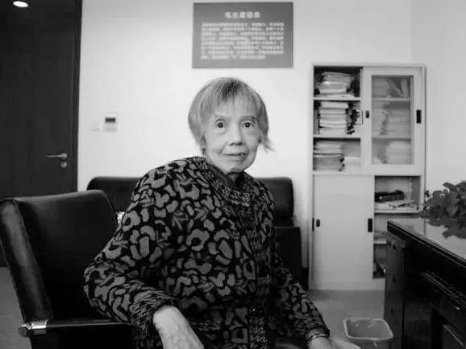
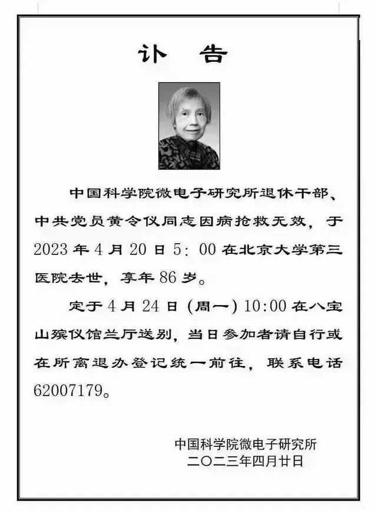
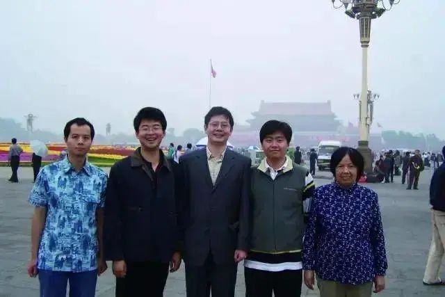
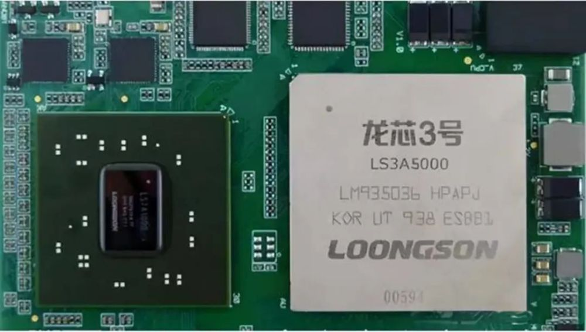
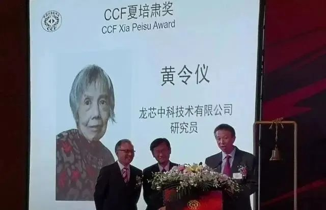

# 她走了，一辈子“匍匐在地，擦干祖国身上的耻辱”

**“十年耻痛今宵去，芳草天涯迷人还。”**

编辑：陈佳莉

中国科学院微电子研究所于近日发布讣告称，该所退休干部黄令仪因病抢救无效，于2023年4月20日去世，享年86岁。

黄令仪，对于普通大众来说不是一个熟悉的名字，在芯片领域却是响当当。

从二极管、三极管、大规模集成电路，到中国自主研发设计的第一枚CPU芯片，黄令仪见证并参与了中国微电子行业从无到有的发展历程。退休之后，她继续发光发热，成为龙芯研发团队项目负责人之一，被誉为“中国龙芯之母”。

歼-20、北斗卫星能够拥有我国国产“心脏”，成功打破西方技术封锁，背后都少不了黄令仪等一批芯片人的付出。

为了研发芯片，龙芯中科董事长胡伟武曾邀请65岁的黄令仪“出山”，也亲眼看到过这位老前辈有多拼。

他对《环球人物》记者表示，快80岁时的黄令仪仍然每天到公司上班，拖着鼠标在电脑上查电路。他想说不要这么辛苦了，黄令仪脱口而出一句话：“我这辈子最大的心愿，就是匍匐在地，擦干祖国身上的耻辱。”

_·黄令仪去世讣告。_

与微电子学结下终生之缘

“黄老师小时候经历过抗日战争，在桂林亲眼见到一名5岁的小女孩在防空洞外被侵华日军的飞机炸死了。‘擦干祖国身上的耻辱’，这种精神是一代代传下来的。”胡伟武对《环球人物》记者说。

1936年，黄令仪出生于广西南宁，祖籍广西桂林全州县两河镇鲁水村。小小年纪的她，经历过山河破碎的绝望和流离失所的痛苦。成年后，她以优异的成绩考上华中工学院（今华中科技大学）。

1958年，黄令仪毕业后被推荐到清华大学半导体专业学习，从此与微电子学结下终身之缘。当时，清华大学半导体专业刚创办不久，黄令仪等一批新生，肩负着将我国半导体专业发扬光大的重任。

两年后，黄令仪学成返校，在华中工学院创建了半导体专业，并亲自讲授半导体器件与材料课。她带领一批年轻的教工和学生，风风火火地创建了国内首个半导体实验室。

“什么都自己动手干，并研制出了半导体二极管。当时居然得到心中敬仰的时任科学院院长、著名诗人、作家郭沫若的视察及鼓励，大家非常兴奋。”黄令仪曾回忆。

上世纪60年代，黄令仪前往中科院计算所二室101组（固体电路组）工作，一心投入到科研工作中。

为了突破“两弹一星”中的瓶颈，国家成立计算机所二部，专攻微型计算机和三极管等项目，这是中国第一个芯片研究团队，黄令仪是团队负责人。在缺资料、缺设备、缺人才、缺材料的情况下，她带领队员们呕心沥血成功研制出半导体三极管。

此后，在大型通用计算机研发过程中，为了能够尽快研制出性能稳定的存储器，黄令仪和她的团队一步一步开始突破。他们研制的芯片在1978年赢得了全国科学大会重大成果奖。此后，晶体管研发也取得了实质性进展。

中国的集成电路和芯片发展开始向世界水平逼近，但差距依然明显。

_·2004年，在龙芯2C芯片设计运行成功后，黄令仪（右一）与龙芯课题组成员到天安门看升旗。_

“琳琅满目非国货，泪眼涟涟”

1989年，黄令仪受邀参加美国国际芯片展览会，但怎么也没有料到，在那里受到了终生难忘的刺激。

在加州拉斯维加斯的展会现场，她参观了一周，成千上万的摊位几乎跑遍了，却没找到中国的摊位。好不容易在拥挤的人群中看到了几个国人手中拿着长城公司的塑料袋，她立马迎上去，亲切地问：“你们是来参展的吧？”
“不，是来参观的。”

她在日记中写道：“琳琅满目非国货，泪眼涟涟。”这坚定了她要“擦干祖国身上耻辱”的决心。

回国后，黄令仪继续研究集成电路，从建立版图库，到探究寄生参数对性能的影响，一切重新开始。这一时期，由她主导研究的两个项目获得了国家专利。

随着黄令仪在业内知名度的提高，2000年，有关单位推荐她去参加在德国纽伦堡召开的国际发明专利博览会。这是我国第一次向外界展示芯片类产品，也是德国第一次邀请我国科研人员参加。黄令仪带着研究成果来到了德国。

那次展会，黄令仪一行让外国人感受到了中国的坚持与毅力。

“大约全国去了32人，别人摊位是一个公司，我们则是一个国，摊位小而拥挤，但毕竟突破了‘零’。”黄令仪曾在自述中写道，“归国的大巴走了约一半车程，被通知我送的专利被评为银奖，高兴之余，写了几句歪句：神州之尊重泰山，赤子荣辱轻鸿毛；灵台无计四十载，不觉青丝已成雪。纽伦堡夜星光灿，启明银座落中华；十年耻痛今宵去，芳草天涯迷人还。”

“但是兴奋之余，定下心来，仔细一想：芯片做出来了，没有用，锁在抽屉中，得了奖，又怎样？它只是一张纸。”黄令仪心中始终不甘。

65岁再“出山”

2001年，65岁的黄令仪已经进入退休生活，但她的志向还没有实现。此时，中科院胡伟武教授等人向全国发出了打造中国芯的集结令。他们亲自找到黄令仪，邀请她一起搞芯片。

对于这段回忆，黄令仪曾自述道——2001年12月左右，夏培肃院士的博士研究生林琦给我打电话，说夏培肃与李国杰所长要找我，希望我能帮助计算所的CPU做物理设计。第二天，一群年轻人坐在一个大会议室中，有人介绍了情况，又让我参观了他们研制成功的用FPGA烧成的CPU芯片，并提出了要求。

当时，黄令仪回答是“请让我考虑三天”。

会后，黄令仪问“你们有多少经费”，回答是200万元，但要留100万培养研究生，顶多只能拿100万做CPU。此时黄令仪心中一震，软件费、投片费、人工费、返工费……这个经费要差一个数量级！当时的她有点不敢接，只怕半途而废、不了了之。

然而，黄令仪内心深处，对计算所有着深厚的感情。最终，她还是毅然选择加入龙芯研发团队，成为项目负责人。

2002年8月10日，我国首款通用CPU“龙芯1号”研制成功。虽然性能上差距很大，却真正打破了国产计算机无芯可用的历史。

在黄令仪等芯片人的不懈努力下，“龙芯3号”等一大批国产高性能芯片应运而生，在很多领域发挥作用：复兴号高铁实现了100%的国产化；歼20等先进军事装备，配套了相控阵雷达，换上了中国自己的“心脏”；北斗卫星也装上了中国芯，彻底打破了西方的技术封锁。

黄令仪曾坦言，参加龙芯项目是她一生中最紧张 、最艰苦的工作，然而也是心情最舒畅和感到最幸福的工作。

“因为它是如此的相似，一样的激情满怀，一样的时代使命感，一样的拼搏，一样的为国家的需要，一样的进展很快。”

2020年1月，黄令仪获中国计算机学会女性科技工作者夏培肃奖。中国计算机学会的获奖理由写道：“黄令仪研究员在长达半个多世纪的时间里，一直在研发一线，参与了从分立器件、大规模集成电路，到通用龙芯CPU芯片的研发过程，为我国计算机核心器件的发展做出了突出贡献。”

_·黄令仪获得夏培肃奖现场。_

在长达半个多世纪的艰辛探索中，以黄令仪为代表的芯片人，从二极管、三极管、微型计算机、大型集成电路等，一路披荆斩棘，打造出了中国人自己的芯片。

“受任于败军之际，奉命于危难之间”，黄令仪为了“擦干祖国身上的耻辱”，倾尽一生。

资料来源：长江日报、极目新闻、澎湃新闻、央视《面对面》节目等。

总监制： 吕 鸿

监 制： 张建魁

主 编： 许陈静

编 审： 苏 睿

