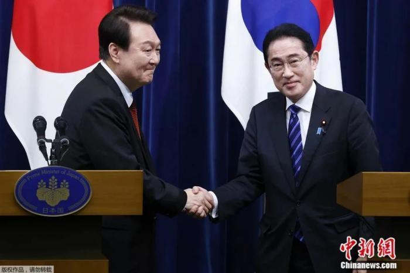

# 尹锡悦称“无法接受日本须为历史下跪”，韩在野党：荒谬！

中新网4月25日电
“这是贬低国民、降低国家威信的荒谬言论！”近日，韩国总统尹锡悦在访美前接受多家外媒采访，引发争议。而其最新的言论涉及韩日关系，遭到韩国在野党的批评。

韩国专家指出，在访美前，尹锡悦或是考虑到美方而接受了采访，本应争取国家利益，但现在失去利益的可能性更大。

**尹锡悦涉日言论遭批**

**“不敢相信这是韩国总统的发言”**

韩国总统尹锡悦24日启程对美国进行访问，在此之前他接受美国《华盛顿邮报》采访时谈到了韩日关系。尹锡悦称，拿百年前的事情(对日)“说绝对不行”“要求下跪(道歉)”令人无法接受。

尹锡悦说，欧洲曾经历过残酷战争，但昔日的对手如今正在携手开创未来，这需要决断力。“我认为，政府(针对对韩日合作持消极态度的人群)的说服工作已经十分到位。”

对此，韩国总统室24日发布说明资料解释称，“尹锡悦此番话意指以这种态度行事不利于发展韩日关系。改善韩日关系是两国关系面向未来发展的必经之路。”

尹锡悦的言论引发韩国在野党批评。共同民主党代表称，“无法理解这番话，怀疑是不是韩国总统的发言。真是令人尴尬和灾难性的。这是不恰当的言论。”

还有人批评称，“这是贬低国民、降低国家威信的荒谬言论。”“看到爆炸性新闻时，我简直不敢相信自己的眼睛。还以为是日本首相接受《华盛顿邮报》采访呢。”

**尹锡悦“单方面主义”言论频出**

**专家：升高外交安保风险**

事实上，这并不是尹锡悦的言论首次招致争议和批评。

《韩民族日报》指出，韩国总统尹锡悦在未经充分公论化的情况下，自以为是地发表与国家安保及受害者人权直接相关外交事宜的状况反复发生。

尹锡悦19日接受路透社采访时表示，如果乌克兰的情况对于国际社会来说变得“难以宽容”，韩国可能会将援乌范围扩大到人道主义和经济领域以外，暗示了对乌克兰提供武器支援的可能性。这与韩国政府之前“不支援杀伤性武器”的方针有所不同。

对此，俄总统新闻秘书佩斯科夫称：“遗憾的是，首尔从始至终采取了相当不友善的立场。当然，供应武器的开始，也就间接意味着卷入这场冲突。”

有批评称，在此过程中，韩国政府提前亮出了谈判底牌，耗尽了谈判能力。

_3月16日，韩国总统尹锡悦(左)与日本首相岸田文雄(右)在东京举行联合新闻发布会后握手。_

尹锡悦在韩日首脑会谈前一天，即3月15日接受《读卖新闻》采访时，就韩国政府提出的二战日本强征韩籍劳工索赔问题第三方代赔方案表示，该解决方案不会导致日后行使追偿权。韩媒称，这也等于是省略了充分听取意见的程序，打出了韩国政府的底牌。

在韩日首脑会谈后，尹锡悦受到强烈批评，他于3月21日回应称，“我本可以成为对史上最糟糕韩日关系置之不理的总统，但我认为，若连我也想刺激敌对性民族主义和反日情绪，将其用于国内政治，就违背了作为总统的职责。”

尹锡悦强调了“决断”，并表示若韩国率先“扫除绊脚石”，日本肯定也会响应。然而，日本政府至今未响应。

韩国专家指出，尹锡悦的“单方面主义态度”将升高外交安保风险。在访美前，尹锡悦或是考虑到美方而接受了采访，本应争取国家利益，但现在失去利益的可能性更大，“很奇怪尹锡悦为什么会以这种方式接受外国媒体的采访”。

