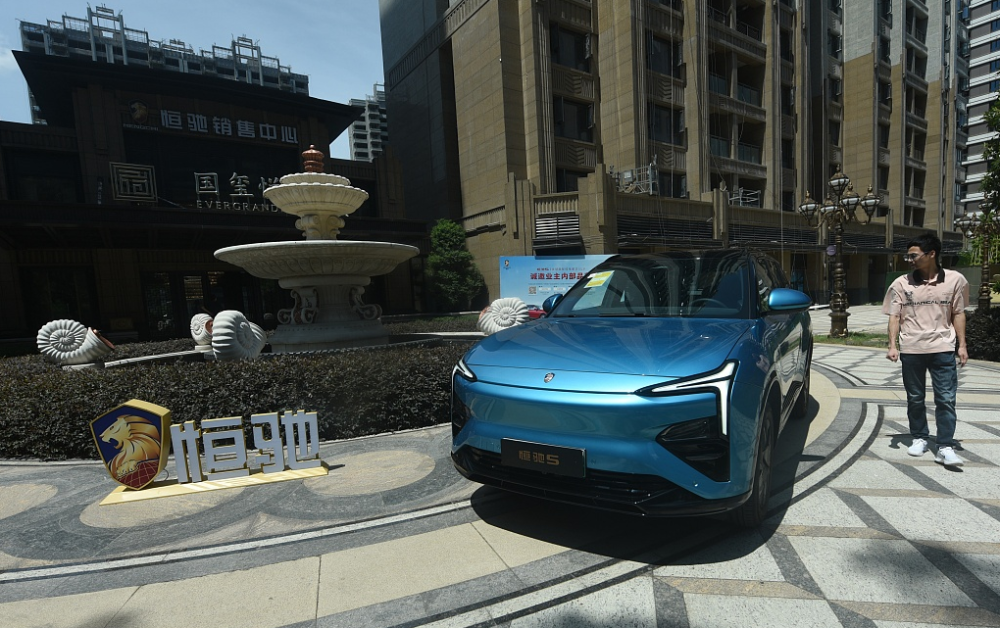

# 恒大汽车2元出售养生谷亏损项目，为向债权人示好？三地工厂已停工

_来源：视觉中国_

作者 | 陈弗也

编辑 | 杨布丁

出品 | 棱镜·腾讯小满工作室

4月24日晚，恒大汽车（00708.HK）发布公告，将出售旗下的47个养生谷项目，收购方为其母公司中国恒大（03333.HK）的附属公司，交易价格仅为2元。

交易完成之后，恒大汽车会短期内持有剩下的天津、南宁两个养生谷项目，除此之外，将会专注于新能源汽车的研发和生产工作。

在众多车企中，恒大汽车是一个特别的存在，一直以来坚持“两条腿走路”，但这“两条腿”的业务又毫不相干，一个是康养旅游项目，一个是新能源汽车项目，且前者贡献着绝大多数的营收。

即便如此，恒大汽车的股票一度备受资本的追捧，在一辆车都未量产的情况下，其市值一度超过吉利、本田、小鹏、理想、上汽、广汽等国内外知名车企。

公开资料显示，恒大汽车共有天津、上海、广州三大整车生产基地，根据作者此前的走访，上海、广州的基地已处于停工状态，仅保留少量人员来维持工厂的基本运营，恒驰5一直在天津工厂进行生产。

此次公告还称，因为资金不足，天津工厂已暂停生产恒驰5。

**为何只卖两块钱？**

恒大汽车前身为恒大健康产业集团有限公司，2020年8月更名为现有名称。

由于恒驰车辆迟迟未能量产，健康产业一直都是这家上市公司营收主要来源。根据恒大汽车2021年中期报告，当时，其总营收为69.23亿人民币，其中来自健康管理部分的营收为68.65亿人民币，新能源汽车部分收入仅4000万元。

这些健康产业的项目主要就是分布在全国各地的“恒大·养生谷”，这些养生谷集医疗、养生养老、商业保险等资源为一体，截至当时，其会员及客户达到45万人次。

不过，养生谷项目一直处于亏损状态，2018年、2019年、2020年、2021年上半年，其归母净利润分别为-14.29亿、-44.26亿、-73.94亿、-47.87亿。

恒大汽车在公告中写道，由于新能源汽车需要庞大的投资，而目前现有资源有限，向养生谷项目进一步投资不符合去杠杆化的整体战略，并会影响新能源汽车业务。

根据此次公告，截至2022年底，待出售资产未经审核的负债净额为247.89亿人民币，交易完成后，恒大汽车将会录得收益247.89亿元。

恒大在3月22日的债务重组方案中曾披露了恒大汽车的相关财务数据，截至2021年底，恒大汽车的总资产为595.21亿，总负债为588.3亿，负债率高达98.8%。估算可知，此次交易完成后，恒大汽车的负债率将会大大下降。

两块钱的交易价，可能仅是象征性的收取。

其母公司中国恒大在收购了这些资产后，负债率或许会提高。但是对于已经严重资不抵债的恒大来说，这些新增的负债并不会对其资产基本面产生质的改变。截至2021年底，中国恒大的负债总额为18980亿，股本总额为-1990亿元。

**或为说动债权人**

3月22日，中国恒大发布了境外债务重组方案，恒大汽车的股票是重组的重要筹码。

根据方案，中国恒大将拿出32.5亿股恒大汽车的股票来发行与恒大汽车股票挂钩的票据。中国恒大还会发行强制可交换债券，可交换30.1亿股恒大汽车的股票。以上股票将占据恒大汽车所有股票的58.54%。

香港市场研究公司Bondsuperart的分析师陈家朗曾向作者分析，恒大汽车和恒大物业都是香港上市公司，他们的部分股份由中国恒大持有，这些属于恒大的境外资产，在对这两家子公司股权的索偿上，境外债权人要比境内债权人优先。

如果重组成功，债权人将有可能成为恒大汽车的主要股东，但他们可能并不愿意接盘一个即将资不抵债的上市公司。

4月3日，中国恒大公布了重组进展，其方案得到了债权人特别小组的认可，但是，特别小组仅持有中国恒大相关债务未偿还本金的20%，而香港法律规定，重组方案须得到持有75%债务的债权人同意，法院才会批准生效。

在陈家朗看来，想让其他债权人接受这个方案，恒大需要提出具有吸引力的条件，这些条件必须要考虑到各个选项的预期损失和实际回收价值。

目前，恒大正在劝说其他债权人在4月27日之前接受这个方案，在这个关键时期为恒大汽车降负债，或许会有一定效果。在交易公告中，恒大汽车也提到，参考港交所同类公司的估值情况，此次交易有助于提高他们的估值，继而吸引投资者以完成融资。

目前，在港交所上市的国产车企有比亚迪、吉利、长城、理想、蔚来、小鹏、零跑等，其中市值最小的是零跑汽车，总值约400亿港币，而恒大汽车停盘前的市值为347亿港币。

**恒大汽车还有救吗？**

在此次交易公告中，恒大汽车还透露了一个关键信息，由于资金不足，其暂停了恒驰5的生产，预计5月恢复生产。

恒驰5是恒大汽车量产的第一款车，自去年9月开始量产以来，到今年3月22日，恒大汽车已经向客户交付了900多辆恒驰5。在竞争激励的新能源汽车市场上，这个交付量显得微不足道。

一位恒大汽车的前员工曾向作者感叹，恒大汽车的性价比相对来说不算低，17万的车有30万的豪华感，但是，很多潜在客户一看是恒大的车，就会被吓跑。

“如果恒大地产不出事，还是如日中天，恒大汽车就自带品牌效应，不愁销量；但如今，恒大地产出事了，‘恒大’就成为了恒大汽车的负资产。”这位前员工说。

恒大汽车的停产并非没有征兆。早在3月22日的公告中，恒大汽车就提到，如果无法获得新的流动性注资，就有停产风险。

根据这份公告，恒大汽车如果能够获得290亿元的融资，将会推出多款旗舰车型，并有望实现量产。但即便如此，2023年-2026年，其累计无杠杆现金流依然是负数，在-70亿元到-50亿元之间。

此外，由于流动资金紧张，为维持基本的业务运营，恒大汽车裁减了员工人数。当时，他们共有2795名员工，包括已停工人员931人。而去年中期，其还有3742名员工。

**腾讯新闻出品内容，未经授权，不得复制和转载，否则将追究法律责任。**

