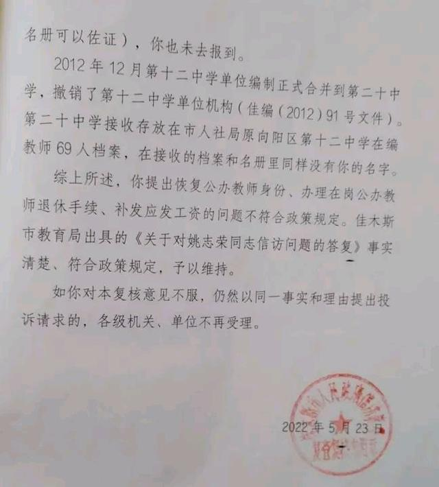

# 教师请病假25年后发现编制消失，媒体：别让吃空饷成理所当然

近日，黑龙江佳木斯“教师请病假25年未返岗，退休前发现编制“消失”，要求补发工资90万”一事引发关注。

1997年，原佳木斯向阳区第十二中学教师姚志荣因病请假到北京治疗，之后一直没有返校工作。2020年，59岁的她在退休前夕发现，学校在编教师中没有自己名字。她向法院提起行政诉讼，请求判令佳木斯市教育局为其恢复教师身份、办理在岗公办教师退休手续、补发2001年1月至2022年7月的工资暂计90万元。

**正观视评：**

请假25年不在岗也就算了，居然还想要编制，享受公办教师退休待遇，甚至还想白拿21年的工资，这要求不能说是过分，只能说是荒唐。也难怪从学校到当地教育局均表示无法满足，当地法院也驳回起诉。

二十多年不在岗，跟离职也没多大区别。就算是身体原因，学校也没有义务为其保留几十年的编制，更不可能让她“吃空饷”。这是很简单的道理，没什么好说的。但让人感到好奇的是，她究竟哪来的底气提出如此要求？

不可否认的是，现实中确实存在人不在岗，却还占着编制、白拿工资的情况。就以姚志荣来说，1997年就已离岗，但直到2001年，在佳木斯向阳区政府的干预下，才取消其编制、停发工资，等于吃了三年多“空饷”。学校保留其编制、继续发放工资，或许是出于人性化考虑，但学校毕竟是政府财政统发工资的单位，这种做法是否合理、可以持续多久，值得商榷。

从这一点上讲，姚志荣的经历对政府部门、事业单位有一定的启示意义。对于因伤病不能胜任工作的职工，是应该予以关怀，但必须兼顾公平，符合规定，绝不能让“吃空饷”成为理所当然。

