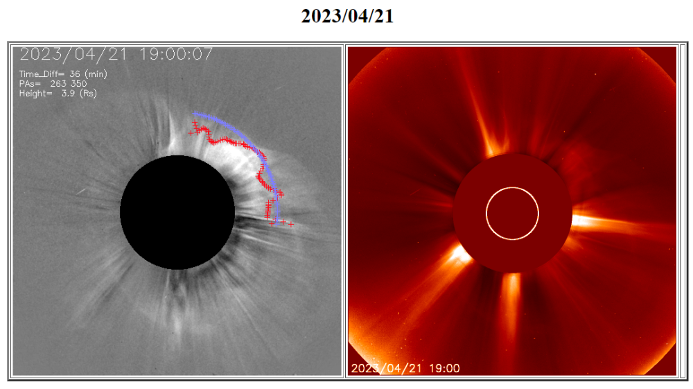
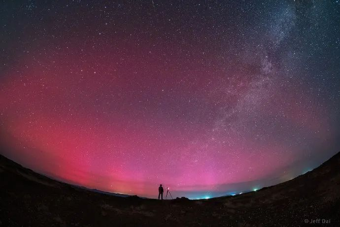
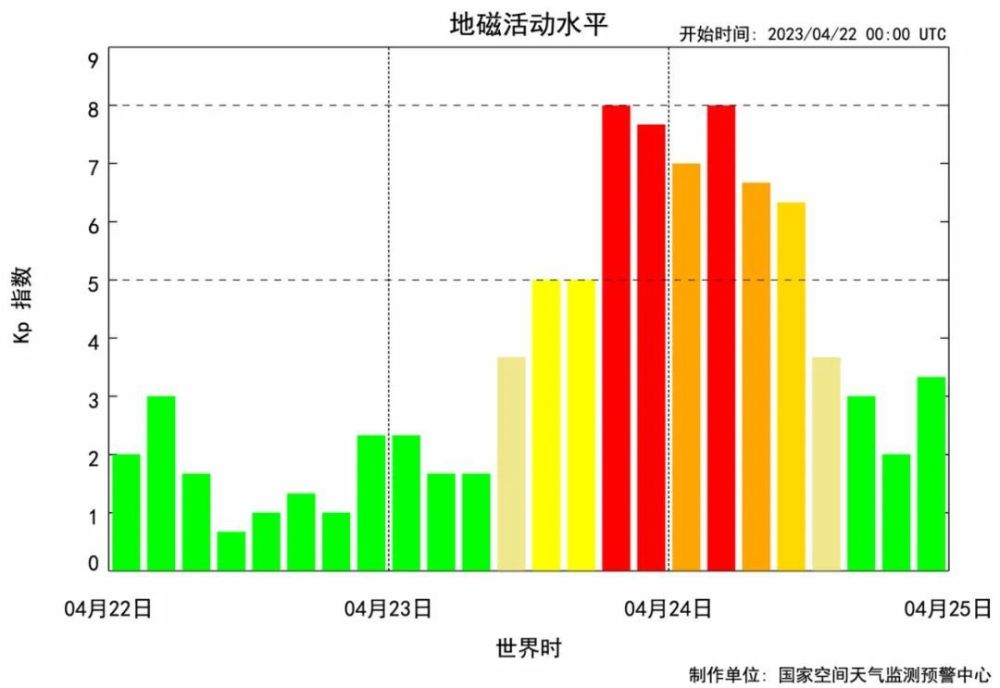

# 新疆现罕见极光，专家：近20年最大地磁暴爆发引起，有卫星面临挑战

据国家空间天气监测预警中心消息，北京时间4月24日2时至8时，发生一场特大地磁暴。此次过程的Kp指数（即全球磁场指数）为8。目前，这场磁暴过程仍在进行中。24日凌晨，地磁暴在新疆克拉玛依引发了绚丽的极光，引发网友热议。

**此次地磁暴有多强？在我国看到极光罕见吗？今年以来为何太阳如此“活跃”？**

针对这些问题，中国气象报记者采访了三位业内专家，一起来看看专家怎么说。

一、近20年最强地磁暴，成因为何？

“这是自2019年12月太阳进入第25个太阳活动周以来，最强的一次地磁暴，也是近20年来最强的一次过程。按照国家标准，地磁暴强度Kp指数可将其划分为五个级别（小、中等、大、特大、超大），此次地磁暴Kp指数高达8，达到了特大地磁暴级别。”国家空间天气监测预警中心首席预报员薛炳森告诉记者，“此次地磁暴是由伴随M1.7级太阳耀斑的日冕物质抛射（简称CME）引发，CME正是产生这次特大地磁暴的直接原因。当这些携带太阳能量的物质高速飞离太阳表面时，就像爆炸冲击波一般，快速传递到太阳系的各处。此次地磁暴之所以强，并不是空间粒子有多强，而是此次日冕物质抛射的方向，是正对着地球而来的。”

薛炳森说，这是来自日冕抛射的能量与地球自身磁场来了一次“正面碰撞”。

_4月21日爆发的日冕物质抛射观测图片，日冕物质抛射是造成此次特大地磁暴的主要原因。供图/国家卫星气象中心_

二、我国出现极光罕见吗？

在此次强烈的地磁扰动下，在新疆克拉玛依，不少人观赏到了极光现象。许多网友被极光的美深深震撼。

_摄影师@Jeff的星空之旅
在新疆克拉玛依拍摄到的极光_

北京天文馆研究员朱进介绍，在我国看见极光比较罕见，但也并非偶然。

近几年是太阳活动高年，太阳较为活跃，当太阳耀斑爆发或日冕物质抛射发生后，一些速度很快的高能带电粒子可能会传输到地球附近，“如果它们（高能带电粒子）不是特别强，受地球磁场影响，基本会被地球的两极‘俘获’，所以极光一般出现在南、北两极；不过，如果高能带电粒子流强度很强，与地球磁场相互作用产生‘特别强的磁暴’，那在中高纬度地区也可能会看到极光，甚至在低纬度地区也能看到。”朱进表示，我国出现极光的次数不一定和大家观测到的次数吻合。譬如，如果发生极光时天气条件较差，被观测到的概率就比较小；受时间、地理位置影响，极光也有没被观测到的情况。

三、赤道地区也曾出现过极光？

极光是一种神秘的天象，自古以来为人所瞩目。在中国的古籍中就有极光观测记录——“大电绕北斗枢星，光照郊野”。

中国科学院地质与地球物理研究所副所长、中国科学院地球与行星物理重点实验室主任魏勇研究发现，在赤道区域也曾经出现过极光。在古代朝鲜保存的历史古籍中，记载的天象记录中就有一种在夜间大气发光的现象——‘有气如火光’，绝大部分位于朝鲜半岛南方，具有肉眼可见性和动态变化性特征。专家推测，这一现象主要是赤道极光，由朝鲜半岛南方的负磁场异常引起的高能粒子沉降而产生。

极光不仅是一种美丽的神奇发光现象，还能够帮助我们理解空间环境中物质能量的转移转化等物理过程。“在通常情况下，地球磁场处于稳定状态，但当地球内部结构和动力发生变化时，地球表面就会出现磁场异常区。在负地磁异常区，磁场的强度显著降低，屏蔽作用减弱，使得地球辐射带中的高能粒子能够更深地穿透大气层。沉降的高能粒子对地球大气进行了电离，从而在夜空中产生红色的赤道极光。”魏勇说。

_极光资料图 来源：网络_

在历史记载的大磁暴事件中，几乎都有观测到极光，中低纬度区域也不算罕见，如1989年3月发生的魁北克磁暴事件、2003年的万圣节的磁暴，都有人在中低纬度区域观测到极光。

四、风云三号“降水星”面临磁暴考验？

“极光虽好看，但越绚丽的极光，意味着地磁暴越强烈，对地面通信和航天器运行威胁就越大。”薛炳森说。

磁暴带来的影响有很多，其中之一就是驱使地球高层大气微粒运动加剧，这会导致飞行在太空的航天器承受较平常更大的飞行阻力。

在此次地磁暴影响下，4月16日刚刚发射的低轨“降水星”风云三号G星就面临挑战，运行轨道或将降低约560米。

薛炳森介绍，地磁暴通常会显著影响500公里以下的近地轨道，地磁暴给地球两极地区注入巨大能量，随后能量传递给高层大气中，造成大气被加热，并向低纬度地区扩散。低层大气受热膨胀，导致卫星轨道上的大气密度增加，使得卫星所受阻力增大卫星运行速度和高度下降，无法维持在原本高度轨道运行。“为保障低轨卫星正常业务运行，当卫星降落到一定位置时，需要人为推升其上升至原本轨道高度。我国的空间天气监测预报为这一预案的实施提供了数据支撑。在这次过程期间，我们为风云三号G星提供了多期空间天气服务。”

除了威胁航天器运行以外，地磁暴还会威胁地球短波通信。短波通信是一个严重依赖地球电离层的通信方式，当地磁暴发生时，电离层电子密度分布会发生很大变化，从而造成不同频率的无线电波的反射率发生变化，导致较高频率的无线电波不能反射；这时如果采用无磁暴时的短波传播信号，电波原有的接收点接收到的信号会大幅度衰减，甚至完全接收不到，从而造成短波通信的中断。

薛炳森表示，未来3至4年，太阳仍处于活跃期，地磁暴等仍会呈现多发态势，但对公众日常生活影响不大，不用恐慌。有效应对地磁暴威胁首先要密切监测太阳活动、及时准确研判并预报其可能发生的地磁暴。

**中国气象报社 出品**

**专家顾问：**

国家空间天气监测预警中心首席预报员 薛炳森

北京天文馆研究员朱进

中国科学院地质与地球物理研究所副所长、中国科学院地球与行星物理重点实验室主任 魏勇

**作者：** 中国气象报全媒体记者张娟 王美丽

**编辑：** 姜虹

**审核：** 段昊书

