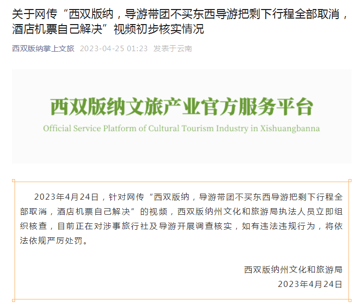

# 网传“游客不买东西导游取消剩下全部行程”，西双版纳官方通报：开展调查核实

2023年4月24日，针对网传“西双版纳，导游带团不买东西导游把剩下行程全部取消，酒店机票自己解决”的视频，西双版纳州文化和旅游局执法人员立即组织核查，目前正在对涉事旅行社及导游开展调查核实，如有违法违规行为，将依法依规严厉处罚。

西双版纳州文化和旅游局

2023年4月24日

来源 | 西双版纳州文化和旅游局

来源：西双版纳掌上文旅

