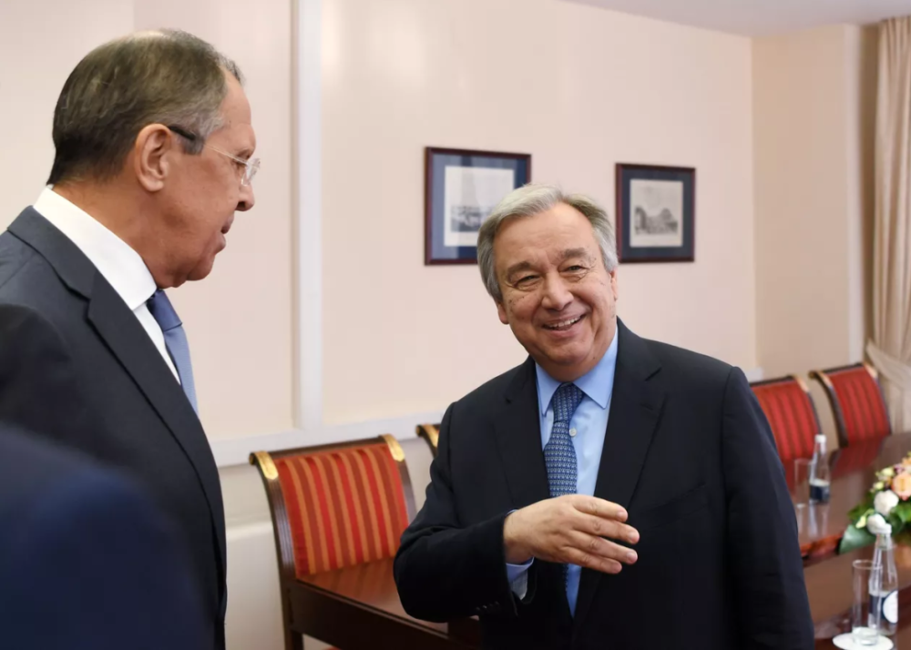
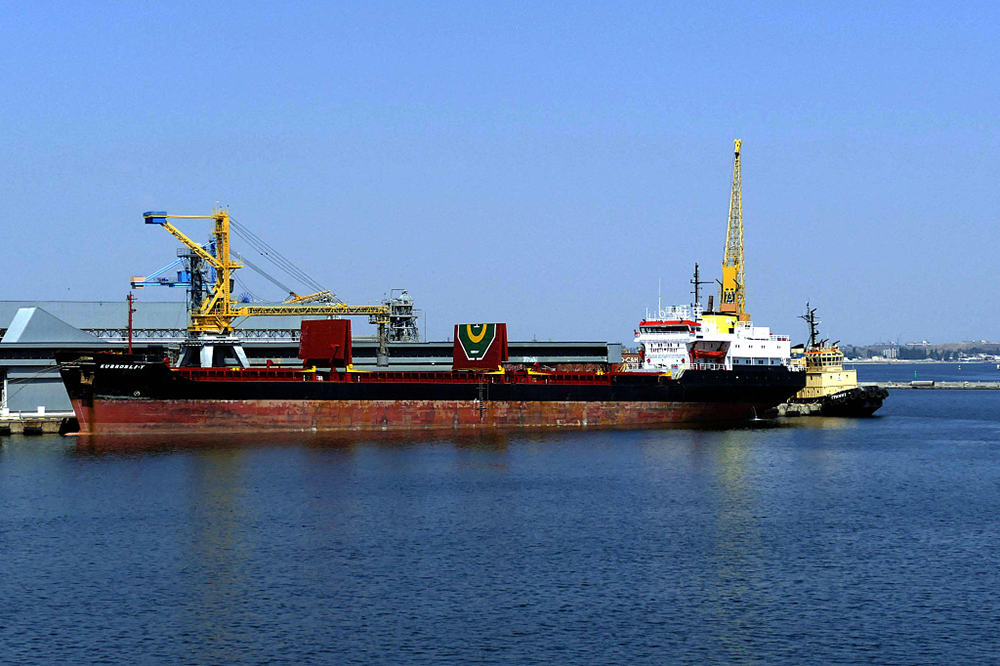

# 联合国秘书长古特雷斯致函普京 俄方：这封信需要研究

当地时间4月24日，联合国秘书长古特雷斯与俄罗斯外交部长拉夫罗夫举行了会面。据悉，双方就乌克兰局势、阿富汗、叙利亚等方面的问题进行了讨论。

联合国表示，关于黑海港口农产品外运协议，古特雷斯对联合协调中心最近在其日常运作中遇到的阻碍表示担忧。古特雷斯向拉夫罗夫提交了一封致俄罗斯总统普京的信，概述了旨在改进、延长和扩大协议的方向。据了解，古特雷斯还向乌克兰、土耳其，即该协议的另外两个签署方发送了类似函件。

另外，古特雷斯就俄罗斯粮食及化肥出口遇到的困难，落实谅解备忘录的情况与拉夫罗夫进行了沟通。古特雷斯详细说明了在这方面已取得的进展，并重申联合国承诺继续努力解决遗留问题。

古特雷斯还向拉夫罗夫介绍了秘书处在解决俄罗斯官员签证问题上所做的最新努力。

据俄罗斯卫星通讯社报道，拉夫罗夫在会见结束后说：“我们研究了目前联合国议程上紧迫的所有问题，安东尼奥∙古特雷斯特别关注了他自己于去年提出并于2022年7月22日被批准进一步落实黑海倡议的前景。”

拉夫罗夫补充称：“秘书长介绍了他为最大限度地推动这项协议的俄罗斯部分所做的努力。他以信件的形式向我们转达了自己的想法，信中阐述了如何进一步行动的想法。当然，这封信需要研究。暂时我们没看到西方国家有真正履行为成功落实秘书长倡议所需事项的意愿。”

俄罗斯早前表示，不会允许粮食出口协议在下月18日到期后继续执行，因为俄方对于本国出口的一系列要求仍未得到满足。

