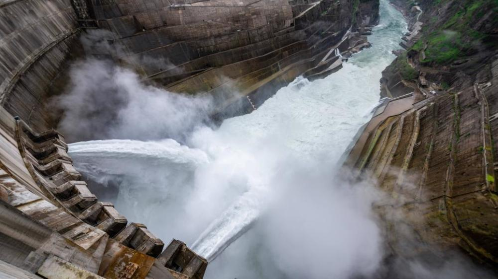

# 能源富省频现电力吃紧：继四川后，水电大省云南也在“等水来”

全国排名前10的水电站中，云南有7座。但在这个仅次于四川的第二水电大省，一批产业正在“等水来”。

据云南气象局数据，今年以来（2023年1月1日至4月20日），云南省平均降水量为34.6毫米，较历史同期偏少63.6毫米（64.8%），为近五年来降水最少年份。昆明市今年以来平均降水量为6.9毫米，较历史同期偏少61.9毫米（90%）。当地气象水文部门此前预测，2023年云南省大部分地区降水总量正常偏少。预计5月中旬至下旬，全省各地陆续进入雨季。

云南水电季节性波动明显，每年的6-10月为丰水期，水电在全省发电总量中的占比甚至超过90%；而在12月和次年1-4月的枯水期，水电出力疲软，需要火电弥补不足。据澎湃新闻了解，去年以来的来水偏枯、水库低水位及火电装机不足等因素叠加，导致云南在当前枯水时节的电力供应形势更趋严峻。

放在稍长的时间尺度上，云南的电力保供任务也并不轻松。“丰紧枯缺，总体偏紧，存在一定缺口”是该省能源主管部门对其“十四五”时期电力供需形势给出的判断。在摆脱“弃水”困局之后，由于铝硅等高耗能产业的密集落地，云南的电力供需格局发生了深刻变化，电力供应将在不短的时间内持续偏紧。

**“西电东送”送端省电力紧缺**

云南是我国水能资源最丰富的省份之一，水电在其电力结构中约占80%，位列全国第二。该省也是“西电东送”的重要省份，依托丰富的水电资源，云南于1993年开启“西电东送”，逐步形成云电送粤、云电送桂、云贵互济、云电入琼格局。

来水偏枯，已经体现在云南水电运营商的一季度发电表现上。

实施“西电东送”“云电外送”的核心企业、总装机容量和年发电量均占云南省三分之一的华能水电（600025.SH）在4月21日公布的2022年财报中称，随着全球变暖加剧及极端气候频发，澜沧江流域来水的不确定性与极端来水的风险也越来越高。2022年澜沧江流域主要断面主汛期来水创历史同期最枯，2023年年初梯级电站蓄能同比减少，水电发电量增长困难。对此，公司将继续“度电必争”，全力协调梯级水电最优方式运行。

一季度，华能水电完成发电量156.10亿千瓦时，同比减少11.44%，上网电量154.84亿千瓦时，同比减少11.46%。

该公司对一季度发电量减少的主因解释称，一是由于2022年汛期来水不足，导致2023年初水电梯级蓄能同比减少61.37亿千瓦时。二是2023年一季度澜沧江流域来水同比偏枯约1成，其中乌弄龙、小湾和糯扎渡断面来水同比分别偏枯6.7%、12.3%和13.6%。

一季度，国投电力（600886.SH）境内控股企业的累计发电量和上网电量同比增长20%左右，但位于云南的大朝山水电站发电量和上网电量拖了后腿，同比下降6.4%左右。

伏笔在去年已经埋下。据公开数据，去年7月云南省降水量同比减少36%，甚至较2011年云南严重干旱的时候低23.1%，同年8月降水同比减少24.6%，与2011年干旱年份水平相近。由于去年下半年云南主力水库汛期蓄水量低于历史同期，放大了枯水期的供电压力。

北京大学能源研究院特聘副研究员康俊杰对澎湃新闻分析称，多方面原因导致了云南当前及近两年时有浮现的电力紧张现象。在供应端，包括云南在内的多个西南省份连续来水偏枯，造成水电出力较正常年份大幅降低。而云南电源装机结构多年来以水电为主，煤电占比偏少，可再生能源增长相对缓慢，一旦水电紧张，调节能力不足。与此同时，云南须履行外送电协议。

在近年来产业转移大潮下，云南电力需求端的变化也不小。“受此前招商引资政策和优惠电价吸引，以电解铝为代表的高耗能行业赴云南建厂，大幅推高了云南当地的用电量。”康俊杰说。

高耗能产业的引入和投产令云南电力负荷快速增长，而当电力紧张时，为保民生用电，唯有压减耗电大户的用电负荷。

澎湃新闻注意到，国家能源局云南能源监管办的一组数据披露，近年来，受省用电需求大幅增长、主要河流流域来水异常偏枯、煤源短缺、煤价高企等不利因素影响，云南省电力供应保障形势严峻复杂。据测算，2023年云南省用电负荷将同比增长7%，用电量将同比增长13.3%，且未来三年每年电量增长均在200亿千瓦时以上。“为充分保障民生用能、防范大面积拉闸限电和确保经济社会平稳发展，云南省自2022年9月开始对全省300余家高耗能企业进行负荷管理。截至2023年3月20日，已累计实施负荷管理192天，累计执行电量129.56亿千瓦时。”

由于水电装机占比大、水电丰多枯少的特性，云南在汛期曾存在较大的弃水压力，“十二五”后期开始，用电量增长大幅低于预期，弃水矛盾日益突出，2016年弃水电量达到历史最高值315亿千瓦时。

为消纳富余电量，云南自2017年开始先后印发《关于推动水电铝材一体化发展的实施意见》等专项政策，通过优惠电价引入水电铝材、水电硅材等产业。

以电解铝行业为例。绿电优势下，2018年开始神火、其亚和魏桥将其电解铝产能陆续转移至云南。据一德期货统计数据，2019年云南电解铝耗电量255万千瓦时，占工业用电20%，至2022年电解铝耗电量增加至575万千瓦时，占工业用电达到33%，复合增长率达到31%。

2022年，云南省用电增速达到11.8%，其中二产用电量增长14%。

2021年，云南就曾因干旱、水电供给持续紧张压减电解铝企业用电负荷。2022年9月，云南电解铝企业先后两次接到压减用电负荷通知，比例分别为10%、15%-30%。2023年2月，部分电解铝企业接到第三轮限电减产通知。据市场机构Mysteel报道，因电力供需形势仍然严峻，云南从4月7日起启动新一轮负荷管理，要求4月10日执行到位（未涉及电解铝行业）。

云铝股份（000807.SZ）2月底在投资者互动平台回应，公司近期收到云南电网通知，目前云南省内电力供需形势严峻，水电蓄能同比大幅减少，为确保电网安全运行和电力可靠供应，要求公司开展用能管理降低相应用电负荷，公司按电网要求配合调整生产组织，在开展用能管理期间公司的电解铝产量将相应减少，同时公司将及时优化安排好全年的设备检修工作。

限电渐成云南电解铝行业的达摩克利斯之剑。不少业内人士担心，即便在丰水期电如期复产，仍不排除今年冬季再次进入减产周期的可能。

神火股份（000933.SZ）4月14日举行的2022年度业绩说明会上，公司高管表示，云南神火属于水力供电生产电解铝，水电整体上还是要看来水情况，具体来水量多少也不可能受控制。“云南省整体的水力发电占到70%以上，火力发电占比（百分之）十几。如果国家或者企业通过加大火电的匹配、新能源的建设等等，可能会有些改善。但短时间内这种状态很难发生根本性改变。”

_白鹤滩水电站位于四川省宁南县和云南省巧家县交界的金沙江干流河段上，是我国实施“西电东送”的国家重大工程。新华社
图_

根据国家明确的消纳方案，乌东德、白鹤滩电站枯水期在云南、四川各留存100亿千瓦时电量，其中云南留存电量包括乌东德电站60亿千瓦时及通过置换方式留存的白鹤滩电站40亿千瓦时。

**如何走出困局：增强能源多元供给能力**

一位云南能源系统人士对澎湃新闻表示，今年云南电力供需形势虽有所变化，但“西电东送”是国家战略，亦有合同约定，外送和往年保持一致，并未减量。

4月4日召开的云南全省能源电力保供工作会议要求，加强煤炭安全生产和增产增供，促进煤电增发稳发，抓好新能源项目建设、蓄水增电、水电开发、新型储能发展、要素保障、完善电力价格机制、安全生产等工作。要强化监测调度，坚决贯彻国家西电东送战略。同时做好节能节电宣传引导。

为稳定企业预期，云南省发改委日前公布《云南省推动铝产业加快提升能效水平促进绿色低碳转型发展的实施方案（试行）（征求意见稿）》，适用于全省电力供应趋紧、确需实行能效管理压减电解铝项目负荷的情况，公开征求意见至5月10日，自10月1日起施行。

该方案提出，原则上全省电解铝能效管理以“枯期—汛期”为一个周期，同一周期内一家电解铝企业承担固定的电力负荷管理比例，根据电力供需形势变化调整实际承担的电力负荷管理规模。

该文件鼓励电解铝企业参与电源建设和电煤保供，可根据电解铝企业电源建设出力情况、电煤保供贡献度，由省电力运行调度工作专班研究确定，适度调减负荷管理规模。

煤电是“枯期保供、汛期调节”最直接的选项。中国电力企业联合会常务副理事长杨昆近日接受媒体采访时称，长期以来，云南省内煤电发展缓慢。目前，云南省发电装机容量煤电占比约11.7%，煤电机组利用小时数长期偏低，去年仅为2858小时，远低于全国平均水平。当可再生能源发电出现较大波动、供应不足时，可控性较强的煤电由于准备不足、供不上来，就会影响用电。

实际上，云南省煤炭资源总量居南方第二、全国第九。但云南省煤炭产业发展一度尴尬，供需矛盾突出，产业发展萎缩，煤炭供需存在明显缺口。

云南决心先补上火电短板，同时加快布局“风光水火储”多能互补基地。

云南省能源局今年1月答复政协委员提案时称，2021年以来，该省电力供给从富裕转为紧平衡和阶段性短缺，电力电量“双缺”严峻形势持续存在。通过强化政策引导火电发电、加强水火风光联合优化调度等方式，牢牢守住了绝不拉闸限电底线。“（2022年）7-8月极端偏枯、9月份蓄能严重不足时及时启动耗能行业能效管理，以长周期、低强度，经济影响最小、涉及主体最少为原则，对负荷集中度高、度电附加值低的耗能行业采取能效管理措施，支撑年底水电蓄能较8月末增加100亿千瓦时，全力守住能源电力安全生命线和民生用电底线。”

云南省能源局称，下一步，将加快释放煤炭产能，确保2023年煤炭产能超过7100万吨。延续能源保供财政资金支持政策，继续支持火电企业省外购煤，制定2023年电煤保供工作方案，力争全年电煤供应不低于3500万吨。动态研判电力供需形势，按照以发定用原则，优化负荷资源组合配置，动态调整能效管理规模。

1月中旬云南出台的《2023年推动经济稳进提质政策措施》提出，大力推动煤炭增产煤电多发。鼓励发电企业与煤矿企业通过参股等方式实现煤电联产。建立激励约束机制，加大力度推动新建480万千瓦煤电项目建设，争取国家新增煤电装机指标支持。

新的煤电项目建设周期一般为2年，相关政策实施对2023年云南煤电装机量提升有限。该省能源局相关负责人曾介绍，“十四五”期间，云南将加快煤炭产能释放，启动实施新一轮煤炭高质量发展计划，加快煤矿整治重组，加快重大煤矿项目建设，加快增产能、增产量，每年新增释放产能1000万吨。到2025年，全省煤炭产量达到9000万吨左右，基本满足全省经济社会发展需求。

保障用能需求倚赖于增强能源多元供给的能力。

2022年夏季，水电资源极为丰富且常年承担大量电力外送任务的四川，史上首次出现丰水期电力电量双缺的极端严重局面，不得不启动能源保供一级应急响应。

今年1月，贵州省气温大幅降低，取暖负荷激增，全省用电负荷持续高位运行。在采取负荷管理仍无法覆盖电力缺口的情况下，决定对省内电解铝企业实施第三轮停槽减负荷。

从四川到云贵，“西电东送”的送端省接连出现电力紧张，有共性因素，缓解出路也相类似。

康俊杰对澎湃新闻说，从相同原因来看，受气候变化影响，近年来无论是枯水期还是丰水期降水都显著减少，水库库容告急，水电出力减少，是水电大省电力紧张的最根本原因。随着高耗能产业向新能源富集的西部地区转移，当地用电量大幅增长，加剧了供需矛盾。迎峰度夏、迎峰度冬期间的降温负荷、取暖负荷激增则会成为催化剂。

“这些地区的风电光伏资源仍有较大发展空间。同时，可以加强电网在更大范围配置及互济。”针对水电大省的缺电困局，康俊杰还建议，加快电力市场建设，发挥市场资源优化配置作用，强化电力源网荷协同调配。

另有一位水电专家对澎湃新闻表示，尽快建设具有多年调节性能的龙盘水电站，才能从根本上改变云南四川的水电调节能力。

杨昆认为，应充分发挥年调节及多年调节水库的作用，合理控制水库水位，按月明确水库的预控目标水位，有序消落，在保障电力供应的同时确保电网系统安全保备能力。同时，还要加强“水火风光”联合调度，加快研究极端气候、外送通道能力等多边界条件下科学合理的电力生产供应结构，并及时进行调整，从根本上解决水电大省枯水期的电力缺口隐患。

4月23日，国家能源局发布一季度全国电力工业统计数据。1-3月份，全国发电设备累计平均利用868小时，比上年同期减少31小时。其中水电544小时，比上年同期减少92小时。

另据国家统计局公布的电力生产情况，3月份，发电7173亿千瓦时，同比增长5.1%。分品种看，火电由降转升，核电、太阳能发电增速加快，风电增速回落，水电降幅扩大。其中，水电下降15.5%，降幅比1—2月份扩大12.1个百分点。

近日举行的国新办发布会上，国家能源局综合司司长、新闻发言人梁昌新回应澎湃新闻关于迎峰度夏电力供需形势的提问时称，预计今年全国最大电力负荷可能超过13.6亿千瓦，较去年有较大的增长。据研判，今年我国全国电力供应总体有保障，部分省份在高峰时段可能会出现用电紧张。作为保供举措之一，国家能源局将继续密切监测云南、贵州等地的来水情况及供需形势，充分考虑汛期来水的不确定性，提早准备迎峰度夏电力保供工作。

