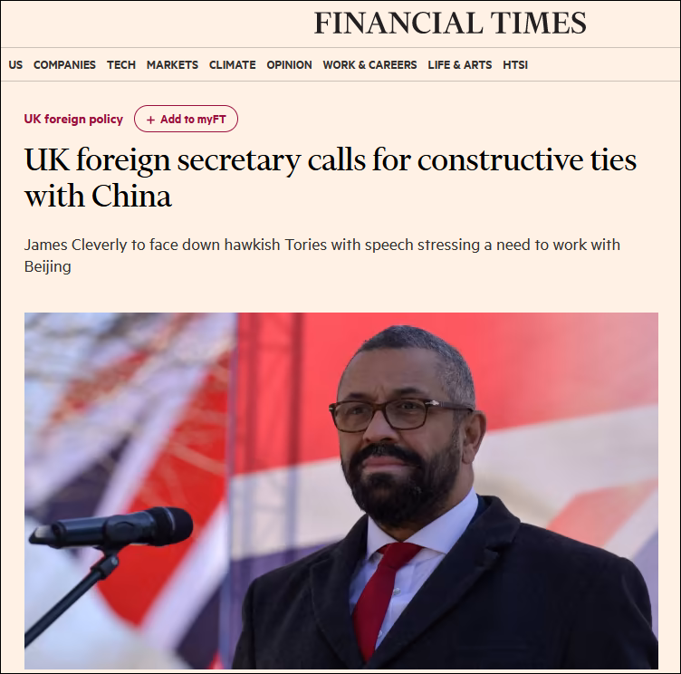
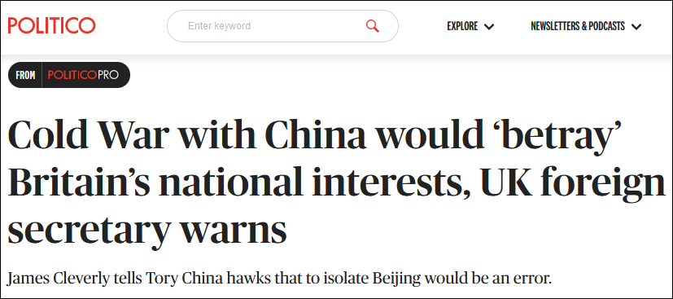
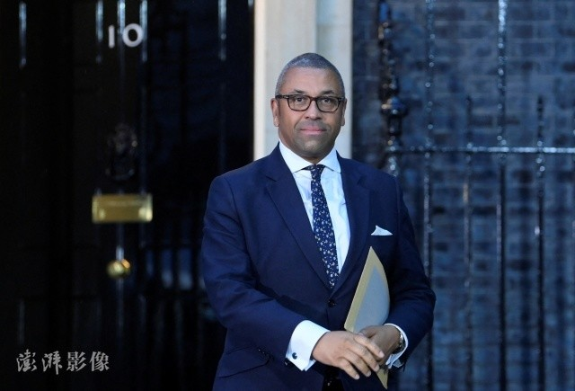

# 英国外交大臣：宣布新冷战和要孤立中国很容易，却背叛了英国国家利益

【文/观察者网 熊超然】当地时间4月25日晚，英国外交大臣詹姆斯·克莱弗利（James
Cleverly）将在位于伦敦金融城的伦敦市长官邸发表一场既定的政策演说，阐述英国对华立场。虽然还未正式讲话，但其办公室已将演讲文稿的节选内容传递给了各大媒体。

综合英国《金融时报》、路透社和美国“政客新闻网”欧洲版报道，克莱弗利将会呼吁英国必须与中国接触，建立“强劲和建设性的”新型双边关系，而非在一场所谓的“新冷战”中孤立中国。媒体认为，他将以此发言压制保守党内部的对华鹰派，发出“与中国对抗恐将损害英国经济利益”的警告。

报道称，克莱弗利的这番言论，势必会引发保守党内对华鹰派人士的不满，自苏纳克担任英国首相以来，英国正重新调整对华政策，立场也变得更为强硬。而近期，许多欧洲国家领导人纷纷访问中国，呼吁对华接触，如今克莱弗利也计划在今年晚些时候访华。

据报道，克莱弗利将制定英国未来一年改善与中国关系的计划，但他同时也坚称“英国不会放松警惕”。演讲文稿中，他仍提到涉台、涉港和涉疆议题，而就在几天前，他还妄称“台湾问题不属于中国内政”。对此，中国外交部发言人回应称：“英国外交大臣显然应该好好补一补历史课了。”

_《金融时报》报道截图_

“政客新闻网”欧洲版称，几周前，英国政府更新的外交和国防政策蓝图认为，中国对英国政策和英国人民日常生活的几乎所有方面都构成了“划时代的系统性挑战”。

报道称，在对华关系上，克莱弗利预计将提出所谓的“三管齐下”（three-
pronged）策略：限制中国企业参与被视为对英国国家安全至关重要的行业；加强同“印太地区”盟友的关系；与中国直接接触以促进稳定的关系。其中，最后一点“最具争议”。

克莱弗利提前“剧透”的演讲稿中这样写道：“对我来说，宣布一场‘新冷战’，并称我们的目标是孤立中国，这将是明确且容易的——甚至可能令人满意。”随后，又有这样一句话：“明确、容易、令人满意，但却是错误的。因为这将是对我们国家利益的背叛，是对现代世界的蓄意误解。”

在这份向保守党内部日益直言不讳的对华鹰派发出的演讲稿中，克莱弗利将会警告“不要进入与中国公开对抗的时代”，因为这可能会损害英国的经济利益，并限制西方应对气候变化和核扩散等共同挑战的能力。

“政客新闻网”欧洲版指出，目前英国正在重新调整对华政策，在一些保守党议员的压力之下，英国首相苏纳克自去年10月上台执政以来，对华立场变得更为强硬，并通过出台“国家安全立法”之名打压中国企业投资。

_“政客新闻网”欧洲版报道截图_

《金融时报》则认为，克莱弗利此番演讲有着呼吁英国与中国建立“建设性关系”的意味，实际上是想借此压制对华鹰派的保守党人。克莱维利的盟友预计，前保守党领袖伊恩·邓肯·史密斯（Iain
Duncan Smith）等对中国持强硬态度的保守党人士，可能会对克莱弗利的讲话感到不满。

《金融时报》还指出，克莱弗利发表这番讲话之际，西方大国正寻求在对中国的崛起感到担忧、国际间合作和维持经济关系需求之间获取平衡。路透社也提到，过去半年里，德国、西班牙和法国这些欧洲国家领导人先后访问中国，并呼吁同中国接触，但英国却是尚未有领导人或官员访华的欧洲大国，一直跟随美国采取了更为强硬的对华态度。

近期，法国总统马克龙在访华前后就欧洲独立自主和台海局势发表了一系列言论，引发国际社会强烈关注。同时，以美国财政部长耶伦为代表的一些美方官员，近期也多次表达希望访华并同中方官员会面的想法。

“政客新闻网”欧洲版报道称，英国外交大臣克莱弗利预计将于今年晚些时候访问中国，但唐宁街方面尚未提出英国首相苏纳克的任何访华计划。

据报道，在克莱弗利这场专门阐述对华政策的演讲中，他将制定英国未来一年改善与中国关系的计划，但他同时也坚称“英国不会放松警惕”。

从媒体披露的演讲内容来看，克莱弗利也提到了英中两国在一些问题上的分歧，其中不乏强硬措辞。他不仅声称“英国将保护自己的国家安全利益”，同时仍不忘炒作涉台、涉港和涉疆议题。谈到台海局势时，他更是声称中国大陆应该对其“大规模军事扩张”背后的意图更加公开化，以防止“悲剧性的误判”发生。

_资料图：英国外交大臣詹姆斯·克莱弗利
图自澎湃影像_

据英国《卫报》此前报道，4月18日，英国外交大臣克莱弗利在参加日本七国集团（G7）外长峰会后接受采访，他表示，鉴于目前中国在国际事务中的影响力，英国应当定期与中国进行密切接触。

报道称，克莱弗利对法国总统马克龙进行了“温和的指责”，因后者在此前曾警告欧洲不要卷入中美在台海的紧张局势。马克龙曾指出，“进一步恶化台海局势完全不符合欧洲的利益”，欧洲不应在这个问题上“成为美国的‘小弟’”，也不应完全根据美国的议程和中方反应制定自己的政策。

此后，马克龙的这番言论被部分西方媒体炒作成为所谓的“争议话题”。而克莱弗利则对此表示，“他并不认为台湾问题纯属中国内政”，并且“台湾海峡两岸不发生冲突，符合全世界每个人的利益”。

“英国外交大臣显然应该好好补一补历史课了。”中国外交部发言人毛宁4月24日对此回应指出，世界上只有一个中国，台湾是中国领土不可分割的一部分，台湾回归中国是二战后国际秩序的重要组成部分，《开罗宣言》白纸黑字写着、《波茨坦公告》清清楚楚印着一个中国原则是国际社会的普遍共识和国际关系基本准则，为第二十六届联合国大会通过的第2758号决议所确认，一个中国原则是中国和英国建立和发展外交关系的政治基础和前提条件。50多年前，英方在中英关于互换大使的联合公报中明确，台湾是中华人民共和国一个省，承认中华人民共和国政府是中国的唯一合法政府。

毛宁再次强调，台湾问题纯属中国内政，是中国核心利益中的核心，解决台湾问题是中国人自己的事，任何外国都无权干涉，希望英方在这个大是大非的原则问题上保持清醒，谨言慎行。

**本文系观察者网独家稿件，未经授权，不得转载。**

