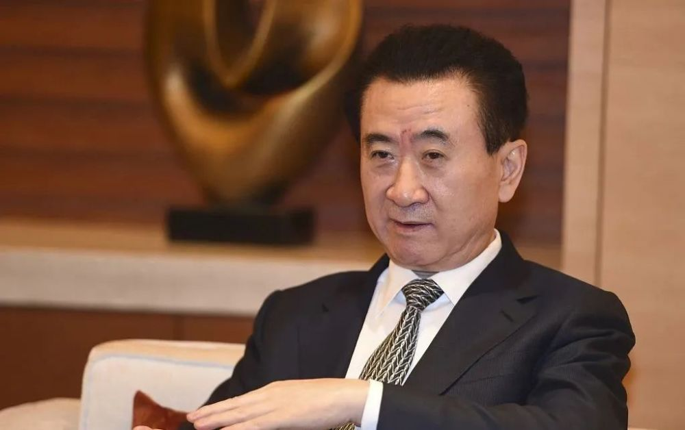

# 380亿对赌悬顶，70岁王健林再立危墙

_来源：视觉中国_

作者 | 郭一非

编辑 | 杨布丁

出品 | 棱镜·腾讯小满工作室

王健林的心头肉，珠海万达商管究竟何时才能上市？

4月25日，港交所官网显示，万达商管招股书状态已更新为“失效”，这已经是王健林第三次失手上市节点。2021年10月、2022年4月及10月，万达商管曾三次递交招股书，最终均告失效。

和过往一样，万达官方的回应也并无新意——上市申请材料失效并不影响上市进程，根据香港上市规则，原申请或再次递交六个月到期后三个月内重新递交的，均属于原申请的延续。因此，公司会尽快按香港联交所要求更新提交申报材料，“目前上市进展有序推进中”。

此前在美元债路演中，有万达商管人士曾一度言之凿凿，2023年2月底前会获得证监会关于赴港上市的批准，今年二季度完成香港IPO上市。

事实证明，王健林还是过于乐观了些。

他更大的压力来自于其与众多投资者的对赌协议：若万达商管2023年底前未能成功上市，后者可要求万达按照8%的收益率回购总额380亿的股权。根据评级咨询机构“YY
Rating”的测算，不考虑预提所得税和股息，万达一方的潜在回购支出规模高达440亿元。

六年前，靠着资产大甩卖，万达得以提前偿还了4000亿元的巨额债务，并借此幸运躲过了高杠杆的反噬，避免重蹈恒大们的暴雷，得以安全平稳落地。如今，年近70岁的王健林似乎又站在了危墙之下，这次又该如何自救？

**创民企海外上市最慢记录**

对于今年二季度上市敲锣，王健林原本信心十足，因此他在与海外银行借款合同中，曾约定5月8日前将完成上市IPO。

但令人意外的是，万达商管上市进度不及预期，触发了提前还款的约定，并直接引爆了这波舆情。这是在380亿股权回购款之外的三笔美元银团贷款，目前，万达尚有借款存量合计13亿美元。

一位投资圈机构人士向作者确认，根据银团合同7.2条的约定，若珠海万达未能在2023年5月8日前完成港股上市，作为借款人，万达需尽快通知各参贷行，如份额超过2/3的贷款行要求还款，万达则需归还本金及对应利息。

该人士透露，2023年4月19日，万达正式向所有参贷行发出豁免同意申请，将合同约定的上市日期调整为2023年11月30日。截至目前，三笔银团均已有超过1/3的参贷行同意该豁免申请。这意味着，提前偿还贷款的条款，已无触发风险。

解除提前偿债风险两天后，有消息称，4月21日，王健林在当天的内部管理层会议上承认，因为商管上市延迟，万达遇到了一些困难，但公司可以克服挑战，战胜困难。

一位万达区域高管向作者确认，关于董事长的讲话精神和要点，区域总在本周一（4月24日）的晨会上向员工进行了传达。不过他并未透露更多信息，“现阶段比较敏感”。

与此同时，市场传言，万达地产板块将被央企华润收购。4月25日，华润一方公开对此否认，称为“谣言”。

万达近期风波不断，除了境外银行贷款提前偿还风险、地产甩卖传言外，困扰他们的，还包括美元债券价格持续下跌、地产信托被传违约，以及内部员工爆料业绩造假等。在商管上市进度遇挫的节点下，这些负面情绪更容易被放大并发酵。

这样的窘境，与王健林过去多次驰援同行的首富气质大相径庭。

作者不完全统计，2022年至今，万达集团已与河南建业、河南鑫苑、山西田森、奥克斯地产等多家公司合作，接管商业项目运营权，此外，万达还接连拿下北京蓝色港湾项目、五棵松卓展购物中心项目。今年以来，王健林还带队奔走河南、贵州、吉林等地，为万达密集签约文旅项目，似乎有意重整文旅板块。

就在王健林意气风发之时，如今，万达商管上市路却卡在了“大路条”上。

早在2021年10月，中国证监会就受理了万达商管赴港上市的申请，后者向香港联交所上市申请递交A1表格，业内俗称“小路条”。按照上市流程，如证监会认为书面反馈意见满足H股发行要求且整改措施到位后，即会出具H股发行批复，俗称“大路条”。之后便是联交所聆讯、路演等上市工作。

不过，一年半时间过去，“大路条”却迟迟未有进展。

“万达商管已经创造了民营企业海外上市的最慢纪录。”IPG中国区首席经济学家柏文喜撰文指出，通常情况下，H股上市公司从取得“小路条”到取得“大路条”只需3-6个月，过去从未出现因批复原因上市周期超过半年的企业。

他拿同行举例对比称，万科旗下万物云，与万达商管同属管理服务企业，在取得“小路条”后约3个月即取得“大路条”，同期的融创服务，从交表到完成上市只用了105天。

**380亿回购款，老王掏得起？**

作为商战场上的最后一搏，万达商管承载了王健林的上市旧梦。他此前曾公开表示，“万达商管是万达的核心企业，我什么企业都能丢，这个不能丢。”

此前，王健林将所有重资产项目都从万达商业中剥离干净，包括万达广场、配套住宅、酒店、写字楼等，仅保留纯粹的商业轻资产运营业务，这就是而今要上市的万达商管。一方面，其为母公司万达集团开发的所有万达广场提供运营服务，另一方面，则向独立第三方商业项目进行外拓，输出万达广场店品牌和管理经验。

眼下，留待万达商管上市最后的时间，或许仅剩8个月。

就在3月21日，就万达商管申请境内发债60亿元一事，证监会下发问询函，其中就包括一旦2023年底前未能成功上市，300亿元的股权回购款一事对其短期偿债能力的影响。截至目前，万达尚未回复该问询。

万达商管负债几何，一旦未能如约上市，王健林掏得起这笔巨额股权回购款吗？

从万达商管最新的财报来看，截至2022年9月底，尽管比上年末少了115亿元，但其现金余额仍为325.39亿元，短期借款39.68亿元，加上一年内到期的非流动负债244.91亿元，合计284.59亿元，至少足以覆盖短期债务。

与此同时，上市招股书显示，王健林与Pre-
IPO投资者签署的对赌协议中，后者总投资额高达380亿元，持股21.17%。这些真金白银力挺老王名单中，包括珠海国资委、郑裕彤家族、碧桂园、中信资本、蚂蚁、腾讯、招商局、PAG太盟投资集团等20多家机构投资者。

若上市折戟，按照YY评级的测算，假设不考虑预提所得税和股息，万达一方的潜在回购支出约440亿元。显然，上述325亿元的账面现金难以覆盖。

不过，王健林依然拥有足够的资产腾挪空间。截至2022年9月末，万达商管总资产为5982.54亿元，总负债为3024.48亿元，净资产为2958.06亿元，资产负债率为50.56%。

YY评级则测算称，在不考虑外部融资的情况下，截至2022年11月末，大连万达商管的经营活动和资产在2023年底前可提供约1087~1213亿元资金，对2022年12月-2023
年全年境内外行权到期债券、以及上市失败下的潜在回购支出，可以实现覆盖比例约 163%~182%，“万达商管仍具备一定安全边际”。

实际上，从今年开始，除了发行合计7亿美元债、60亿元境内公募外，王健林已经频频出手进行融资。

在1月份将万达酒店股权质押融资约8.5亿港币后，4月份，趁着股价反弹，王健林又两次减持万达电影5%的股份，合计套现约15.3亿元。

王健林的后手还有什么，外界不得而知。

