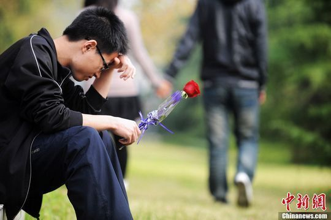

# “大专毕业，长相白净，身高中等”，农村男青年为何成为婚恋“出局者”

**核心要点：**

  * _1_ （父代）完成儿子结婚的任务，还要带孙子，带完孙子还会积极劳动，最好能够经济上支持儿子，或者至少能够自己攒养老钱，不拖累儿子。
  * _2_ 婚姻成本从10年前开始明显增高，现金彩礼、三金首饰、城市商品房是女方要求的基本项。保守估算，这里一个适婚男性的结婚成本一般在50万元。
  * _3_ 在上一代人结婚时，老实本分很符合女性择偶标准的男性性格，然而在下一代，这一性格在婚恋竞争中是尤为劣势的。
  * _4_ 婚恋选择中女性权力的崛起和主体性觉醒，伴随而来的是其日益重视与男性互动中的情感性体验，外向性格的男性更能给予情感回应、提供情绪价值，相比之下老实的男性则互动不佳。
  * _5_ 农村男性婚配压力增大，又或者走向反面，即男性在婚恋上的“躺平”心态，这可能往往是以伪“单身主义”心态标榜自我的一种无奈反抗。
  * _6_ 在当前高度竞争的农村婚恋市场，不遵守市场秩序、不按规则行事的男性，就很可能被淘汰出局，于是，经济条件不差的人、老实本分的人以及道德上的好人，也很可能成为大龄剩男。

*新乡土是武汉大学中国乡村治理研究中心官方账号，致力于介绍最前沿的三农问题，发布独具视角的三农政策解读。

在豫南农村老家，青年的婚恋问题始终是村民过年绕不开的话题，家长里短、闲言碎语里传达了一个家庭的发展能力、社会地位。今年迎来了新冠疫情放开后的首个新年，务工青年的大规模返乡，在助推他们成为村庄焦点的同时，也将这一群体的婚恋话题推上村庄的舆论榜，“老李的儿子带对象回来了”、“老张的儿子娶了邻村老赵的女儿”。。。。这些议论充斥着每一场人情酒席、亲友聚会，作为长期在外求学的返乡青年，儿时玩伴的信息一个接一个地传到我这里。

小安，90年生人，我的小学同学，是周围几个行政村适婚的健康男青年群体中极个别的未婚男青年之一，也是唯一的30岁以上的大龄剩男。在当地的婚恋环境中，他不可避免地成为村民闲话的焦点，也自然地进入我的家乡信息库。他的婚恋困境之所以为我所关注，不仅仅是他作为当地这一方面的特殊现象，更是因为，不幸地，他的身上集中展现了当前当地婚恋市场秩序的总体样态，成为我观察家乡婚恋问题的一面镜子。

小安的婚恋困境，当然有其个体性因素，但他与家庭的择偶行为和婚恋市场规则的冲突是主要原因，而这一冲突正体现出当地乃至全国农村普遍的婚恋市场秩序，也决定了他正在成为本地婚恋市场上的“出局者”。

1\. 被动的父代VS积极的父代——父代竞争力

伴随结婚成本的剧增，父代支持儿子的结婚成本成为全国普遍现象，而伦理责任厚重的华北地区，为儿子结婚更是父代的人生任务，它意味着父代的人生价值和意义所在，包括传宗接代的个体性价值和村庄竞争中社会性价值的实现。在恩往下流的伦理观念主导下，完成儿子结婚的任务，还要带孙子，带完孙子还会积极劳动，最好能够经济上支持儿子，或者至少能够自己攒养老钱，不拖累儿子。这种伦理观念，至少在60后70后父代身上体现的淋漓尽致。

在家乡，儿子结婚是父代的责任是社会共识。小安的父母当然遵守着这一规则，但他们在儿子小安的结婚任务上却是一种“被动的父代”类型。他们一共生育了2女2儿，女儿早已出嫁，大儿子也在10年前低成本地结婚，他们早已攒够了小儿子结婚的经济积蓄，没有经济压力。他们总是在等待儿子自己找到对象然后再出钱结婚，他们认为只要准备好结婚钱就不愁结不了婚。然而，正是由于父母行动上的被动，小安至今单身。

实际上，“积极的父代”成为农村婚恋市场的重要竞争力，儿子结婚上“积极的父代”主要表现为两点：

一是主动的经济积累。当地没有出现突出的性别失衡，本地婚为主，婚姻成本从10年前开始明显增高，现金彩礼、三金首饰、城市商品房是女方要求的基本项。近几年，当地县城商品房首付（近两三年县城房价均价约4千元左右，首付一般20万左右）是首要的也是最低要求，现金彩礼一般是10万元左右，三金约3万元，外加订婚花费（约2万）、结婚酒席开支（约5万）等其余杂项开支，小汽车正在成为女方要价选项但还未普遍，所以，保守估算，这里一个适婚男性的结婚成本一般在50万元。对于积累能力不足的儿子来讲，高额的结婚成本必然要依赖父母。在当地，只要父代努力外出务工攒钱，基本都能支付得起一个儿子的结婚成本，而在多个儿子的家庭，如果儿子们结婚早、错峰结婚则父代基本也可以独立支付，如果集中结婚则需要向亲友借钱支付，但是后续也能通过务工积累还清债务。所以，相比豫中、豫东的高价彩礼，这里80后、90后男青年基本都能结的了婚。

二是主动的婚姻选择。家乡务工青年多是初中学历，少数专科学历，职业选择也多以上海、广州的制造业工人为主。务工市场的分散性、工业生产生活的封闭性，使得他们不仅脱离了乡村熟人社会圈，更未在务工城市建构社交圈，这便限制了他们在同龄异性群体中的交往机会，接触不到同龄女性、自己找不到对象成为当前农村适婚男青年的普遍问题。所以，父代便成为儿子择偶的积极行动者，熟人圈则是他们的主要途径。虽然小安父母早已储备了结婚所需费用，但他们几乎没有主动为小安寻找对象。

2\. 老实的男孩VS外向的男孩——男性个体竞争力

与小安找不到对象的婚恋困境形成鲜明对照的是，同村离婚5年且带着一个儿子的男青年小林（35岁）去年再婚了，相比小林擅于社交的外向性格，小安则更为老实木讷。

小安的父母开始产生了困惑：小安大专毕业，长相白净，身高中等，论学历、长相、婚恋状况以及家庭经济条件都超过小林，怎么小林还先找到对象了呢？

男性本身的个体性因素一直是女性择偶的重要选项，在当前女性主导的婚恋市场上尤其如此。在上一代人结婚时，老实本分很符合女性择偶标准的男性性格，然而在下一代，这一性格在婚恋竞争中是尤为劣势的。男性性格条件的这一婚恋竞争项的变化，其背后反映了两个结构性原因。一是生产结构变化带来男性能力需求的变化。在农村上一代60后70后结婚时期，社会分化程度较低，男性的经济能力表现差异化程度较低的农业劳动能力，女性在婚姻中需要是踏实、顾家的男性，而老实本分被人们认为是男性这一能力的重要表现。然而进入市场经济时代，高度社会竞争要求男性更具有竞争市场机会所需的社交能力，于是外向性格被视为男性能力的重要表现。二是女性主体性觉醒带来情感性需求的变化。婚恋选择中女性权力的崛起和主体性觉醒，伴随而来的是其日益重视与男性互动中的情感性体验，外向性格的男性更能给予情感回应、提供情绪价值，相比之下老实的男性则互动不佳。

所以，我们在农村普遍看到，能说会道、会“哄”女孩的男性往往更受女孩欢迎，而一批“老实人”剩男正在婚恋竞争中被排斥，主要不是因为经济条件，而是因为男性自身是否能够积极主动地建构亲密的男女关系。

3\. 好人VS有钱人——社会地位竞争力

小安爷爷奶奶在世前是整个行政村口碑很好的人，他们会对经济困难的旁系亲戚和邻居给予无私帮助，支助他们的儿子（50后、60后）在困难年代上学，人际关系也很融洽，村民们敬重其人品，也总是请他们给自己的孩子当媒人。小安父母的人际关系也很好，待人和善，从不惹事，村民们都夸性格好。但是，这种和善的“好人”在村庄中的社会地位远不如以前。小安的母亲抱怨到“以前，家里有人生病或者有其他事情时，前后村子过路的人都会到家里坐坐，现在小孩爸爸中风了，XX路过家门口也不再进来看看了”。他的父母认为，从品行上他们在熟人圈子的婚姻竞争中应该是不落后的，甚至是有优势的，但是隔壁邻居品行远不如他们，为人处事比较强势霸道，但却因为其经济条件更好而总是有村民上门给邻居家儿子做媒。

在大多数人品行良好、道德分化不大的现状下，经济评价已经超越道德评价，成为乡村社会评价体系中的主导，经济条件好的人社会地位也更高，在社会竞争中也更有优势。小安父母对乡村社会评价体系的认知偏差，使得其对小安的婚恋产生误判，他们认为的“不愁娶”儿子正在成为村庄的大龄剩男。

上述三个要素是当地甚至全国农村婚恋市场的重要竞争力量，在女性主导的婚恋市场上，它们之间的互斥性较弱，都是婚配的必要条件。当然，这是排除少数极端选择的群体的，比如完全是经济条件导向的择偶标准。

事实上，由于女性在婚恋市场上的绝对优势，使得其择偶的标准日益精细化进而要求也日益增高。一位70多岁的乡土媒人总结过当前农村女方的择偶标准：“有房有车”、“有爹有妈”、“有才有貌”。随之而来的，可能将会是农村男性婚配压力的增大，又或者走向反面，即男性在婚恋上的“躺平”心态，这可能往往是以伪“单身主义”心态标榜自我的一种无奈反抗。

在当前高度竞争的农村婚恋市场，不遵守市场秩序、不按规则行事的男性，就很可能被淘汰出局，于是，经济条件不差的人、老实本分的人以及道德上的好人，也很可能成为大龄剩男。

