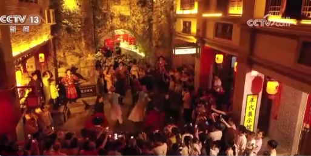
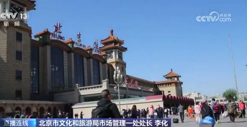

# 今年“五一”何以不同？旅游市场迎重要转折点，预计恢复到2019年水平

越来越近的五一假期，持续高涨的出游热情，当民众的出游需求将得到强劲释放，吃住行游购娱，如何看待多地多部门发出告诫提醒，又该怎样维护游客的合法权益，让大家玩得安心开心？《新闻1+1》邀请北京市文化和旅游局市场管理一处处长李化，中国旅游研究院院长戴斌，共同关注：呵护出游热情，规范市场秩序。

**880万左右！五一北京游客接待量将超2019年同期**

北京市文化和旅游局市场管理一处处长李化：今年以来北京市文旅消费市场呈现出强劲复苏态势，经我们研判，五一期间市民和游客出行出游的需求高、活动多、人员流动大。根据在线旅游平台数据研判分析，五一假期北京全市预计接待游客将达到880万左右，较2019年同期会增长3%，全市酒店营业数量大概有5100多家，目前已预定的房间数已经远超2019年同期的51%。所以通过这些数据，我们也得出五一今年游客接待量，将会远远超过疫情前2019年的同期水平。

**今年“五一”何以不同？如何看待旅游市场即将迎来的重要转折点？**

**中国旅游研究院院长戴斌：** 每年的春节、五一、国庆假期都是城乡居民集中出游的时间窗口，今年五一尤其不同。

第一，预计今年五一假期，全国出游人数会超过2亿4千万人次，超过2019年4个百分点，同时也会创造1200亿消费。如此巨大的市场，我们判断它将会迎来“乙类乙管”之后，旅游市场恢复的一个转折点，也就是说真正恢复到2019年的水平。

第二，庞大的游客集中出游，势必会推高价格，会带来安全和品质方面一些潜在的风险，这也是我们尤其要加以关注的。

**“吃住行游购娱”哪个环节的价格问题最为突出？**

**中国旅游研究院院长戴斌：**
一是散客市场目前来看是最可能出现问题的领域。应该说对于各地团队旅游市场来说，我们有一套监管手段和措施，无论是对旅行社，对平台商，还是对于导游、司机都有相应的监管手段，但是很多人没有通过旅行社出去，没有导游带团出去，这些散客到了现场，在景区、景点之外出了问题怎么办？我会重点关注两个环节。一个是餐饮，一个是购物。餐饮这个环节有很多地方还没有完全做到明码标价，有时候会出现价格乱象，在购物这一块特别要关注老年团，还有一些购物团，“不合理低价游”可能带来的价格管制上的风险。

**规范市场价格秩序的政府责任与解决之道**

**中国旅游研究院院长戴斌：**
节假日由于游客的集中出行，会导致价格上涨的压力，这是个客观存在的事实。政府的职责首先是要做好引导，及时发布相关信息。比如说某一个地方游客过多的时候，可以有意识去疏散游客，特别是城市的节假日，客流的调控和监管将成为重中之重。同时我们也要对价格管制方面进行分类。不是要求所有地方价格都不能上涨，而是上涨必须要做到透明。第二要讲究诚信，不能说游客到了现场，告诉游客说价格要调高，把订单取消了，这显然是不对的。所以从这个意义上去讲，我们价格的公开透明和企业的诚信经营，将是政府引导市场管控价格的重中之重。从市场监管的主体上看，文化和旅游部门要重引导，价格监管部门和市场监管部门要及时跟上。

来源：央视新闻

