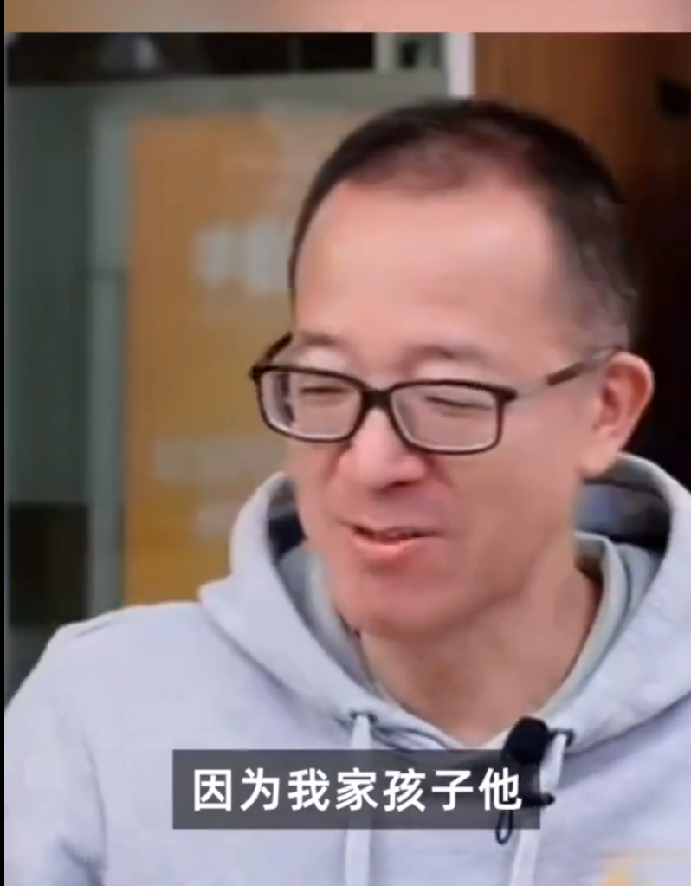
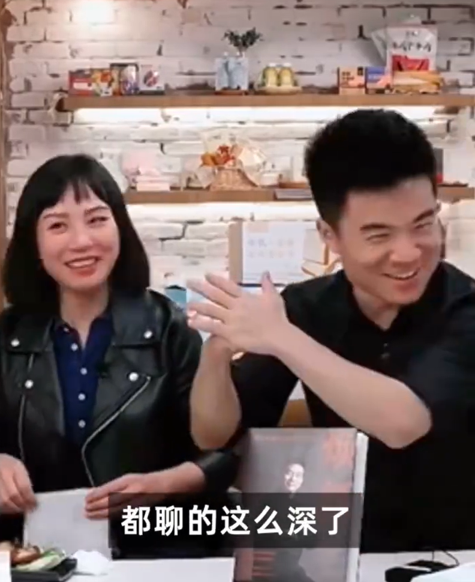

# 俞敏洪：可以考虑董宇辉接班，自家孩子未表达过要来新东方

每经编辑：张锦河

4月25日晚，新东方董事长俞敏洪在东方甄选直播间谈及企业接班问题时表示：“我家孩子没有真正表达过要去新东方（的意愿），而且新东方是一个股份几乎都是公众的公司，所以我倒不存在二代接班的问题。但是，
**比如像董宇辉这样的人才，未来是不是有可能接班还是可以考虑的。** ”董宇辉在一旁笑而不语并双手抱拳。

_图片来源：新浪微博视频截图_

俞敏洪建议董宇辉出国留学：人生最大遗憾是没有出国留学

4月19日，在东方甄选看世界直播间中，俞敏洪表示， **自己人生中最大的遗憾是没有出国留学，到国外接受2-3年的留学教育，并建议董宇辉出国留学。**
对此，董宇辉表示，“俞老师之前都给我规划过了，帮我选了全球最顶尖的几所学校。”

俞敏洪还称， **出去留学不会耽误工作的，白天上课晚上直播。**

值得注意的是，4月18日，董宇辉在直播中自曝拒绝1000万广告费，此事引发关注。

董宇辉回应拒绝千万广告费：不是炫耀，近一年或已拒绝超1亿

据蓝鲸财经，4月20日，董宇辉在东方甄选直播间中回应称：“我当时是无心说的， **没有向大家炫耀的意思** 。其实从去年到今年，
**我拒绝的代言或者商务可能加起来有10个1000万以上** 。关于这些为什么我没有接受， **我觉得不能拿太多，容易钱挣的太多就不想吃苦了。** ”

他还表示：“我说这些的目的不是为了自证清白或高风亮节，当然您还可以继续批评，也可以继续关注，任何的声音都存在合理性。 **我现在手上都没有1000万**
，有一句话叫做‘论迹不论心，论心无完人’，‘此心光明，亦复何言’。”、

东方甄选“发红包”，董宇辉或拿到千万

4月11日晚间，港股东方甄选（HK1797）公告，向154名合格参与者（承授人）授出股份奖励3045.9万股。
**按照东方甄选当天收盘价29港元计算，本次股份奖励总价值约8.83亿港元。**
平均下来，151名参与员工每人将获得市值为487万港元（约合427万元）的股票。

据潮新闻，“董宇辉肯定在股权激励行列，当时他出名后，很多机构去挖他，开千万年薪都挖不动，这次肯定拿到股权激励的。”
**杭州一MCN机构高管表示，董宇辉这次不仅拿到股权激励，很可能拿到股权数量跟高管一个层次。**

自去年6月以来，东方甄选及其主播董宇辉的名气持续狂飙，才华与人品担当的董宇辉也被称为全网丈母娘的女婿。

当晚，董宇辉继续表示，“女婿有钱，新东方给了我高管的待遇，从走红到现在才七八个月，我对于现在工资已经非常知足了，这工资已经完全超出了预期；而且老俞（俞敏洪）给我发了股票，不止一股，还挺多的，具体不能说。”

每日经济新闻综合自蓝鲸财经、九派新闻、潮新闻、公开资料

每日经济新闻

