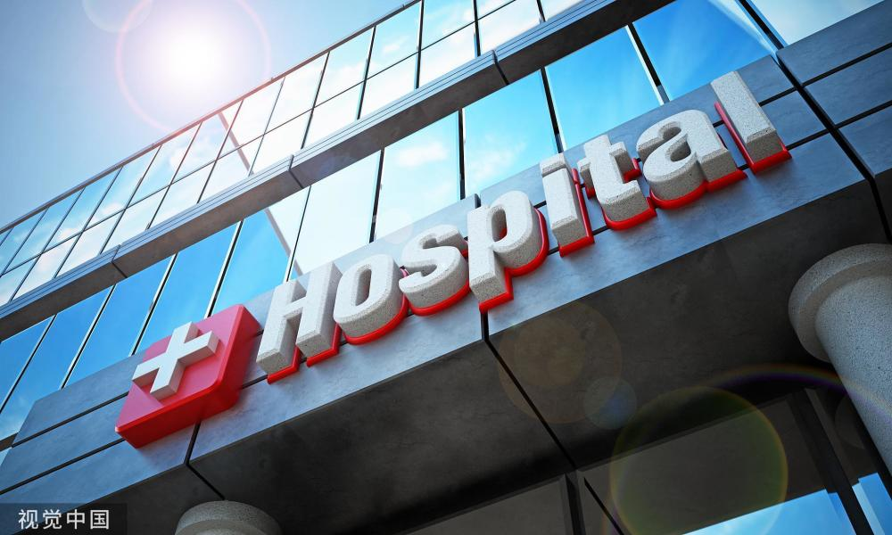
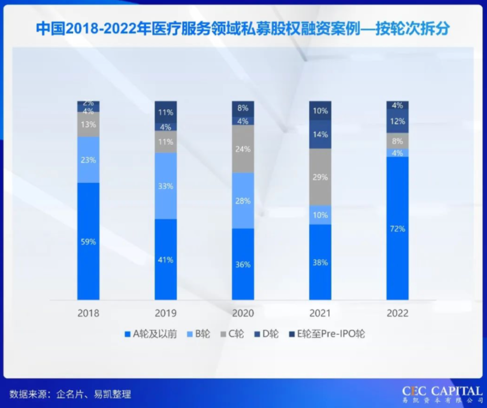

# 又一家医院即将登陆A股：大浪淘沙后，投资医院仍是“好生意”

三博脑科（三博脑科医院管理集团股份有限公司）的A股IPO，已经万事俱备，只等敲钟。

三博脑科在创业板上市的申请已由深交所审议通过，并获证监会同意注册。据三博脑科近日披露的公告，本次发行价格29.6元/股对应募资总额11.73亿元，较原计划的5亿元募资额多出6.73亿元。

继3年前以8亿元巨额B轮融资惊艳医疗圈之后，这家由三位知名神经医学专家参与创建、以神经专科著称的医疗集团，在资本“凛冬”之后，又给医疗服务领域投资者注入了一剂“多巴胺”。

在2009年爱尔眼科眼科上市后，一度长达十余年都没有民营医疗机构通过IPO登陆A股市场。直到2022年，这一僵局才由何氏、普瑞、华厦等三家眼科企业打破。

如今，二级市场向严肃性专科医疗集团敞开大门，多位业内投资人表示，这代表了政策对民营严肃医疗的鼓励。拥有高技术壁垒的严肃医疗服务，在市场冰点情绪中，再次证明了自己的价值。

对医疗服务投资者而言，这或许也昭示着新的风向。

早期疯狂而美妙的泡沫已经退散，炒概念、炒短线、跨界玩医疗的混乱年代已经过去，眼科、口腔、医美等传统“黄金赛道”不仅变得拥挤，还要扛住集采的冲击。

回顾过去，2022年堪称医疗服务领域在一级市场中的“冰点”。《2023易凯资本中国健康产业白皮书》显示，以披露了交易金额的私募股权融资事件作为统计口径，2022年医疗服务领域共完成25笔融资，总计融资额仅52亿元，较2021年下降17%，为2018年以来最低。

“大浪淘沙”之后，仍然留在医疗服务行业的投资者，更多是能与拥有长周期属性的医疗服务机构携手向前的“长资本”。

“长”在两方面——更专业的、长期扎在医疗圈的投资团队，以及“财大气粗”，能够长期持有某赛道头部标的投资基金。

易凯《白皮书》显示，相较于前三年，2022年中国医疗服务领域私募股权融资案例，越来越多发生在A轮及以前，“买了上市就卖”的玩法不再流行。有专注于短线投资的投资人称，从2019年到现在，几乎不再投医疗服务机构。

_△
图片来自《2023易凯资本中国健康产业白皮书——医疗与健康服务篇》_

医疗服务天然的公益性和长周期性，与资本的逐利性在冲突中彼此寻求着矛盾统一。有耐心或有实力长期持有，成为进入医疗服务生意的另一种“资本”。

与此同时，涉足医疗服务的投资者，风格也更加谨慎：开始对标的近乎抄底式的调查，仅看赛道头部公司，预先留好退路，更加关注标的的盈利、效率、牌照资源，甚至所在地域也要考虑……

但这种谨慎，本质上是资本受过前几年的“教育”之后，开始用比较正常的眼光去看待医疗——这本来就不是一个赚快钱的行业，甚至不是一个用来赚钱的行业。

大浪淘沙后，投资人把“确定性”攥在自己手里

潮水过后，“裸泳”者离场。在2023年还能继续“玩医院、投诊所”的人，或许才称得上业界真正的“大佬”。

某知名FA（(Financial Advisor）机构高管估计，如今医疗服务领域每年融资并购交易量仅占到整个医疗板块的10%左右。

谨慎行事，是仍留在医疗服务行业的投资人给出的统一回答。

表面上看，投资人对标的的选择更加“务实”。多位医疗健康投资界专家向八点健闻表示，曾经流行的，仅用一个好的概念来吸引投融资的方式，早已行不通了。

“摊大饼”搞规模的玩法也不灵了。“现在投资者不再看机构一年能扩张多少家，而是看一年内能赚到多少钱，”资深医疗投资人林掌柜说，“他们会研究公司报表、数据，更精细化地投资。”

林掌柜还发现，投资人对标的所处的地域也更加重视。“基本上只看大湾区、长三角、京津冀和武汉等个别中部城市的投资机会，其他地方的标的，基本不会考虑。”在上述地区之外，除非某个标的拥有一些稀缺资源，比如辅助生殖等较难申请到的牌照，才会提起投资人的兴趣。

资深投资人、上海慧眼医学诊断科技创新研究中心创始人李结兵用“造庙”来形容如今的医疗服务投资：

先看“风水”好不好——即标的所在地域，是否能最大限度发展该标的的特色。李结兵回忆，当时想投妇产相关的项目，就专门选择了华东某省的一家妇婴医院，因为考虑到该省人民生育意愿更高，市场更大。

再看“菩萨”灵不灵——即医院专家团队是否技术过硬，能否满足患者需求，老板是否靠谱。李结兵在投资前，专门接触过院内医生——“见面发现他们做事还是蛮认真的，没有糊弄人，很专业。”此外，“老板人也不错，还是信佛的。”

另一家知名投资机构的大健康领域投资人孔锐（化名）也表示，投资前会对创始人做详尽调查。“年龄大的、身体不好或者精神状态不好的”，有风险；思路不清晰，做事“不着边际”的，不靠谱；股权结构分散、混乱，创始人“互相打架”的标的，更是要亮红灯。

“造庙”的最后，是看“香火”旺不旺——即医院管理是否到位，管理者是否懂经营。投那家妇婴医院之前，李结兵甚至请了财务总监专门去做审查，研究医院是否花重金在百度上做推广。“后来发现没有，就是靠口碑。”

一位投资机构高管表示，会从医院管理者的视角去检验标的的可靠性和效率：科室的绩效考核、安全管理、门急诊量、三四级手术占比、财务指标、盈利能力、成本控制……都是他会考查的因素。“我们投的一家医疗服务企业，CEO曾是其他行业高管。到了医疗圈子后，他非常会算账，算医保政策、单病种成本，非常精明，效率极高。”这家医疗集团在并购中十分注意的“安全垫”也让他青眼相加，“即收购成本足够低，所处的区域足够好。”

除了在标的选择上花费心思，投资人对医疗服务项目回报的预期、退出机制等也有了更冷静的考虑。

“我们对所有医院项目都是平常心看待。那家妇婴医院只是上了新三板，没有上主板，我们也没有要求他们去赚暴利。”李结兵说。

资深医疗行业投资人蔡鑫（化名）曾经投资过眼科门诊品牌。双方约定，5年内要么上市、要么被并购。不过，在投资时，蔡鑫表示，眼科门诊品牌的盈利与否，并不作为其最终是否需要回购股份的指标。“只是给它一个压力，我们也需要有个退出的渠道。”

事实上，在选择投资这家眼科门诊品牌那一刻，蔡鑫似乎就已做好全盘打算。开眼科门诊很难，拿眼科牌照更难。该品牌拥有数家连锁门诊和牌照，从一开始就有卡位优势。“许多上市公司都找过我们投的这家品牌，想收购，因为拿牌照很难，又有区域限制，比如这个区域开了一家眼科门诊，卫健委就不再批第二家了。”蔡鑫道破玄机。

凭借这个优势，蔡鑫并不担心项目的退出：“IPO我觉得可能还需要点时间，但如果要并购的话，应该随时都能卖掉。我们可以做大一点再考虑这个事。”

进一步看，投资人的谨慎也标志着医疗服务行业投资思路的变化：更趋于长期稳定的、微利的、逆周期的投资，不再看重短期暴利，而是在医疗机构公益性与资本逐利性之间寻找平衡。

由于医疗服务需求的刚性，使其正好具有“逆周期性”的优势，即表现稳定，不随经济周期而波动。

三博脑科的上市，或许将重新激活医疗服务产业投资，但投资者表现应该会更加理性。孔锐认为，短期内没有特别的刺激因素，这种活跃并不会像2015年前后那样，成为新一轮泡沫的起点。

“我们看医疗时也明白，它是一个可以提供稳定流水的产业，不过是慢回报的。”孔锐说。

“消费医疗”的中场战事，“严肃医疗”渐入佳境？

曾经在投资者看来，消费医疗是投了就赚钱的好生意。

被称为“民营医院IPO第一股”的爱尔眼科便是最好的例子。2009年，爱尔眼科作为创业板首批28家公司之一登陆A股。此后十年，其营收增速从未低于20％，年营收从6.06亿元增长至99.90亿元，年复合增长率高达34.35％。

如此优异的成绩自然使得爱尔眼科备受资本市场的青睐。上市之初，其市值不足70亿元，2017年最后一个交易日，其市值达到488.48亿元。2018年初，高瓴资本出资10.26亿元，以27.60元/股认购爱尔眼科定增6成的股票。其后，爱尔眼科股价开始狂飙，2021年初，股价突破高点92元，市值一度接近4000亿元。

如今，爱尔眼科市值近乎腰斩，股价也回到了接近2018年初的28元左右。而高瓴早已于2021年三季度高位离场，前后4年间，获利45亿元，再度书写神之一笔。

在林掌柜看来，眼科医院的红利时代已经过去。2018年后，眼科医院赖以生存的白内障手术受到集采、控费等约束，风光不再。而其依靠的“社区筛查”获客模式，也受到了严格的规范。

“原来，像‘光明快车’这种下到社区的模式，能筛查出很多白内障患者，通过优惠免费、专车接送的福利吸引他们去医院做手术。”
林掌柜说，但后来，这两种福利与各地严打“骗保套保”的重点查处对象中，“涉嫌变相降低入院门槛、诱导患者入院手术”的问题很难完全区分开来。

此外，贡献眼科医院收入主要来源的屈光项目也日趋内卷，“你有全飞秒，我也有全飞秒，大家都在争，获客成本水涨船高。”

眼科医院从风口到遇冷，正是消费医疗的缩影。

自2015年以来，鼓励社会办医政策迭出。此后，资本纷纷将目光聚焦于消费医疗，热点赛道走马灯般变换。

林掌柜总结，资本投资消费医疗每隔两年切换专科热点：六年前的医美、辅助生殖，四年前的口腔、眼科（眼科连锁医院为主），两年前的新中医、新心理和新康复，现在的眼视光（眼科连锁门诊为主）。

这种变换的根源在于消费医疗技术门槛、投资门槛都相对较低，难以形成专业壁垒。一旦某个专科走热，资本便一拥而上，裹挟着企业在全国遍地开花，市场迅速饱和。新的政策倾向或热点赛道出现后，原有赛道立即降温。

反映在资本市场上，便是医美企业IPO难。2022年初，伊美尔在港交所的招股书状态为“失效”，再往前看，2021年，敷尔佳、创尔生物也是上市折戟。

口腔、眼科赛道虽然在2022年有多家企业上市，但表现也并不理想。

在港股上市的瑞尔集团、美皓集团以及清晰眼科全数破发，瑞尔在上市之前，由于与投资方对赌，可赎回优先股变为流动负债，一度出现“资不抵债”。

当然，消费医疗并非再无明天。

过去三年，中医药在医疗服务中更加显眼。连锁中医门诊“固生堂”2021年底在港股上市后，更引发了资本对于中医药的关注。类似的赛道还有康复、心理等。

即便是已经从风口掉落的赛道，也未必没有资本看好。“医美越不规范，我们越要做，别人不规范就是我们的机会。”李结兵透露，其所在机构和上海九院合作布局的上实医美就坐落在寸土寸金的上海外滩。

与消费医疗“城头变换大王旗”相反，严肃医疗因高壁垒、稀缺性的特性，持续受到市场重视，或许将开启医疗投资“新大陆”。

可能过不了多久，我们就可以看到三博脑科创始人——栾国明、于春江和石恩祥这三名医生在深交所敲钟。

从2021年谋求上市开始，三博脑科三次向深交所提交注册招股书，经历“凤凰涅槃”后，终于注册生效。

一位业内人士判断，从三博脑科获准上市可以看出，政府对于重资产、长投资的严肃医疗“还是支持的”。而对于消费医疗，则很难有政策上的倾斜，“轻资产的消费医疗能做就做，国家不反对也不支持。”

“公立医院技术好，但服务不好，而且一床难求，那可以去三博脑科。”该人士认为，民营严肃医疗可以丰富多层次的医疗服务供给体系，弥补公立医院的不足，满足部分人的医疗需求。又比如，美的集团出资百亿建设的和佑国际医院，拥有大湾区首个重离子肿瘤治疗项目，占地半个足球场大小，“这种项目政府肯定欢迎。”

在一级市场，严肃医疗也颇受关注。2022年，香港亚洲医疗、达康医疗、敦复医疗等多家头部企业均获得亿元以上的融资，涉及的专科包括肿瘤、神经、心血管、血液透析等。

一名参与到亚洲医疗融资的投资人告诉八点健闻，亚洲医疗几乎代表了中国民营医疗服务的最高水平，心外手术量仅次于阜外医院和安贞医院，“严肃医疗本身就很难做，壁垒相当高，心血管更是皇冠上的明珠。”

从长远来看，武汉亚心总医院也不再局限于心血管疾病，基于之前的运营经验，其在肿瘤和骨科也取得了不小的成功。更难能可贵的是，亚洲医疗集团跑通了国外扩张的道路，未来增长颇具潜力。

“对资本来说，这样的标的肯定不容错过。”上述投资人说道。

跑赢医疗服务慢周期，还看“长资本”

2015年到2018年期间，资本市场热钱汹涌，有钱没地方投成为最大的“困扰”。

不仅是卖药的，就连搞房地产、卖茶叶、卖瓷砖、甚至养珍珠的上市公司都纷纷进入医疗服务投资领域。

“当时大家对医疗都有憧憬，上市公司炒概念、讲故事，只要宣布进军医疗行业，或者象征性收购一家诊所，股价立马就上来了。”前述业内人士回忆。

后来，这批带有投机色彩的投资者很快就收获了教训。

集采、医保控费使得管理医疗机构的要求越来越高，行业趋于规范，“莆田系”纷纷退场或隐匿；教培行业遭到重创，物伤其类，医疗服务投资者成为惊弓之鸟；叠加疫情影响之下，民营医疗哀声一片。

恒康是急速扩张后从巅峰跌落的典型案例。2012~2017年间，恒康累计出资43亿元，并购了19家医院及医疗机构，市值一路狂飙到300多亿元，却在随后的4年里急转直下，债务不断，最终破产重组。

据一位医院管理研究专家观察，经历几年动荡，卖茶叶、养珍珠等跨界资本或产业资金早已离场，没有耐心的、短线的、鱼龙混杂的资本基本退出，仍然留在舞台上的包括两大类——医疗产业链上的产业资本和看好医疗的投资基金。共同特点是务实、长期深耕，“现在倒是医疗投资在去泡沫化。”

“一类投资者是巴菲特，大量买入，长期持有；另一类则像散户，今天进场明天退出。”这位专家分析，长期深耕的医疗服务企业往往在市场上表现优异。2006年开诊的东莞康华医院，拥有2000余张床位，年收入接近30亿元，以社会办医之姿成为当地前三的医院。

前述FA机构高管表示，医疗服务投资周期非常长，对于一个好的医疗服务的企业来说，5～7年只是刚刚开始，大部分资本无法匹配如此长的周期。一些外资基金喜欢长线稳健投资，会在此时下手，长期持有。

蔡鑫对此表示认同。他进一步解释，一些外资基金，或许会趁当下医疗服务项目价格低时进行价值投资，再做并购，估值做大做强后上市，从而获得回报。“纯人民币的市场化VC，我觉得这两年可能会比较谨慎。”

普华永道的研报显示，2022年相比2021年，医院及诊所融资并购交易数量下降明显，从135笔减少到84笔，减少近4成，但交易总金额仅从317亿元减少至295亿元，减少不到1成。由此可见，当下的医疗服务投资，资金规模也越来越大。

还留在场上的玩家会发现，当下可供选择的优质标的不多，而这些各个赛道的头部企业，往往被多方投资者共同关注，成为市场上的“香饽饽”。强者恒强，“大鱼吃小鱼”的时代或将到来。

宋昕泽、张雨箫丨撰稿

刘 冉丨编辑

**本文首发于微信公众号「八点健闻」，未经授权不得转载**

