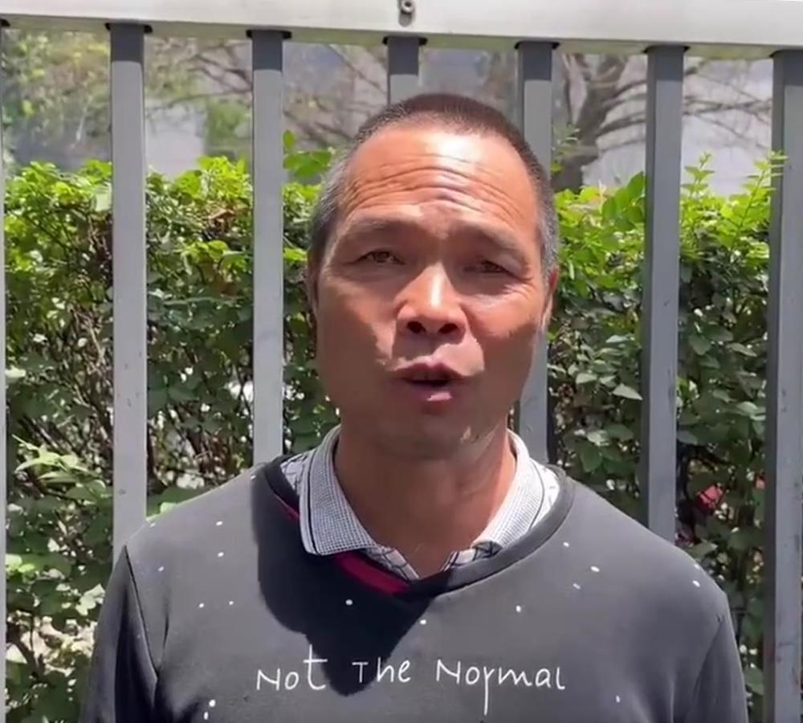
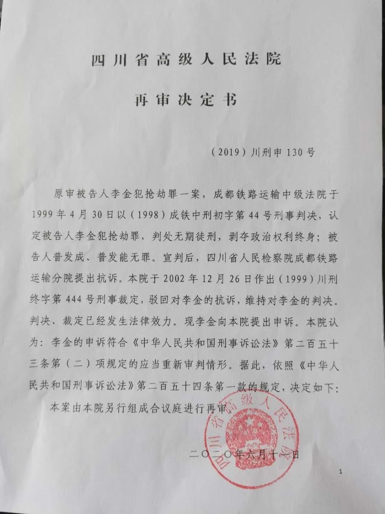
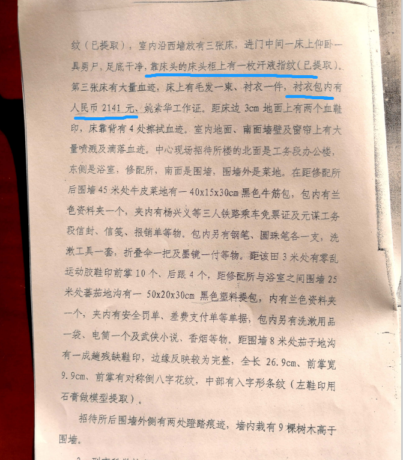

# 四川高院再审29年前“隔空杀人”案：被告人坐牢21年出狱后喊冤

4月25日，四川省高院开庭再审备受争议的云南元谋“隔空杀人”疑案。

这起案件发生于1994年10月。原成都铁路运输检察院指控，被告人李金及普发成、普发能两兄弟在云南元谋火车站招待所抢劫并杀死2人，但被害人随身携带的上千元现金，却遗留在衣服口袋里没被劫走。

案发后，法院曾判处3名被告2人死刑1人死缓。四川高院发回重审，普氏两兄弟被判无罪，李金被判无期徒刑。

2017年7月7日，李金刑满释放。为了证明自己的清白，他委托律师向四川省高级人民法院提出再审申请。四川高院于2020年6月决定再审。

_李金案再审决定书_

**“劫财杀人”被判无期徒刑**

1994年10月14日凌晨2点，云南省楚雄元谋县发生一起抢劫杀人案。旅客白鹤林、姚素华下火车后入住元谋工务段招待所208房间，凌晨5时50分，2人被发现在房内遭抢劫杀害。

尸检报告显示，死者白鹤林系被他人用匕首类锐器刺伤心脏及大血管失血性休克死亡，姚素华系被他人用单刃锐器和钝器多次击伤头部等处，导致颅脑挫裂大失血休克死亡。

案发后近一年的时间里，案件始终没能取得进展。直到1995年9月，云南元谋县27岁的李金因涉该案，被铁路公安收容审查。1996年4月，同为元谋县人的普发成、普发能两兄弟也被元谋县能禹火车站铁路派出所民警带走收容审查，并于同年10月8日被逮捕。

据了解，1988年，李金曾因盗窃罪被元谋县法院判处有期徒刑3年。服刑期间，他认识了因犯抢劫罪入狱的普发成，但出狱后双方再无联系。在警方审讯元谋招待所案件时，李金被反复要求指认一同犯案的同伙，普发成也由此被牵连进了这起命案中，后来开庭时，两人才又见了面。

四川省人民检察院成都铁路运输分院指控，被告人李金和普发成、普发能两兄弟于案发前1天在元谋火车站共谋抢劫，跟踪白、姚2名旅客至招待所。次日凌晨，3人携带工具进入房间后将其杀死。随后，李金抢得一个装有人民币2000余元的手提包，普氏兄弟也抢得另一旅客的手提包，后逃离现场。

1997年2月，成都铁路运输中级法院对该案进行一审。判决书中提到，李金在到案后详细供述了与普发成、普发能兄弟相遇预谋抢劫、跟踪被害、抢劫作案等经过，“与现场勘查笔录记载的部分情况，以及普发成曾经供述的基本事实相符”。

经审理，成都铁路运输中级法院一审判决李金、普发成两人死刑，剥夺政治权利终身；普发能死刑，缓期2年执行。宣判后，3名被告人均提出了上诉。

1998年3月，四川省高级人民法院以原判认定事实不清，证据不足为由，将该案发回成都铁路运输中级法院重审。

在后续的庭审中，普发成称其有罪供述是诱供、逼供的结果，而普发能始终没有承认涉案。兄弟两人的辩护人也提到，公诉机关没有充分的证据证明他们参与抢劫，“李金的供述与普发成曾作出的有罪供述矛盾太多，没有旁证”，“现场勘验记录中的证据未得出确切的结论”等。

1999年4月30日，成都铁路运输中级法院认定，李金犯抢劫罪，鉴于其认罪态度和案件实际情况，改判无期徒刑，剥夺政治权利终身；而普发成、普发能兄弟则因“证据不足”被判无罪。

改判之后，法院仅认定了李金一人作案。为此，四川省人民检察院成都铁路运输分院向四川省高院提出抗诉，坚持认为李金一人作案的事实不清、证据不足，且量刑畸轻；宣告普氏兄弟无罪适用法律错误。同时，李金本人也在宣判后提起抗诉。

2002年12月，四川省高院作出刑事裁定。其中提到，因“普发成、普发能两兄弟不能如期到案，合议庭当庭裁定对其中止审理”，即只是单独审理了李金涉案部分。

四川省高院认定，案发当时，被告人李金伙同他人，在元谋火车站跟踪两名旅客，探知二人住在招待所某房间。10月14日凌晨，李金等人携带撬棍匕首等工具，翻大门进入招待所。李金撞开房门，与他人入室用撬棍、匕首向在靠窗和相邻床上熟睡的两名旅客头部、胸部击打、刺杀，致一人当场死亡，另一人重伤，送医抢救途中死亡。

四川省高院终审裁定，维持对李金无期徒刑的判决。

**“坐牢”21年后喊冤：案发时不在场**

2017年7月7日，在“入狱”长达21年9个月零10天后，多次减刑的李金终于被刑满释放。

出狱之后，李金便开始奔走伸冤，请求再审元谋县招待所命案，以证明自己的清白。

李金告诉中国新闻周刊，1994年10月13日案发时，他并不在元谋县当地，而是在云南省德宏州盈江县打工，两地相距700多公里。

这一信息也得到了方恩华的证实。方恩华在后来的律师询问时提到，1994年初至6月，李金在盈江县自己家里帮忙管理甘蔗林。7月，当地户宋河上游修建水电站，他和李金在铜壁关乡帮助村民搬迁建房。

一直到1994年9月20日，也就是案发前20多天，两人回到方恩华在盈江县的家里过了中秋节。而在过完节后，他们与几名工友转至中缅边界的红坡河（音）伐木、搬运木材，这份工作持续了大概1个月时间。

对于当年打工的情况，李金至今有清晰的回忆。例如，当时砍伐一批木料的价格为10块钱，“大概2米长，20公分宽，人家改好（木料）之后，我们把它抬到路边的斜坡上，装好再用牲口拖到公路边。”

方恩华也称，他们在节后到红坡河搬了20多天的木料，又回到了盈江县的家里，“李金在家里干了几天活，直到农历九月过完才离开（盈江）”。

中国新闻周刊注意到，当年的农历九月二十九，已经到了阳历11月初，这离案发时间已经过去了半个月。

“案发时，我和方恩华及多名工友在盈江县打工，根本没有作案的时空条件”，李金在申诉书中说。

李金还提到，早在1995年被收容审查时，他就向警方办案人员表明，案发时自己并不在元谋县老家，但并未被采纳。

后续案件审理及“服刑”期间，他又多次向提审的昆明铁路公安重案组的侦查人员、铁路检察院的检察官等反映申诉，希望办案人员依法核实该案，但也被拒绝了。

**定罪证据只有口供？**

除了不在场的证据，李金告诉中国新闻周刊，四川高院作出的终审判决中，定罪的直接证据只有他本人的有罪供述，而这份供述是侦查机关通过刑讯逼供等非法手段取得的。

中国新闻周刊注意到，多份判决书中提到，办案人员曾在案发现场采取到汗液指纹、运动胶鞋印、蹬踏痕迹等，但并未明确提到这些勘查证据是否为李金系留下的印迹，也未表明指纹鉴定结果是否系李金本人。

1999年，普发成的辩护律师也曾提到，公安机关提取的证据有失真实，提取的现场指纹不是被告人所留。

_现场勘查笔录显示，被害人身上的钱财未被劫走
图源/四川省高院终审裁定书截图_

此外，四川省人民检察院成都铁路运输分院于1999年提出的刑事抗诉书中显示，公安机关在现场附近找到了被害人被抢走的包；现场勘查笔录也显示，被害人的衬衣包内有人民币2141元，并未被抢走。

也就是说，李金为劫财而杀人，却未拿走被害人口袋里的钱，还把抢得的手提包留在了现场。至于抢走了多少钱、如何处理这笔钱，这些信息也并未披露。

四川省高院的终审判决还显示，李金抢走的被害人手提包，是在其被抓后指认现场时辨认出来的；作案所用的工具，也是李金在警方收集的4根撬棍中辨认出的“较为相近”的其中之一。也就是说，作案工具并非侦查人员在现场搜查所得。

“案件的一审、二审都没有认定这些客观证据与李金有关，也不能证明李金到过现场并实施了犯罪”，张具堆告诉中国新闻周刊。

另一个疑点在于，这起抢劫杀人案的作案人数不定。在普发成、普发能被法院认定无罪后，案件变为由李金1人所为。四川省高院在后续终审裁定中又提到，根据“李金的供述并与现场勘查、尸检结论等证据相印证，足以认定该案的作案人员在二人以上”。

案发后至今，有关部门并没有查明，也未公布除李金之外的其他涉案人员。

曾是被告之一的普发成也在接受媒体采访时提到，检方认定他们兄弟两人参与案件的证据，只有李金的口供。

普发成回忆，当年，他和弟弟莫名其妙被警方带走，直到被问及1994年10月13日的行踪时，才知道摊了事。他们并没有参与该案，也不知道该交代什么，民警便反复询问，经过多次不合法询问，自己被逼无奈承认参与了案件。

成都铁路运输中级法院作出的第一份判决也显示，普发成曾在庭审中辩称没有参与抢劫，曾向公安机关供述，抢劫及指认现场是按侦查人员意图实施的；普法能始终否认参与了抢劫，但均未被采纳。

据了解，普氏兄弟在1999年被判无罪并出狱后，一直在向铁路公安部门、法院寻求赔偿。他们称，正是当年自己坚持不认罪，坚称是遭到了诬陷，才得以被判无罪。

2010年9月，四川省高院认为“中止审理原因消失”，恢复了对普氏两兄弟涉及案件部分的审理。四川省人民检察院认为，四川省人民检察院成都铁路运输分院于1999年6月对普发成、普发能两兄弟无罪判决的抗诉不当，决定向四川省高院撤回抗诉并获得准许，普氏兄弟的无罪判决生效。

2011年，成都铁路运输中级法院对普发成、普发能兄弟给予20余万元的国家赔偿。

**案发后29年再审：希望公正判决**

2018年，李金委托云南昆明的律师杨名跨、张具堆代理该案进行申诉。

2019年5月，经充分准备及多方取证后，李金向四川省高级法院提出再审申请。

四川省高院认为，李金的申诉符合《中华人民共和国刑事诉讼法》第二百五十三条第(二)项规定，即“据以定罪量刑的证据不确实、不充分、依法应当予以排除，或者证明案件事实的主要证据之间存在矛盾的”应当重新审判情形，决定另行组成合议庭进行再审。

今年4月25日，该案在四川高院公开开庭审理。李金的代理律师公开表示，这是多年来国内重大命案冤案中，基于当事人申诉，法院以最短时间主动回应并提起再审的重大冤错案件。

“法院决定提起再审，说明他们也发现了这个案子有问题”，张具堆说。

张具堆还告诉中国新闻周刊，该案的关键在于普氏兄弟被判无罪并获得国家赔偿，这对于李金的申诉具有重要意义，“根据公诉机关指控，李金和普氏兄弟两人的供述能够相互印证，普氏兄弟终审确认无罪，李金作出的有罪供述虚假性显而易见，相当于整个证据链全部坍塌了。”

李金透露，他们曾申请普氏兄弟在案件再审时出庭作证，但未获允许。

参与庭审的人员告诉中国新闻周刊，检方认定李金为作案罪犯，应当为其犯下的抢劫杀人事实负刑事责任。而李金的代理律师则作了无罪辩护，认为其在遭刑讯逼供之后被枉法裁判。

在李金否认了检方的指控后，他当年的雇主方恩华还出庭作证，证明李金当年并不在凶案发生现场，而是在盈江县打工。

“除了方恩华，我在边境干活时还有其他工友，但是他们已经快七十岁了，也没法过来（作证）”，李金说。

案件审理从当天上午9时持续到下午17时许，法院未当庭宣判。如今已经57岁的李金称，希望法院能尽快给他一份公正的判决。

“我从一个小伙子变成了一无所有的老头子，承受了29年的杀人包袱，如今无儿无女孤身一人。”

作者：王春晓

