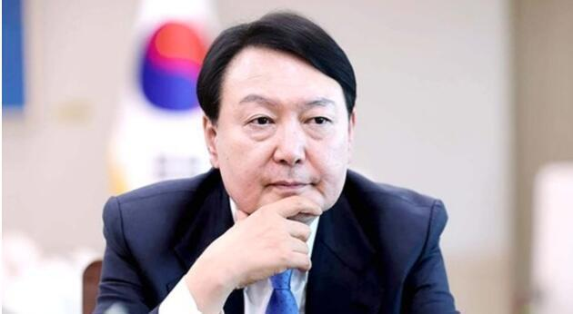

# 尹锡悦访美求“核保护伞”，韩媒关注：他能否拿到美国的书面承诺

【环球时报特约记者 王逸 金惠真】韩国总统尹锡悦24日启程前往美国进行为期7天的国事访问。
据韩联社25日报道，韩美两国官宣将在26日元首会谈上另行发表延伸威慑联合声明，其中如何强化核保护伞打消韩国民众安全顾虑备受关注。

_韩国总统尹锡悦 资料图_

“不再是口头承诺，尹锡悦将拿到‘韩国型核保护伞’书面承诺？”韩国News1新闻网24日报道称，据韩国总统府当天透露，韩美政府正在讨论以韩美元首签署文件的方式，有效加强美国延伸遏制举措更具时效性的方案。其代表性方案是，美国提供“韩国型核保护伞”，即韩国领土若受到朝鲜等国的核攻击，美国将进行核反击报复。目前双方正围绕具体措辞进行最终协调。

美联社25日报道称，美国总统国家安全事务助理沙利文24日透露，拜登希望特别强调美国对遏制朝鲜核行动的“坚定”承诺。沙利文没有提供新的威慑措施的细节，但他称尹锡悦此次访问是在朝鲜继续发展其核和导弹能力的关键时刻进行的，美韩领导人将有机会就此进行密切磋商。他称，美国希望就平壤日益激进的言论向其发出一个明确的信息，“拜登总统将在朝鲜构成的威胁方面加强我们的对朝长期威慑承诺。”

沙利文宣称，美韩联盟已经远远超越了朝鲜半岛，“现在是印太地区乃至全世界的一股良善力量”。他说，“周三，拜登总统和尹锡悦总统将宣布关于对朝延伸威慑、网络合作、应对气候变化、对外援助、投资以及加强我们人民之间关系的主要成果。”另外，沙利文还透露，拜登还计划赞扬尹锡悦在与日本和解方面的“决心和勇气”。

尹锡悦在《华盛顿邮报》24日刊出的专访中表示，韩国的安全问题迫在眉睫，因此与日本政府的合作刻不容缓。他称：“欧洲曾经历过残酷的战争，但昔日的对手如今正在携手开创未来。我不能接受拿100年前的事情对日本说绝对不行，要求其下跪道歉。这需要决断，我认为，政府的说服工作已经十分到位。”尹锡悦的此番言论在韩国国内引发巨大争议。《韩民族日报》25日批评称，这番话让人联想到日本前首相安倍晋三的谈话，尹锡悦再次表现出对日本的“低姿态单边主义”，对过去历史视而不见，提出改善韩日关系，只强调“未来”。

美国媒体25日报道称，韩国总统尹锡悦27日将访问美国国会。他将通过30多分钟的英语演讲回顾韩美同盟70年历程，探讨两国共同的挑战课题，道出韩美同盟的未来愿景。演讲结束后，美国副总统哈里斯夫妇和国务卿布林肯将主持国宾午宴。在结束华盛顿日程后，尹锡悦将前往波士顿，28日在麻省理工学院与数字、生物领域学术专家对话，并出席韩美产业集群圆桌会议等活动。

