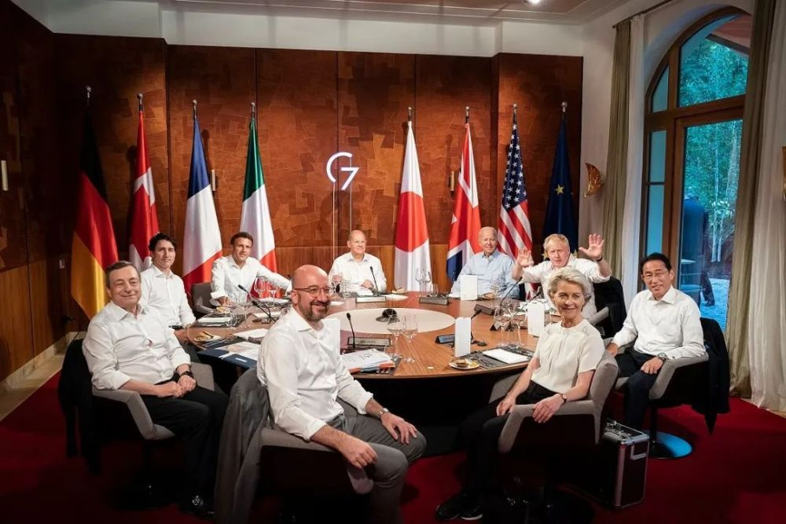
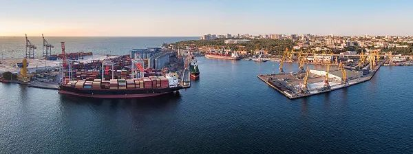

# 美国提出对俄全面制裁方案遭到反对，“杀手锏”或将无法启用

日前，据日媒爆料，为进一步对俄罗斯施压，削弱其经济和军事实力，七国集团（G7）正在酝酿全面禁止对俄出口。

而就在俄官员表示将以终止黑海港口农产品外运协议作为回应之际，G7内部被曝出现了巨大分歧。

_2022
年的G7峰会。图源：视觉中国_

据英国《金融时报》24日报道，作为下个月举行的G7峰会前谈判的一部分，美国提出对俄全面制裁方案，遭到欧盟和日本反对。

“杀手锏”或将无法启用

“从我们的角度来看，这根本不可能。”三名消息人士向《金融时报》透露，日本和欧盟国家代表在上周的一次筹备会议上表示，美国此举不可行。

据报道，G7峰会声明草案中将包含一项内容——用含有少数豁免的全面出口禁令方案，取代目前对俄罗斯逐个产业分别实施的制裁。

换句话说，目前西方国家对俄罗斯的制裁模式是，除非某一领域遭到制裁，否则对俄出口所有商品都是被允许的。而新的方案将规定，除非某一领域获得了豁免，否则对俄所有出口都将被禁止。

对此，美国白宫国家安全委员会表示，美国将“继续寻找让俄罗斯承担责任的方法”。

长安街知事（微信ID：Capitalnews）注意到，自去年2月俄乌冲突发生以来，G7对俄罗斯实施了多轮制裁，限制对俄出口军用品、奢侈品等。欧盟则禁止对俄出口先进半导体、电子部件、量子计算机等先进技术以及能源设备、航空航天设备、军民两用设备、部分机械和交通运输设备等，旨在切断大部分俄罗斯与西方经济、技术、设备和金融产业的联系。

与此同时，G7还施压并要求第三方国家遵守西方对俄制裁措施。但随着土耳其、阿联酋和中亚地区一些国家与俄罗斯的贸易额增长，他们面对的压力也越来越大。

此次G7峰会拟发表的声明草案中还包括，将继续减少对俄罗斯的能源进口，在限制俄罗斯钻石贸易方面引入“可追溯性机制”，以减少俄罗斯的钻石出口收入。

分歧背后

23日，俄罗斯联邦安全会议副主席梅德韦杰夫在社交媒体上发文称，“G7提出的全面禁止对俄出口的想法很棒，因为这也意味着G7将禁止从我国进口商品，其中包括对G7至关重要的商品类别。在这种情况下，运粮协议和他们所需的许多其他商品往来都将结束。”

_梅德韦杰夫资料图。图源俄媒_

梅德韦杰夫所说的运粮协议，即黑海港口农产品外运协议。

去年7月，在联合国和土耳其的调解下，俄罗斯、土耳其、乌克兰和联合国代表签署了有关取消对俄罗斯产品的出口限制以及俄罗斯协助外运乌克兰粮食的多边协议。

作为世界第五大粮食生产国，自协议签署以来，乌克兰已出口约2800万吨粮食。表面上看，这为乌克兰粮食运输开辟了通道，但俄罗斯粮食和化肥出口却因制裁仍无法进入国际市场。

_停靠在敖德萨港的集装箱船。图源：视觉中国_

俄罗斯外交部此前就曾发出警告，如果西方国家继续阻碍俄罗斯粮食和化肥出口，黑海运粮协议将被延期。

“如果黑海运粮协议没有续签，乌克兰无法出口，那么预计食品价格将再次大幅上涨。”美国媒体24日报道称，全球发展中心的高级研究员伊恩米切尔表示，在全球粮食危机中，黑海运粮协议的终止可能会引发灾难性后果。

据悉，G7将于5月19日到21日在日本广岛举行峰会，讨论对俄罗斯制裁等议题。值得注意的是，峰会前一天，也就是黑海运粮协议到期之时。

当地时间4月25日，俄罗斯总统新闻秘书佩斯科夫表示，黑海运粮协议中涉及俄罗斯的条款目前仍未得到执行，而俄罗斯和乌克兰粮食出口量的下降或将导致世界粮食危机。从目前形势来看，这不利于黑海运粮协议的延长。

除了粮食之外，能源问题也一直是成员国内部分歧的导火索。俄方指出，去年俄罗斯与欧盟的贸易额为2587亿欧元，同比增长2.3%，俄罗斯依然是欧盟第五大贸易伙伴。

虽然德国、法国、荷兰等国大幅减少了对俄出口，但保加利亚、匈牙利等国却进一步加大了从俄罗斯进口天然气等能源产品。

在此前的欧盟制裁中，由于对俄能源的依赖程度不同，各国对制裁内容多次发生分歧，如果欧盟想要按照美国提议的全面禁止对俄出口，则需要得到27个成员国一致同意，这项任务估计“道阻且长”。

制裁走到了尽头？

《金融时报》报道称，围绕声明草案的分歧显示，西方除了对俄制裁不断加码外，已无更多手段。

自2022年2月以来，欧盟已对俄罗斯进行了10轮制裁，禁止了价值超过1350亿欧元的双边贸易流动，其中包括几乎全部的俄罗斯石油产品，以及大量机械设备和电子产品出口。

代价是，欧盟成员国之间为了争取各自的利益，通常需要经过数周漫长而激烈的争论才能谈妥一轮制裁条款。

有官员表示，新的全面出口禁令将引发更多的争吵。

据《金融时报》20日报道，大多数欧盟官员承认，目前俄罗斯尚未受到制裁的部分，都是欧盟成员国无法割舍的。因此，新增的制裁条款，大概率也将无法通过。

“或许，我们需要豁免的俄罗斯商品，将多于被禁止的。”一位官员说。

