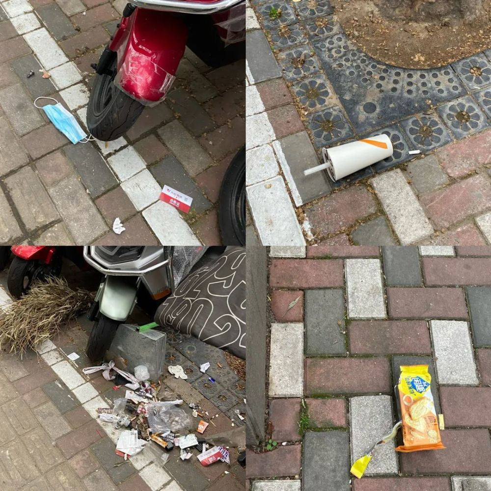
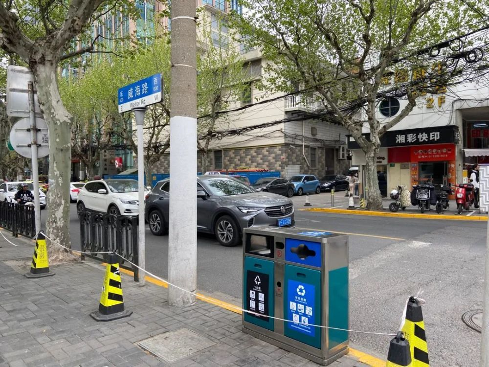
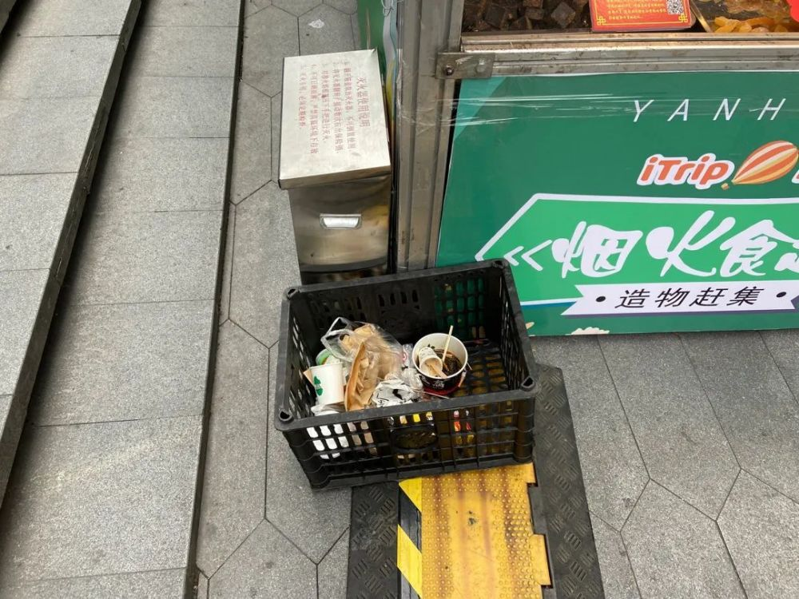
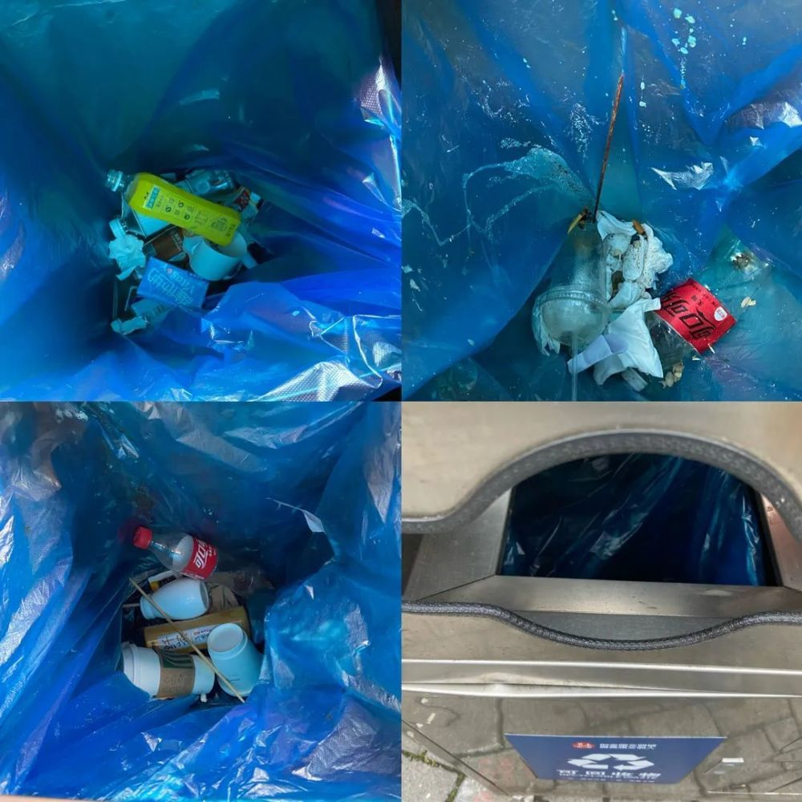
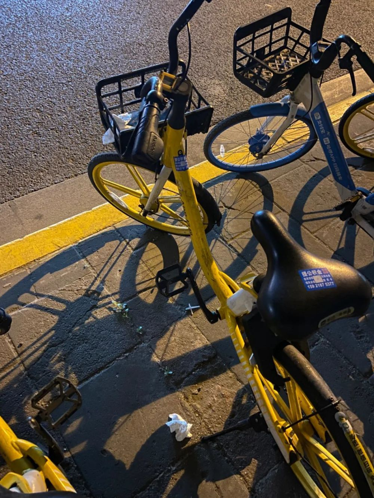
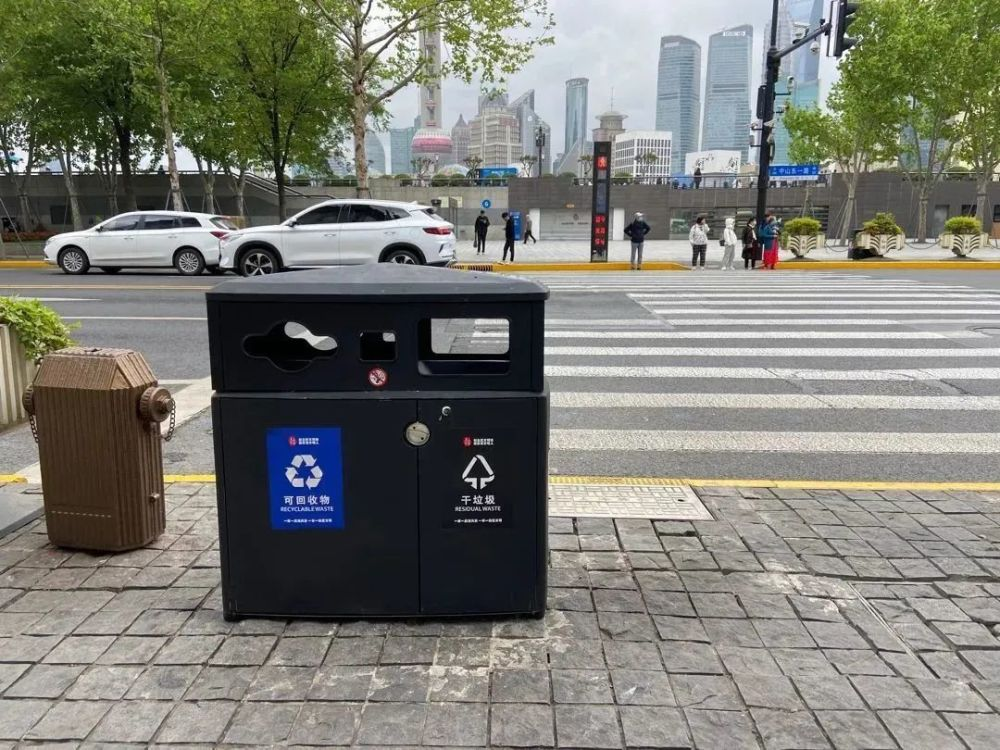
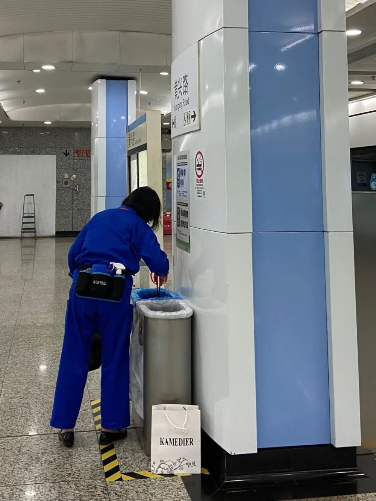

# 街头桶减少了，垃圾却变多了，不能光靠制造“不便”倒逼市民形成习惯

上海施行垃圾分类进入第四年，公共场所的垃圾桶数量前段时间又上热搜引发争议。

有网友称，“自从搞了垃圾分类，上海的垃圾桶就集体消失了”，“共享单车车筐就是垃圾桶”；有人不理解，“垃圾分类就分类，撤桶干什么”；还有网友质疑撤桶是“一刀切的做法，这是不是有点懒政了”。

同时，部分网友表示，“没有垃圾桶后，街道整洁多了，不然垃圾桶周围丢得乱七八糟”；也有人在评论区给出建议，把垃圾带回家，或者找便利店、地铁站丢弃。

垃圾分类虽好，但撤桶有必要吗？找不到垃圾桶，街头乱丢的垃圾变多了吗？这种“不便”能否倒逼市民形成“垃圾不落地”的观念和习惯？

上海市人大代表曾指出，减少或取消公共场所垃圾桶并不能减少源头垃圾产生的数量，还会给市民造成不便，间接破坏了环境卫生，建议适当增加垃圾桶数量并优化布局。

而环保人士认为，环境变好必然会有一些小的代价，垃圾桶减少带来的不便是促使人们改变观念和行为的契机，从社会成本、管理难度上来说减少垃圾桶是必要的。相关部门在减少垃圾桶的同时，应当进行告知和行为引导，优化服务弥补不便。

上海市绿化和市容管理局局长邓建平在做客“2023民生访谈”中表示，将按照动态优化调整全市废物箱的设置，提升公共区域垃圾分类精细化管理水平。

**街头的垃圾桶好找吗？**

近日，记者走访了上海各区多条路段，观察垃圾桶设置现状。

在杨浦区永吉路（靖宇南路—双阳路段），沿街有各类商铺、学校和居民区，花坛边设有休憩座位。

_永吉路有零星垃圾。本文图片均为
澎湃新闻记者 陈悦 图_

记者走访发现，500米路段没有垃圾桶，但有一处社区垃圾回收分类站；当时沿街有2名环卫工人，一人推着垃圾车清洁，一人提着垃圾夹和袋子捡垃圾。下午四五点放学时间，不少学生手里拿着零食，沿街有一些口罩、奶茶杯、食品包装袋、烟蒂被丢在地上。

静安区茂名北路，附近餐饮店众多，人流量大，沿路不太容易发现垃圾桶，不过街面干净。在通往茂名北路的地铁14号口、与威海路相交的十字路口，记者各发现一个垃圾桶，紧邻的12号线地铁站台、站厅也均有垃圾桶。在附近的吴江路美食街，垃圾桶“藏”在地铁4号出口附近，不是那么显眼，近期这里有美食市集，许多商家都在摊位准备了篮筐作为垃圾桶。

_威海路与茂名北路交叉口的垃圾桶。_

全长3.3公里的四川北路有14个垃圾桶，均设在公交站台。记者走访的中山北路、南京西路、黄兴路等地铁站，刷卡进站后，站厅和站台都能找到垃圾桶，通常在站台中间靠立柱的位置。

记者观察发现，市民游客走在街上产生的垃圾主要是餐巾纸、奶茶咖啡杯、饮料瓶、烟蒂和其他食品包装，奶茶咖啡有时会有残余，大多被直接丢进垃圾桶。

早在2019年，上海加大了对公共区域废物箱优化调整的力度，多个行政区公共区域的废物箱数量比以前减少了近一半。

根据2019年7月发布的《上海市道路、公共广场等废物箱配置导则》，上海市道路、公共广场废物箱的设置应结合道路和公共广场人流特征及生活垃圾产生特点，同时设置位置应既方便生活废弃物的投放，也方便分类收集和运输作业。

4月20日，上海市绿化和市容管理局局长邓建平在“2023民生访谈”中透露，2019年，上海全市有公共废物箱6.2万个，到2022年上半年，全市废物箱数量削减到3.6万个，到2022年年底，废物箱优化增加到3.8万个。

**为何街头不设湿垃圾桶？**

_吴江路市集，商家在摊位边摆放篮筐放垃圾。_

与小区的四分类垃圾桶相比，街头的垃圾桶分类也更少。

上海公共区域垃圾桶主要分为干垃圾桶和可回收物桶，部分可回收物投放口已升级改造为扁口或圆口，以减少垃圾混投。

在走访中，记者随机查看了一些可回收物桶。四川中路香港路公交站的可回收桶内除了一根串签，主要是纸杯、塑料瓶；宁波路的可回收物桶为空桶，丢弃物都在干垃圾桶；南京东路四川中路交叉口的可回收物桶（投放口未改造）、中山东一路的可回收物桶（投放口已改造）存在垃圾混投，有废弃纸巾和塑料包装。

_记者在街头随机查看了部分可回收物桶的垃圾。_

街头是否应该增设湿垃圾桶？

环保专业人士郝利琼说，公共场所没有人监管的情况下，市民游客很难有效进行垃圾分类，几乎都是混合垃圾。即便另设湿垃圾桶，也形同虚设，环卫部门后续也无法将其作为湿垃圾进行收运，反而会招来更多的挑战和质疑。不过，在美食街、夜市等大客流的餐饮地段，湿垃圾产生较多，可以考虑放置湿垃圾桶。

她倡议，市民游客尽量减少在街头吃东西，或者自己产生的垃圾自己带回去，这在一些国家和地区也是惯例，“吃不完的东西带回家，吃剩的果核也带回家，渐渐形成习惯。每个人可以做好自己分内的事情。”

**人们的习惯改变了吗？**

_餐巾纸丢弃在共享单车车筐和地上。_

但走在上海街头，人们或多或少遇到过这些情况：喝完的奶茶杯拿了很久找不到地方扔，街头的共享单车车筐里有餐巾纸和塑料瓶，甚至是几包垃圾被丢在街角……

2019年，上海市绿化市容局相关负责人在接受《解放日报》采访时曾表示，和小区“撤桶并点”的目的类似，上海公共区域废物箱的逐渐减少，是为了制造“不方便”，让公众逐渐养成正确分类投放垃圾和减少垃圾产生量的意识。不设置湿垃圾桶和有害垃圾桶，是参考国际先进经验，引导市民将湿垃圾和有害垃圾就近投放到社区的集中收集点或专业回收处置渠道，提升收运处置的效率，降低垃圾收运处置的成本。

2019年社区垃圾分类“定时定点”投放后，郝利琼团队发现，有些居民会把垃圾投入公共垃圾桶。如果街头垃圾桶很多的话，不想分类的居民就可以任意丢垃圾，所以她当时建议市政部门减少小区周边的垃圾桶。

郝利琼说，“不方便”之后，市民会注意小区垃圾投放时间，而非一股脑扔到公共垃圾桶；游客也会意识到，扔垃圾是有条件的、有成本的，而非想扔就扔，这对于尚未实施垃圾分类的城市市民也是一种提醒，一种文化的传递。

郝利琼认为，垃圾桶减少是上海垃圾分类的成果。这是为了降低社会成本、优化分类管理，“整个市政的能力是有限的，不可能为了街头的垃圾分类而派专人值守或手工分类，正如小区撤桶也是为了降低值守的成本。在垃圾分类管理更为先进的国家和地区，它们的垃圾桶都很少。”

_中山东一路的废物箱。_

上海市第十五届人大代表杨建忠认为，自2019年7月1日《上海市生活垃圾管理条例》施行以来，上海在生活垃圾源头减量、科学管理、资源化利用等方面均取得了很大的进步，不过，减少或取消公共场所垃圾桶并不能减少源头垃圾产生的数量。基层调研时有不少居民提出，公共场所垃圾桶过少，“丢垃圾难”给老百姓的生活带来诸多不便。

杨建忠表示，生活垃圾产生的多少是由生活方式决定的，减少或取消垃圾桶只能改变垃圾的流转路径，而不能减少垃圾总量。“手里拿一张污秽的餐巾纸走几条马路找不到垃圾桶，这不是老百姓对美好生活的向往。”杨建忠表示，由于垃圾桶过少或者分布不合理，当手中垃圾扔无可扔之地的时候，大部分人还能揣在兜里带走，但是总有一部分人随手就扔掉了。

“撤桶甚至没有桶，是个提升公众意识的好机会，也有助于垃圾分类的推进，将垃圾分类的工作锁进一个小的闭环，更利于监管和宣传。”
“捡拾中国”发起人王子人指出，“但是在撤的时候，没有告知也没有说明为什么撤以及希望大家怎么做，在意识层面大家完全是空白，所以就会不知道怎么做，也就会形成垃圾到处漂流的现状。”

**未来该如何优化？**

“靠‘堵’的办法往往弊大于利。” 去年，杨建忠提出科学配置公共场所垃圾桶的建议。

他提议深入调查研究，有关部门应根据人流量等变量，建立模型，对垃圾桶的配置密度和空间布局进行科学测算，出台指导性意见。当增加垃圾桶桶数量，并优化垃圾桶布局，垃圾桶应分布于人流交汇口，例如重点分布于地铁口、公交站、停车场、十字路口等等区域。加强对垃圾桶的网格化管理，做到责任到人，确保及时清理，保持干净整洁。

当时，上海市绿化和市容管理局的答复为“解决采纳”。经过调研优化，到2022年年底，上海全市的废物箱数量较上半年增加了2000个。

_保洁员在清理地铁站的垃圾桶。_

在郝利琼看来，许多上海市民已经在三四年间逐渐适应垃圾桶少的现状，但外地游客来沪确实会不适应，怎样让这些游客感到方便是政府部门需要解决的问题。

4月20日，上海市绿化和市容管理局局长邓建平表示，将按照三个原则动态优化调整全市废物箱的设置，提升公共区域垃圾分类精细化管理水平。

一是跟市民出行路径相匹配的原则，每个公交站点和轨道交通站点出入口，一定范围内将设置废物箱，方便市民上下班出行中简单投放随身垃圾需求。

二是跟人流数量密度相匹配的原则，在过街横道线进出口根据人流量实际情况增设废物箱，同时在公共广场、街心花园、开放绿地等人流密集的场所选择适宜的位置，优化废物箱的设置。

三是跟精细化管理相匹配的原则，到去年年底，上海道路废物箱投放口二次升级改造将近2.2万组，今年继续推进优化道路公共场所废物箱投口二次升级改造工作，引导市民群众正确分类投放。

海报设计 白浪

